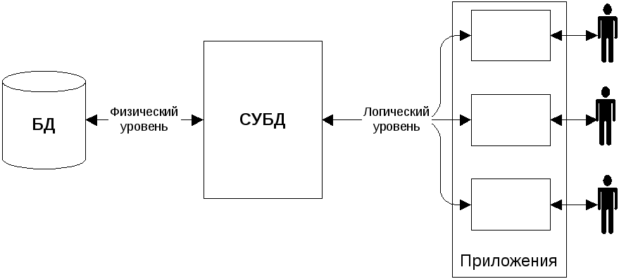
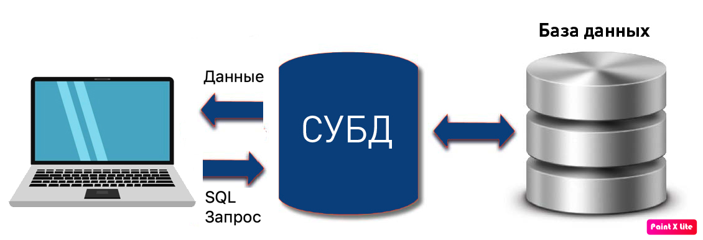
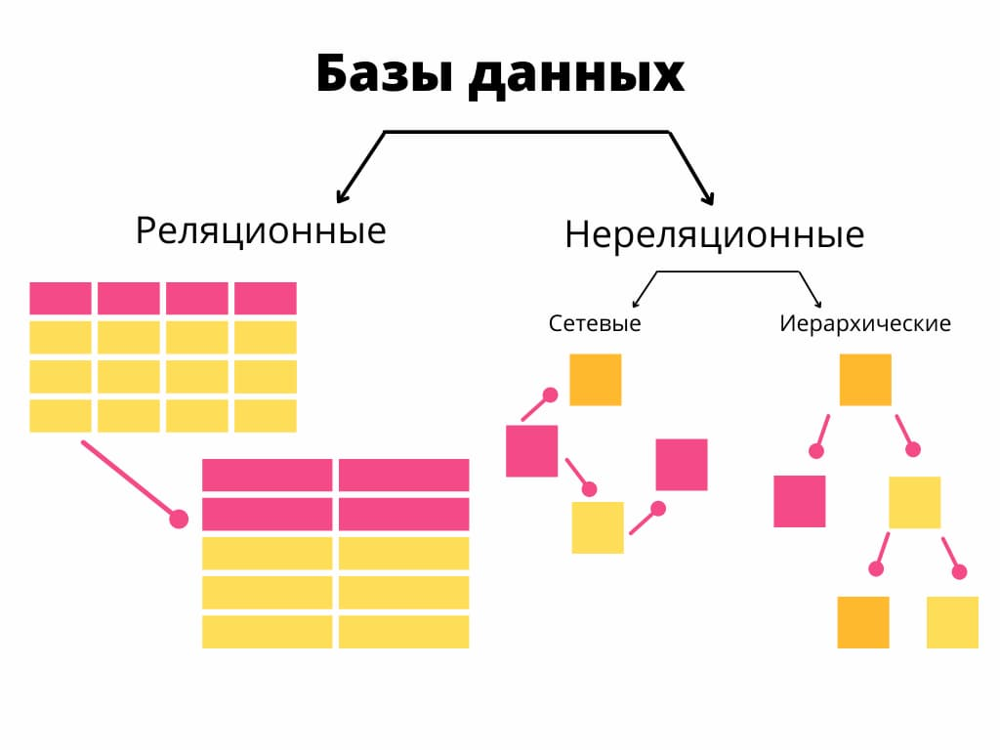
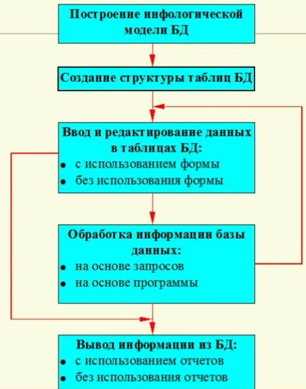

### **Раздел 1. Основные понятия теории БД**

### **Введение**
Прежде чем начать наш курс лекций, посвященный базам данных и основам их проектирования, заострим внимание на том, что наш мир постоянно и активно развивается. По этой причине происходит не только рост популяции человечества, но и экспоненциальный рост объемов информации. Если в древние времена для хранения данных использовались наскальные рисунки, глиняные дощечки или папирусы, то с развитием технологий менялись и носители информации. Следующим этапом стала библиотека — хранилище бумажных копий знаний.

Со временем мы пришли к цифровой эре, результатом которой стало появление электронных аналогов этих хранилищ — баз данных. Теперь данные хранятся в информационном пространстве, а для их анализа и обработки используются различные информационные системы (ИС). Основой современных ИС являются электронно-вычислительные машины (ЭВМ), способные хранить, добавлять, обрабатывать и анализировать информацию. В данном курсе мы затронем принципы организации этих систем и научимся применять полученные знания для создания и управления базами данных.

### **Понятия**

Для начала ознакомимся с ключевыми понятиями, которые будут сопровождать нас на протяжении всего курса:

*   **Данные** — это отдельные факты, числа или символы, сами по себе не несущие полного смысла (например, "Иван", "Петров", "100").
*   **Информация** — это обработанные и организованные данные, которые становятся полезными и обретают смысл (например, "Студент Иван Петров набрал 100 баллов на экзамене").
*   **База данных (БД)** — это организованная совокупность структурированных данных, хранящаяся в электронном виде и управляемая как единое целое.
*   **Система управления базами данных (СУБД)** — это комплекс программных средств, предназначенный для создания, наполнения, обновления и управления базой данных. СУБД выступает посредником между базой данных, пользователями и приложениями. Примерами являются: MySQL, PostgreSQL, SQLite, Microsoft SQL Server, Oracle Database.

*   **Сущность (Entity)** — объект предметной области, информацию о котором мы храним (например, "Студент", "Книга", "Заказ").
*   **Атрибут (Attribute)** — характеристика сущности, которая становится полем (столбцом) в таблице. Например, у сущности "Студент" атрибуты: `id`, `имя`, `фамилия`, `курс`.
*   **Запись (Record) или Кортеж (Tuple)** — набор значений атрибутов, описывающий один конкретный экземпляр сущности (строка в таблице).
*   **Первичный ключ (Primary Key, PK)** — атрибут (или набор атрибутов), который однозначно идентифицирует каждую запись в таблице (например, `id`). Его значение должно быть уникальным и не может быть пустым (`NULL`).
*   **Внешний ключ (Foreign Key, FK)** — атрибут в одной таблице, который является первичным ключом в другой таблице. Он необходим для установления связей между таблицами и обеспечения целостности данных.

### **Модели данных**

Исторически сложилось два основных подхода к организации данных:

*   **Нереляционная модель**
*   **Реляционная модель**

**Нереляционная модель (NoSQL)** предлагает гибкий подход к хранению данных. Существует множество ее видов: документная, ключ-значение, колоночная, графовая. Их общая черта — возможность изменять структуру данных "на лету", без строгой предварительной схемы. За счет отказа от строгих требований **ACID** (см. ниже) в пользу принципов **CAP/BASE**, такие БД достигают высокой масштабируемости, производительности и гибкости. Они идеальны для социальных сетей, больших данных, интернета вещей (IoT), каталогов товаров и корзин покупок.

**Главное отличие реляционной модели** — в строгой, заранее определенной табличной структуре. Данные организованы в виде таблиц (отношений), связанных между собой. Эта модель строго следует принципам **ACID**, что гарантирует надежность и целостность данных. Она идеально подходит для сложных запросов с агрегацией данных и транзакционных систем, где важна точность: бухгалтерские отчеты, банковские транзакции, системы бронирования.

**Объяснение ACID и CAP/BASE:**
*   **ACID** — набор свойств, гарантирующих надежность транзакций:
    *   **A**tomicity (Атомарность): Транзакция выполняется целиком или не выполняется вовсе.
    *   **C**onsistency (Согласованность): Транзакция переводит базу данных из одного целостного состояния в другое.
    *   **I**solation (Изолированность): Параллельные транзакции не мешают друг другу.
    *   **D**urability (Долговечность): Результаты выполненной транзакции сохраняются в системе навсегда.
*   **CAP/BASE** — противоположный подход, жертвующий мгновенной согласованностью (С в CAP) в угоду доступности и масштабируемости. **BASE** расшифровывается как Basically Available (базовая доступность), Soft state (мягкое состояние), Eventual consistency (конечная согласованность). Данные на всех узлах распределенной системы согласуются не мгновенно, а через некоторое время.

В нашем курсе мы подробно рассмотрим наиболее популярную и распространенную **реляционную модель данных**. Ее важнейший аспект — связи между таблицами. Выделяют три основных типа связей:

*   **Один-ко-многим (One-to-Many, 1:N)** — одна запись в таблице А связана с несколькими записями в таблице Б (например, один автор написал много книг). **Это самая распространенная связь.**
*   **Многие-ко-многим (Many-to-Many, M:N)** — одна запись в А связана со многими записями в Б, и наоборот (например, студенты и курсы). Реализуется через **промежуточную таблицу**.
*   **Один-к-одному (One-to-One, 1:1)** — одна запись в А связана только с одной записью в Б (встречается реже, например, данные паспорта и данные человека).

#### **Нормализация**

Нормализация — это процесс проектирования и оптимизации структуры базы данных для приведения ее к определенным стандартным формам. Цели нормализации:

*   **Устранение избыточности данных:** Исключение хранения одних и тех же данных в нескольких местах.
*   **Устранение аномалий:** Предотвращение проблем, возникающих при добавлении, изменении или удалении данных (аномалии вставки, обновления, удаления).
*   **Упрощение структуры данных:** Создание логичной, понятной и эффективной схемы.

**Основные нормальные формы (НФ):**
*   **Первая нормальная форма (1НФ):** Таблица называется нормализованной, если все ее атрибуты атомарны (неделимы). В каждом поле таблицы должно храниться только одно значение.
*   **Вторая нормальная форма (2НФ):** Таблица находится в 2НФ, если она удовлетворяет условиям 1НФ и каждый неключевой атрибут полностью зависит от всего первичного ключа (а не от его части).
*   **Третья нормальная форма (3НФ):** Таблица находится в 3НФ, если она удовлетворяет условиям 2НФ и ни один неключевой атрибут не зависит от другого неключевого атрибута (отсутствуют транзитивные зависимости).

#### **Язык SQL (Structured Query Language)**

SQL — универсальный структурированный язык запросов, предназначенный для управления данными в реляционных базах данных. Его можно разделить на несколько подмножеств:

*   **DDL (Data Definition Language) — Язык определения данных.**
    Команды DDL используются для создания, изменения и удаления структур объектов базы данных (таблиц, индексов, представлений).
    *   `CREATE`: Создание новых объектов (например, `CREATE TABLE`).
    *   `ALTER`: Изменение существующих объектов (например, `ALTER TABLE`).
    *   `DROP`: Полное удаление объектов (например, `DROP TABLE`).

*   **DML (Data Manipulation Language) — Язык манипуляции данными.**
    Команды DML используются для работы с самими данными внутри таблиц: их добавления, изменения, удаления и выборки.
    *   `SELECT`: Чтение и выборка данных (самый часто используемый оператор).
    *   `INSERT`: Вставка новых записей.
    *   `UPDATE`: Обновление существующих записей.
    *   `DELETE`: Удаление записей.

*   **DCL (Data Control Language) — Язык управления данными.**
    Команды DCL используются для управления правами доступа пользователей к данным и структурам базы данных.
    *   `GRANT`: Предоставление прав пользователю.
    *   `REVOKE`: Отзыв прав у пользователя.

---

### **Технологии работы с БД**

Работа с базой данных — это циклический процесс, состоящий из нескольких ключевых этапов.

**1. Проектирование:**
*   Определение бизнес-требований и целей создания БД.
*   Выделение сущностей, их атрибутов и связей между ними.
*   Создание концептуальной модели (ER-диаграммы) и логической модели.
*   Нормализация структуры до необходимой нормальной формы.

**2. Реализация:**
*   Выбор конкретной СУБД (MySQL, PostgreSQL и т.д.) в зависимости от задач.
*   Создание физической модели БД путем выполнения DDL-запросов (`CREATE TABLE ...`).

**3. Наполнение и манипуляция данными:**
*   Заполнение созданных таблиц данными с помощью оператора `INSERT`.
*   Изменение и удаление существующих данных с помощью `UPDATE` и `DELETE`.

**4. Запросы и выборка данных:**
*   Извлечение полезной информации из БД с помощью оператора `SELECT`.
*   Использование условий (`WHERE`), соединений (`JOIN`), агрегации (`GROUP BY`) и сортировки (`ORDER BY`) для формирования сложных запросов.

**5. Администрирование и обслуживание:**
*   Регулярное резервное копирование и отработка процедур восстановления.
*   Мониторинг и настройка производительности (создание индексов, оптимизация запросов).
*   Управление пользователями и их правами доступа.

**Инструменты для работы:**
*   **Командная строка (CLI):** Консольные клиенты СУБД (например, `psql` для PostgreSQL, `mysql` для MySQL). Дают полный контроль, но требуют знания синтаксиса.
*   **Графические клиенты (GUI):** DBeaver, HeidiSQL, pgAdmin, MySQL Workbench. Позволяют визуально управлять структурой БД, удобно писать запросы и просматривать результаты в виде таблиц. Наиболее удобны для начинающих.
*   **Интеграция с языками программирования:** Для прикладного использования БД в рамках приложений используются специальные драйверы и коннекторы (например, `psycopg2` для Python + PostgreSQL, `JDBC` для Java, `mysql-connector`).