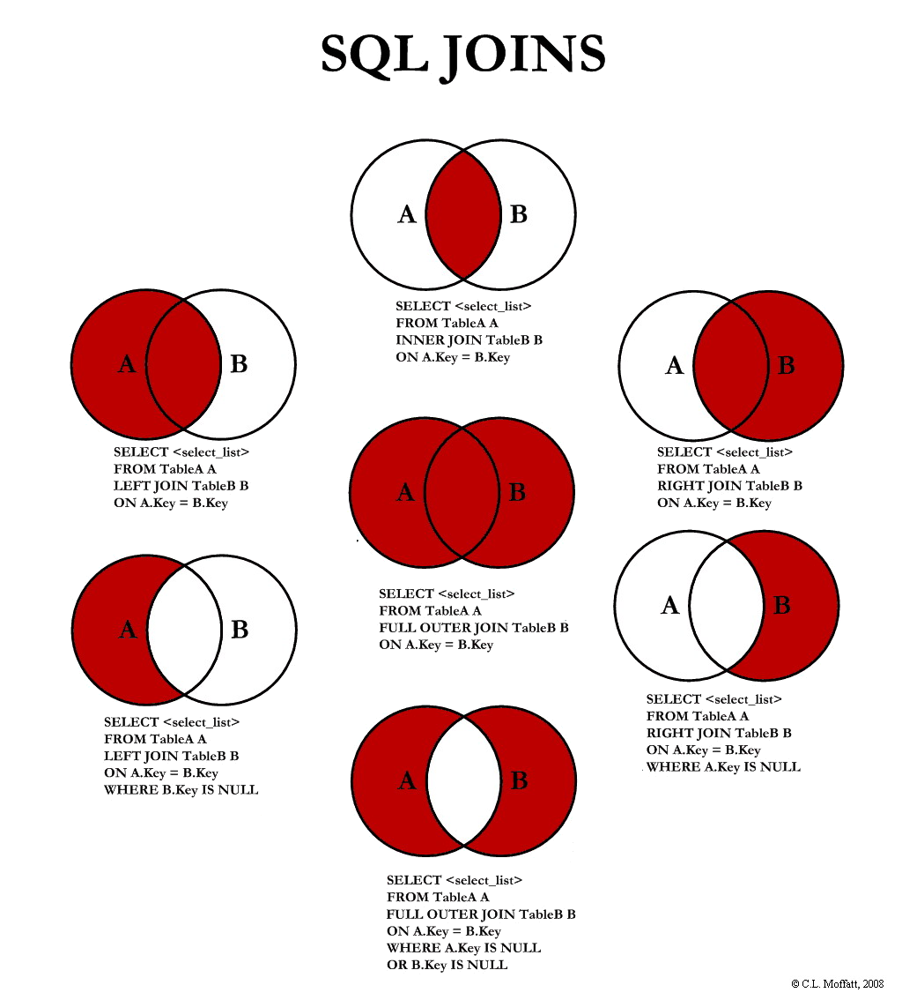

# Основы DML (Data Manipulation Language)

И вот ввновь мы изучаем главный язык реляционных баз данных а именно SQL. Сегодня мы рассмотрим начальные этапы программирования на данном языке, узнаем почему в данном языке принято использовать КАПС объявления команд и решим несколько не сложных задач, чтобы не скучать и не тонуть в монотонной теории.

## 1. Что такое SQL и как он работает?
**SQL (Structured Query Language)** - это декларативный язык программирования, предназначенный для работы с реляционными базами данных. 

**Как это работает:**
1. Вы отправляете SQL-запрос к СУБД (MySQL, PostgreSQL, etc)
2. СУБД анализирует запрос (парсинг)
3. Оптимизатор запросов определяет наиболее эффективный способ выполнения
4. СУБД выполняет запрос
5. Возвращает результат клиенту

```
Клиент → SQL-запрос → СУБД → Результат → Клиент
```

Итак алгоритм мы повторили а почему все же команды пишутся в верхнем регистре? ответ прост так исторически сварилось. Если быть точнее то виной всему то что раньше работали на терминалах которые попросту не поддерживали строчные буквы, после чего это стало правилом хорошего тона для улучшения читаемости создаваемых запросов.

Пример:
```sql
-- Так читается легче
SELECT name, age FROM users WHERE age > 18;

-- Чем так
select name, age from users where age > 18;
```

## 3. Основные команды DML
Так как на прошлом уроке мы разобрали что такое DML посмотрим более пристально что из себя представляет Data Manipulating Language. 

### 3.1. SELECT - получение данных

**Назначение:** Извлечение данных из одной или нескольких таблиц.

**Синтаксис:**
```sql
SELECT столбец1, столбец2, ...
FROM таблица
[WHERE условие]
[ORDER BY столбец [ASC|DESC]]
[LIMIT количество];
```

**Примеры:**
```sql
-- Получить все столбцы из таблицы employees
SELECT * FROM employees;

-- Получить конкретные столбцы
SELECT first_name, last_name, salary FROM employees;

-- Выборка с условием
SELECT * FROM employees WHERE department = 'IT';

-- Сортировка результатов
SELECT * FROM products ORDER BY price DESC;

-- Ограничение количества результатов
SELECT * FROM orders LIMIT 10;
```

### 3.2. SELECT с дополнительными операторами

**DISTINCT** - возвращает уникальные значения в столбце:
```sql
SELECT DISTINCT department FROM employees;
```

**WHERE с операторами сравнения:**
- `=` равно
- `!=` или `<>` не равно
- `>` больше
- `<` меньше
- `>=` больше или равно
- `<=` меньше или равно

```sql
SELECT * FROM products WHERE price > 100;
SELECT * FROM users WHERE age != 30;
```

**LIKE** - поиск по шаблону:
```sql
-- Найти всех пользователей с именем, начинающимся на 'J'
SELECT * FROM users WHERE name LIKE 'J%';

-- Найти email'ы в домене gmail.com
SELECT * FROM users WHERE email LIKE '%@gmail.com';
```

**BETWEEN** - совпадение значений в диапазоне:
```sql
SELECT * FROM products WHERE price BETWEEN 50 AND 100;
```

**IN** - проверка вхождения в список:
```sql
SELECT * FROM employees WHERE department IN ('IT', 'HR', 'Sales');
```

### 3.3. INSERT - добавление данных

**Назначение:** Добавление новых записей в таблицу.

**Синтаксис:**
```sql
INSERT INTO таблица (столбец1, столбец2, ...)
VALUES (значение1, значение2, ...);
```

**Примеры:**
```sql
-- Добавление одной записи
INSERT INTO users (username, email, age)
VALUES ('john_doe', 'john@example.com', 25);

-- Добавление нескольких записей
INSERT INTO products (name, price, category)
VALUES 
    ('Laptop', 999.99, 'Electronics'),
    ('Book', 19.99, 'Education'),
    ('Phone', 499.99, 'Electronics');
```

### 3.4. UPDATE - обновление данных

**Назначение:** Изменение существующих записей в таблице.

**Синтаксис:**
```sql
UPDATE таблица
SET столбец1 = значение1, столбец2 = значение2, ...
[WHERE условие];
```

**Примеры:**
```sql
-- Обновление всех записей (осторожно!)
UPDATE products SET price = price * 1.1; -- Увеличить все цены на 10%

-- Обновление с условием
UPDATE employees 
SET salary = salary * 1.05 
WHERE department = 'Engineering';

-- Обновление нескольких столбцов
UPDATE users 
SET last_login = NOW(), login_count = login_count + 1 
WHERE user_id = 123;
```

### 3.5. DELETE - удаление данных

**Назначение:** Удаление записей из таблицы.

**Синтаксис:**
```sql
DELETE FROM таблица
[WHERE условие];
```

**Примеры:**
```sql
-- Удаление всех записей (очень опасно!)
DELETE FROM temp_logs;

-- Удаление с условием
DELETE FROM orders 
WHERE status = 'cancelled' AND created_at < '2023-01-01';

-- Удаление одной записи
DELETE FROM users WHERE user_id = 456;
```

## 4. JOIN - объединение таблиц



**Основные типы JOIN:**
- `INNER JOIN` - только совпадающие записи из обеих таблиц
- `LEFT JOIN` - все записи из левой таблицы и совпадающие из правой
- `RIGHT JOIN` - все записи из правой таблицы и совпадающие из левой
- `FULL JOIN` - все записи из обеих таблиц

## 5. Лучшие практики и рекомендации

1. **Всегда используйте WHERE** в операциях UPDATE и DELETE
2. **Сначала тестируйте с SELECT** перед выполнением UPDATE/DELETE
3. **Используйте транзакции** для важных операций

**Пример транзакции**
```sql
START TRANSACTION;

-- Списание денег со счета отправителя
UPDATE accounts 
SET balance = balance - 1000 
WHERE account_id = 123 AND balance >= 1000;

-- Зачисление денег на счет получателя
UPDATE accounts 
SET balance = balance + 1000 
WHERE account_id = 456;

-- Если обе операции успешны - подтверждаем
COMMIT;

-- Если возникла ошибка - откатываем
-- ROLLBACK;
```

4. **Делайте резервные копии** перед массовыми изменениями
5. **Используйте понятные псевдонимы** для столбцов

## 6. Заключение

DML - важнейшая часть SQL, позволяющая взаимодействовать с данными в базе. Понимание и правильное использование команд SELECT, INSERT, UPDATE и DELETE является фундаментальным навыком для любого разработчика, работающего с базами данных.

Для эффективного обучения рекомендуется практиковаться на реальной или учебной базе данных, постепенно усложняя запросы и экспериментируя с различными операторами и условиями. Этим мы и займемся в нашей классной работе.