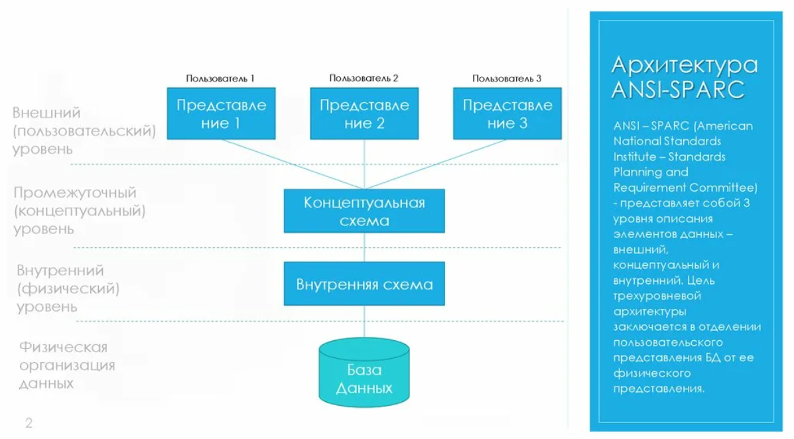

# Конспект: Логическая и физическая независимость данных

## Введение

**Независимость данных** — это фундаментальное свойство систем управления базами данных (СУБД), которое позволяет вносить изменения в организацию данных на одном уровне, не затрагивая другие уровни. Это ключевая концепция, обеспечивающая гибкость и долговечность информационных систем.



# Трехуровневая архитектура ANSI/SPARC

Для понимания независимости данных рассмотрим трехуровневую архитектуру:

### Уровень 1: Внутренний уровень (Physical Level)
- **Что это:** Физическое представление данных на носителе
- **Что включает:** Форматы хранения, структура файлов, индексы, методы доступа
- **Для кого:** Разработчики СУБД и администраторы баз данных

### Уровень 2: Концептуальный уровень (Conceptual Level)
- **Что это:** Логическая структура всей базы данных
- **Что включает:** Таблицы, связи, ограничения целостности
- **Для кого:** Администраторы баз данных и проектировщики

### Уровень 3: Внешний уровень (External Level)
- **Что это:** Представление данных для конкретных пользователей или приложений
- **Что включает:** Представления (views), виртуальные таблицы
- **Для кого:** Конечные пользователи и разработчики приложений

## Физическая независимость данных

**Физическая независимость** — это возможность изменять физическое хранение данных без необходимости изменения логической структуры или прикладных программ.

### Примеры физических изменений:
- Изменение метода хранения данных (файловая система → SSD)
- Добавление новых индексов для ускорения поиска
- Изменение организации файлов (переpartitioning)
- Переход на новый носитель данных
- Изменение стратегии кэширования

### Как достигается:
Через отображение концептуального уровня на внутренний. СУБД обеспечивает этот уровень абстракции.

**Пример:** 
```sql
-- Старая структура хранения
CREATE TABLE employees (
    id INT PRIMARY KEY,
    name VARCHAR(100),
    salary DECIMAL(10,2)
) STORAGE = HDD;

-- Новая структура хранения (после изменения)
CREATE TABLE employees (
    id INT PRIMARY KEY,
    name VARCHAR(100),
    salary DECIMAL(10,2)
) STORAGE = SSD, COMPRESSION = ZLIB;
```
*При таком изменении запросы приложений остаются неизменными*

## Логическая независимость данных

**Логическая независимость** — это возможность изменять концептуальную схему базы данных без необходимости изменения внешних представлений или прикладных программ.

### Примеры логических изменений:
- Добавление новых таблиц в базу данных
- Добавление новых атрибутов в существующие таблицы
- Изменение связей между таблицами
- Создание новых представлений (views)
- Реорганизация структуры таблиц

### Как достигается:
Через отображение внешнего уровня на концептуальный уровень.

**Пример:**
```sql
-- Исходная структура
CREATE TABLE customers (
    customer_id INT PRIMARY KEY,
    first_name VARCHAR(50),
    last_name VARCHAR(50),
    email VARCHAR(100)
);

-- Приложение использует представление:
CREATE VIEW customer_names AS
SELECT first_name, last_name FROM customers;

-- После изменения структуры (добавили поле middle_name)
ALTER TABLE customers ADD COLUMN middle_name VARCHAR(50);

-- Представление и запросы приложения продолжают работать без изменений
SELECT * FROM customer_names; -- Работает как и раньше
```

## Практическое значение независимости данных

### Преимущества для разработчиков:
- **Сокращение времени разработки:** Не нужно переписывать код при изменениях в БД
- **Упрощение сопровождения:** Изменения вносятся централизованно
- **Повышение надежности:** Меньше точек отказа при изменениях

## Инструменты и методы обеспечения независимости

### Методы обеспечения физической независимости:
- Использование табличных пространств (tablespaces)
- Партиционирование таблиц
- Использование синонимов (synonyms)
- Реализация абстракции хранилища через СУБД

### Методы обеспечения логической независимости:
- Представления (views) вместо прямого доступа к таблицам
- Хранимые процедуры и функции
- Абстракция доступа через ORM (Object-Relational Mapping)
- Версионирование схемы базы данных

### Современные подходы:
- **Миграции базы данных:** Систематическое управление изменениями схемы
- **API-ориентированная архитектура:** Предоставление данных через API, а не прямые запросы
- **Контейнеризация:** Изоляция изменений через контейнеры

## Заключение

Логическая и физическая независимость данных — это не просто теоретические концепции, а практические инструменты, которые позволяют создавать гибкие, масштабируемые и долговечные информационные системы. Понимание и правильное применение этих принципов является ключевым навыком для разработчиков и администраторов баз данных.

**Ключевые выводы:**
- Физическая независимость защищает от изменений в хранении данных
- Логическая независимость защищает от изменений в структуре данных
- Представления — мощный инструмент обеспечения независимости
- Правильная архитектура БД снижает cost of change на протяжении всего жизненного цикла системы


## Проверочные вопросы

1. **Объясните разницу** между логической и физической независимостью данных на конкретном примере.
2. **Какие преимущества** дает независимость данных при разработке крупных информационных систем?
3. **Опишите сценарий**, когда физическая независимость позволила бы улучшить производительность системы без изменения кода приложений.
4. **Как представления (views)** помогают обеспечить логическую независимость?
5. **Какие риски** могут возникнуть при неправильной реализации принципов независимости данных?