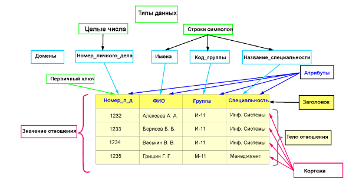
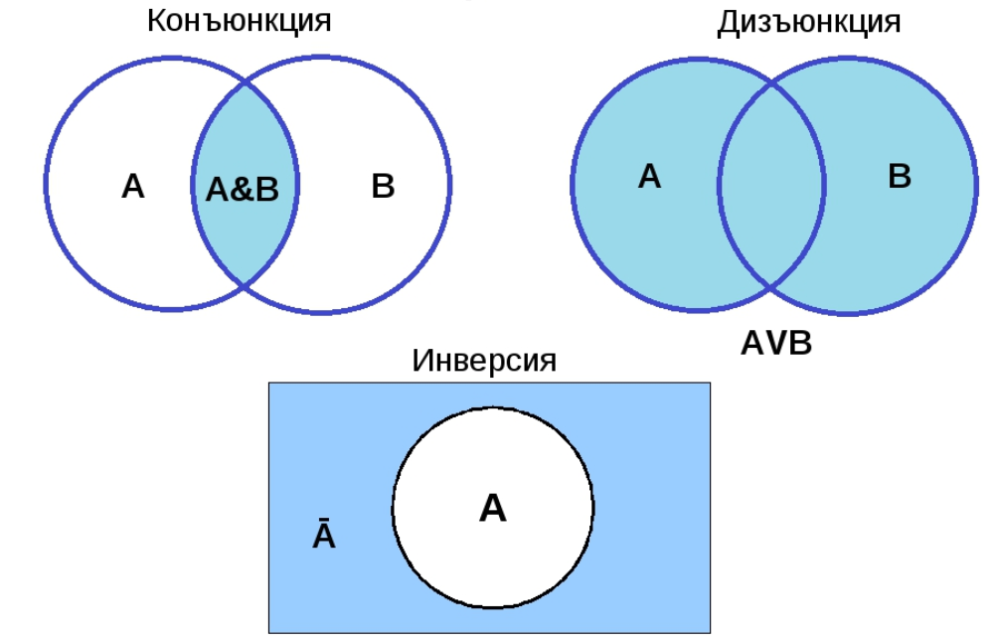

# Раздел 2. Взаимосвязи в моделях и реляционный подход к построению моделей  

## Часть 1: Введение в реляционную алгебру  

Перед тем как заниматься математикой давайте разберем некоторые смысловые моменты работы, то есть с чем работает и как. Допустим, что вы работаете в интернет-магазине. У вас есть:

- Таблица `Клиенты` — кто купил что.
- Таблица `Товары` — что есть в наличии.
- Таблица `Заказы` — кто что заказал и когда.

Вам нужно ответить на вопросы:

- Какие клиенты купили телефон за последние 3 месяца?
- Какие товары НЕ покупались вообще?
- Какие клиенты из Москвы сделали больше 5 заказов?

Из нашего введения в SQL мы знаем что это все делается посредством взаимодействия с базой данных (БД), то есть мы понимаем что у нас **реляционная модель данных**. И если мы хотим получить какой-то ответ, то надо руководствоваться и некоторой алгеброй, которая в нашем случае называется **реляционная алгебра**. Под **реляционной алгеброй** понимают математический фундамент, на котором построены все современные СУБД (системы управления базами данных), включая MySQL, PostgreSQL, SQLite и другие.

Ключевой мыслью является факт того, что реляционная алгебра — это набор некоторых операций над таблицами (отношениями), которые позволяют получать новые таблицы на основе существующих.

---

## Что такое реляционная модель?

Давайте вспомним что подразумевается под реляционной базой данных или же что такое реляционная модель. Перед этим ознакомимся с более строгими понятиями относящимися к нашей структуре.

- **Отношение (Relation)** — это **таблица**.  
  Например: `Студенты(Имя, Группа, Средний_балл)`

- **Кортеж (Tuple)** — это **строка** в таблице.  
  Например: `("Иванов", "ИС-21", 4.7)`

- **Атрибут (Attribute)** — это **столбец** (или поле).  
  Например: `Имя`, `Группа`, `Средний_балл`

- **Домен (Domain)** — множество допустимых значений для атрибута.  
  Например: `Группа ∈ {"ИС-21", "ПК-22", "ЭК-23"}`



**Пример изображения**

**Fun Fact**
Слово *relation* в английском означает **отношение** или **связь**. 

Модель называется реляционной, потому что:

- Данные представлены в виде **отношений (таблиц)**.
- Между таблицами существуют **взаимосвязи** (например, студент → группа → факультет).
- Все операции работают с **целыми таблицами**, а не с отдельными записями.

> Эдгар Кодд (Edgar F. Codd) — отец реляционной модели. В 1970 году опубликовал статью, положившую начало революции в базах данных.

---

## Что такое реляционная алгебра?

**Реляционная алгебра — это формальная система, состоящая из:**

- Множества **отношений** (таблиц).
- Набора **операторов**, которые принимают одно или два отношения и возвращают новое отношение.

Главная цель: **получать ответы на запросы, комбинируя и фильтруя данные с помощью операций.**

Она **процедурна** — вы описываете *как* получить результат, шаг за шагом. В качестве примера можно рассмотреть конструктор LEGO из него мы можем посредством простых кирпичиков (операций) строить сложные структуры (запросы).

---

## Основные операции реляционной алгебры

Поначалу мы ознакомились с некоторыми из них на практике, чтож сегодня мы попробуем ознакомится с ними более формально и узнаем пару новых! Всего операций немного — около 8 базовых. Мы рассмотрим 6 самых важных.

---

### Операции выбора (Selection) — σ (сигма)

> **Выбирает строки, удовлетворяющие условию.**

**Синтаксис:**  
`σ<условие>(Отношение)`

**Пример:**  
Дана таблица `Студенты`:

| Имя     | Группа | Средний_балл |
|---------|--------|--------------|
| Иванов  | ИС-21  | 4.7          |
| Петров  | ПК-22  | 3.9          |
| Сидорова| ИС-21  | 4.8          |

Запрос: *Найти всех студентов со средним баллом > 4.5*

```text
σ Средний_балл > 4.5 (Студенты)
```

**Результат:**

| Имя     | Группа | Средний_балл |
|---------|--------|--------------|
| Иванов  | ИС-21  | 4.7          |
| Сидорова| ИС-21  | 4.8          |

---

### Операция проекции (Projection) — π (пи)

> **Выбирает только указанные столбцы (атрибуты).**

**Синтаксис:**  
`π<список_атрибутов>(Отношение)`

**Пример:**  
Из той же таблицы `Студенты` выбрать только имена и группы.

```text
π Имя, Группа (Студенты)
```

**Результат:**

| Имя     | Группа |
|---------|--------|
| Иванов  | ИС-21  |
| Петров  | ПК-22  |
| Сидорова| ИС-21  |

> **Важно!** Проекция может удалять дубликаты. Если два студента из одной группы (то есть поля совпадают) — в результате будет одна запись (если других атрибутов нет).

---

### Операция объединения (Union) — ∪

> **Объединяет две таблицы с ОДИНАКОВОЙ структурой (одинаковые атрибуты). Удаляет дубликаты.**

**Синтаксис:**  
`R ∪ S`

**Пример:**  
Таблица `Студенты_ИС`:

| Имя     | Группа |
|---------|--------|
| Иванов  | ИС-21  |
| Сидорова| ИС-21  |

Таблица `Студенты_ПК`:

| Имя     | Группа |
|---------|--------|
| Петров  | ПК-22  |
| Иванов  | ИС-21  | ← дубликат

```text
Студенты_ИС ∪ Студенты_ПК
```

**Результат:**

| Имя     | Группа |
|---------|--------|
| Иванов  | ИС-21  |
| Сидорова| ИС-21  |
| Петров  | ПК-22  |



**Пример на диаграмме Эйлера-Венна**

---

### Операция разности (Difference) — −

> **Возвращает строки, которые есть в первой таблице, но отсутствуют во второй.**

**Синтаксис:**  
`R − S`

**Пример:**  
`Студенты_ИС − Студенты_ПК`

→ Вернёт только Сидорову (Иванов есть в обеих таблицах — он исключается).

**Результат:**

| Имя     | Группа |
|---------|--------|
| Сидорова| ИС-21  |

---

### Декартово произведение (Cartesian Product) — ×

> **Каждая строка первой таблицы соединяется с каждой строкой второй.**

**Синтаксис:**  
`R × S`

**Пример:**  
Таблица `Студенты` (2 строки) × Таблица `Предметы` (2 строки) → 4 строк.

`Студенты`:

| Имя     |
|---------|
| Иванов  |
| Петров  |

`Предметы`:

| Название     |
|--------------|
| Математика   |
| Информатика  |

```text
Студенты × Предметы
```

**Результат:**

| Имя     | Название     |
|---------|--------------|
| Иванов  | Математика   |
| Иванов  | Информатика  |
| Петров  | Математика   |
| Петров  | Информатика  |

> Здесь надо понимать, что это очень "дорогая" операция — быстро растёт размер результата. Обычно используется как промежуточный шаг перед фильтрацией.

---

### Операция переименования (Rename) — ρ (ро)

> **Переименовывает атрибут или всё отношение.**

**Синтаксис:**  
`ρ<новое_имя>/<старое_имя>(Отношение)`  
или  
`ρ<новое_имя>(Отношение)`

**Пример:**  
Переименуем атрибут `Имя` в `ФИО`:

```text
ρ ФИО/Имя (Студенты)
```

Или переименуем всю таблицу для удобства:

```text
ρ Лучшие_студенты (σ Средний_балл > 4.5 (Студенты))
```

---

## Комбинирование операций — пример запроса

> Давайте решим практическую задачу.

**Задача:**  
*Найти имена студентов из группы ИС-21, у которых средний балл выше 4.5.*

**Шаги:**

1. Выбрать студентов из ИС-21:  
   `σ Группа = 'ИС-21' (Студенты)`

2. Из них выбрать тех, у кого балл > 4.5:  
   `σ Средний_балл > 4.5 ( ... )`

3. Взять только имена:  
   `π Имя ( ... )`

**Полная запись:**

```text
π Имя (
    σ Средний_балл > 4.5 (
        σ Группа = 'ИС-21' (Студенты)
    )
)
```

**Результат:**

| Имя     |
|---------|
| Иванов  |
| Сидорова|

> Это эквивалентно SQL-запросу:
> ```sql
> SELECT Имя FROM Студенты
> WHERE Группа = 'ИС-21' AND Средний_балл > 4.5;
> ```

---
## Дополнительные материалы

- Подробно можно ознакомиться с объяснениями в сети [тут](https://habr.com/ru/articles/145381/).
- В качестве онлайн тренажера вы можете попробовать данный [сайт](https://relax.mad.uom.gr).
