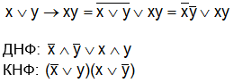
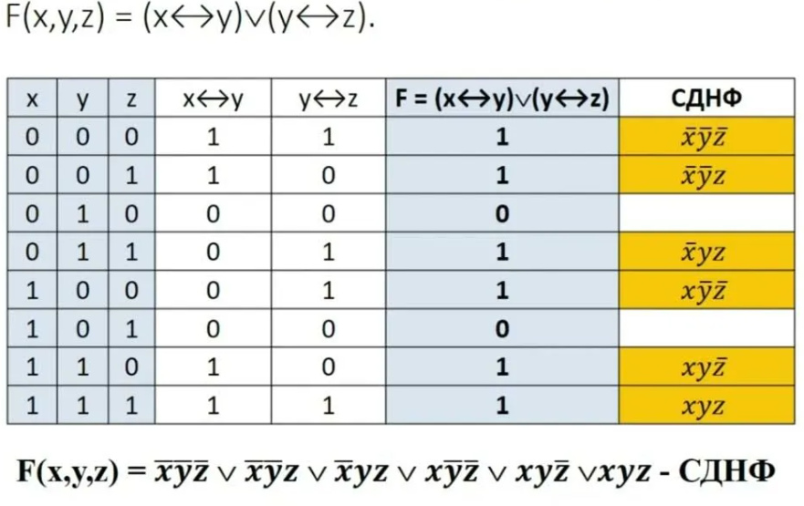
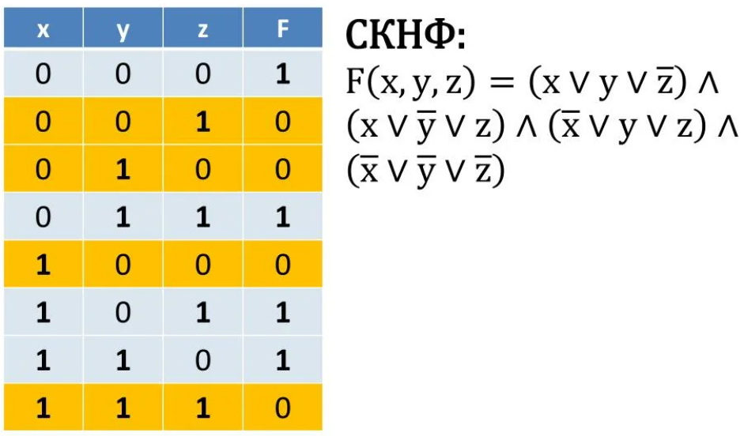

# **Булевы функции. ДНФ и КНФ.**

### **Понятие булевой функции**

В основе цифровой электроники и логики программирования лежит простейший кирпичик — **булева функция**.

**Определение:** Булева функция — это функция, аргументы которой ($x_1, x_2, ..., x_n$) и сама функция могут принимать только два значения: **0** ("ложь") или **1** ("истина").

*   **Обозначение:** $f(x_1, x_2, ..., x_n)$
*   **Примеры из жизни:** Условие "Если на улице дождь ИЛИ я забыл зонт, то я промокну" можно представить как булеву функцию.

**Мощность:** Количество различных булевых функций от `n` переменных растет не просто быстро, а сверхбыстро. Оно равно $2^{2^n}$.
*   **n = 1 (одна переменная):** $2^{2^1} = 4$ функции.
    *   Константа 0, Константа 1, Тождественная функция ($f(x)=x$), Отрицание ($f(x)=\neg x$).
*   **n = 2 (две переменные):** $2^{2^2} = 16$ функций.
    *   Это все знакомые операции: Конъюнкция (И, $\land$), Дизъюнкция (ИЛИ, $\lor$), Сложение по модулю 2 (XOR, $\oplus$), Импликация ($\rightarrow$) и другие.

---

### **Способы задания: таблица истинности**

Самый наглядный способ задания булевой функции — **таблица истинности**. В ней перечислены все возможные наборы значений аргументов и соответствующие им значения функции.

**Пример:** Построим таблицу истинности для функции импликации $f(x_1, x_2) = x_1 \rightarrow x_2$ ("если $x_1$, то $x_2$").

| $x_1$ | $x_2$ | $x_1 \rightarrow x_2$ |
|:-----:|:-----:|:---------------------:|
| 0 | 0 | 1 |
| 0 | 1 | 1 |
| 1 | 0 | 0 |
| 1 | 1 | 1 |

> **Замечание:** Импликация ложна **только тогда**, когда условие истинно ($x_1=1$), а следствие ложно ($x_2=0$). Во всех остальных случаях она истинна.

---

### **Нормальные формы: ДНФ и КНФ**

Чтобы унифицировать работу с функциями (для алгоритмов, схемотехники), их приводят к стандартному виду — **нормальной форме**.

#### **Дизъюнктивная нормальная форма (ДНФ)**

**ДНФ** — это логическое ИЛИ (`OR`) одного или нескольких **конъюнктов** (логических И `AND`).

*   **Конъюнкт** — это конъюнкция переменных или их отрицаний.
    *   *Примеры конъюнктов:* $x_1$, $\neg x_1 \land x_2$, $x_1 \land \neg x_2 \land x_3$.
*   **Общий вид ДНФ:** $K_1 \lor K_2 \lor ... \lor K_m$
*   **Пример ДНФ:** $f(x_1, x_2) = (x_1 \land \neg x_2) \lor (\neg x_1 \land x_2)$ (функция XOR).

#### **Конъюнктивная нормальная форма (КНФ)**

**КНФ** — это логическое И (`AND`) одного или нескольких **дизъюнктов** (логических ИЛИ `OR`).

*   **Дизъюнкт** — это дизъюнкция переменных или их отрицаний.
    *   *Примеры дизъюнктов:* $x_1$, $\neg x_1 \lor x_2$, $x_1 \lor \neg x_2 \lor x_3$.
*   **Общий вид КНФ:** $D_1 \land D_2 \land ... \land D_m$
*   **Пример КНФ:** $f(x_1, x_2) = (x_1 \lor x_2) \land (\neg x_1 \lor \neg x_2)$

> **Важно!** Одна и та же функция может быть представлена разными ДНФ и КНФ. Задача минимизации — найти самую короткую из них, чтобы упростить логическую схему.

*Пример получения ДНФ и КНФ из логического выражения*
---

### **Совершенные нормальные формы (СДНФ и СКНФ)**

Это частный, но очень важный случай ДНФ и КНФ. Они **единственны** для каждой функции.

#### **Совершенная ДНФ (СДНФ)**

**СДНФ** — это ДНФ, у которой в каждый конъюнкт входят **все переменные** функции (либо сами, либо с отрицанием).

**Алгоритм построения СДНФ по таблице истинности:**
1.  Выбрать **все строки**, где функция равна **1**.
2.  Для каждой такой строки составить **конъюнкт**:
    *   Если переменная в наборе = **1**, пишем её **саму**.
    *   Если переменная в наборе = **0**, пишем её **отрицание**.
3.  Соединить все полученные конъюнкты знаком **дизъюнкции** ($\lor$).

**Пример:** Построим СДНФ для импликации $f = x_1 \rightarrow x_2$.

| $x_1$ | $x_2$ | $f$ | Соответствующий конъюнкт |
|:-----:|:-----:|:---:|:------------------------:|
| 0 | 0 | 1 | $\neg x_1 \land \neg x_2$ |
| 0 | 1 | 1 | $\neg x_1 \land x_2$ |
| 1 | 0 | 0 | — |
| 1 | 1 | 1 | $x_1 \land x_2$ |

**СДНФ:** $f(x_1, x_2) = (\neg x_1 \land \neg x_2) \lor (\neg x_1 \land x_2) \lor (x_1 \land x_2)$

*Пример СДНФ для функции*

#### **Совершенная КНФ (СКНФ)**

**СКНФ** — это КНФ, у которой в каждый дизъюнкт входят **все переменные** функции.

**Алгоритм построения СКНФ по таблице истинности:**
1.  Выбрать **все строки**, где функция равна **0**.
2.  Для каждой такой строки составить **дизъюнкт**:
    *   Если переменная в наборе = **0**, пишем её **саму**.
    *   Если переменная в наборе = **1**, пишем её **отрицание**.
3.  Соединить все полученные дизъюнкты знаком **конъюнкции** ($\land$).

**Пример:** Построим СКНФ для импликации $f = x_1 \rightarrow x_2$.

| $x_1$ | $x_2$ | $f$ | Соответствующий дизъюнкт |
|:-----:|:-----:|:---:|:------------------------:|
| 0 | 0 | 1 | — |
| 0 | 1 | 1 | — |
| 1 | 0 | 0 | $\neg x_1 \lor x_2$ |
| 1 | 1 | 1 | — |

**СКНФ:** $f(x_1, x_2) = \neg x_1 \lor x_2$
> *В данном случае СКНФ совпала с самой импликацией, так как для нее существует очень простая форма.*

*Пример СКНФ*

**Сравнительная таблица СДНФ и СКНФ:**

| Критерий | СДНФ | СКНФ |
| :--- | :--- | :--- |
| **Строится на...** | Наборах, где **f = 1** | Наборах, где **f = 0** |
| **Элементы** | Конъюнкты | Дизъюнкты |
| **Связка** | Дизъюнкция ($\lor$) | Конъюнкция ($\land$) |
| **Уникальность** | Да, для данной функции | Да, для данной функции |

---

### **5. Практическое применение и минимизация**

*   **Применение:** Любая логическая схема в процессоре вашего компьютера — это реализация набора булевых функций. ДНФ и КНФ — это "инструкции" для создания таких схем на базе логических элементов (И, ИЛИ, НЕ).
*   **Минимизация:** СДНФ и СКНФ часто являются избыточными. Например, СДНФ для импликации может быть упрощена до $f = \neg x_1 \lor x_2$. **Минимизация** (например, методом Карно или Квайна) позволяет находить такие короткие выражения, что напрямую ведет к удешевлению и упрощению электронных схем.