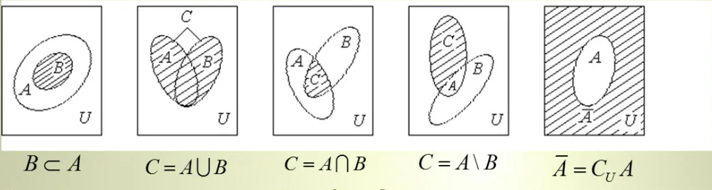

# **Общие понятия теории множеств. Основные операции над множествами**

Сегодня познакомимся с теорией множеств и разберем в чем ее особенности и как работать с базовыми терминами в данном направлении. Данный материал должен помочь вам понять, что представляет из себя множество и также понять зачем оно вам нужно в данном разделе.

---

## **Часть 1. Основные понятия теории множеств**

### **1.1. Понятие множества**

**Определение:** **Множество** — это совокупность определенных различаемых объектов, рассматриваемая как единое целое. Эти объекты называются **элементами** множества.

**Примеры множеств:**
- Множество студентов в этой аудитории
- Множество натуральных чисел $\mathbb{N} = \{1, 2, 3, ...\}$
- Множество гласных букв русского алфавита $\{а, е, ё, и, о, у, ы, э, ю, я\}$

**Обозначения:**
- Множества обозначаются заглавными латинскими буквами: $A, B, C, ...$
- Элементы множества обозначаются строчными буквами: $a, b, c, ...$
- Принадлежность элемента множеству: $a \in A$ (элемент a принадлежит множеству A)
- Непринадлежность: $a \notin A$ (элемент a не принадлежит множеству A)

### **1.2. Способы задания множеств**

**1. Перечисление элементов:** Множество задается списком всех его элементов в фигурных скобках.

**Примеры:**
- $A = \{2, 4, 6, 8\}$ — множество четных чисел от 2 до 8
- $B = \{a, b, c, d\}$ — множество первых четырех букв латинского алфавита

**2. Описанием характеристического свойства:** Указывается свойство, которым обладают все элементы множества.

**Примеры:**
- $C = \{x | x — простое число\}$ — множество простых чисел
- $D = \{x | x^2 < 9\}$ — множество чисел, квадрат которых меньше 9

**3. С помощью порождающей процедуры:** Описывается правило построения элементов множества.

**Пример:**
- $E = \{2n | n \in \mathbb{N}\}$ — множество четных натуральных чисел

### **1.3. Виды множеств**

**Конечные и бесконечные множества:**
- **Конечное** — содержит конечное число элементов ($A = \{1, 2, 3\}$)
- **Бесконечное** — содержит бесконечное число элементов ($\mathbb{N} = \{1, 2, 3, ...\}$)

**Пустое множество:** Множество, не содержащее ни одного элемента. Обозначается $\varnothing$ или $\{\}$.

**Равные множества:** Два множества равны, если они содержат одни и те же элементы.
$A = B$ означает, что $\forall x (x \in A \Leftrightarrow x \in B)$

**Подмножество:** Множество $A$ называется подмножеством множества $B$, если каждый элемент $A$ является элементом $B$.
Обозначение: $A \subseteq B$

**Собственное подмножество:** $A \subset B$ означает, что $A \subseteq B$ и $A \neq B$

**Универсальное множество ($U$):** Множество, содержащее все элементы, рассматриваемые в данной задаче или теории.

---

## **Часть 2. Основные операции над множествами**

### **2.1. Объединение множеств**

**Определение:** **Объединением** множеств $A$ и $B$ называется множество, содержащее все элементы, которые принадлежат хотя бы одному из множеств $A$ или $B$.

**Обозначение:** $A \cup B = \{x | x \in A \lor x \in B\}$

**Пример:**
Если $A = \{1, 2, 3\}$, $B = \{2, 3, 4\}$, то $A \cup B = \{1, 2, 3, 4\}$

### **2.2. Пересечение множеств**

**Определение:** **Пересечением** множеств $A$ и $B$ называется множество, содержащее все элементы, которые принадлежат одновременно и $A$, и $B$.

**Обозначение:** $A \cap B = \{x | x \in A \land x \in B\}$

**Пример:**
Если $A = \{1, 2, 3\}$, $B = \{2, 3, 4\}$, то $A \cap B = \{2, 3\}$

**Непересекающиеся множества:** Если $A \cap B = \varnothing$, то множества не пересекаются.

### **2.3. Разность множеств**

**Определение:** **Разностью** множеств $A$ и $B$ называется множество, содержащее все элементы, которые принадлежат $A$, но не принадлежат $B$.

**Обозначение:** $A \setminus B = \{x | x \in A \land x \notin B\}$

**Пример:**
Если $A = \{1, 2, 3\}$, $B = \{2, 3, 4\}$, то $A \setminus B = \{1\}$

### **2.4. Дополнение множества**

**Определение:** **Дополнением** множества $A$ до универсального множества $U$ называется множество всех элементов из $U$, не принадлежащих $A$.

**Обозначение:** $\overline{A} = U \setminus A = \{x | x \in U \land x \notin A\}$

**Пример:**
Если $U = \{1, 2, 3, 4, 5\}$, $A = \{2, 3\}$, то $\overline{A} = \{1, 4, 5\}$

### **2.5. Симметрическая разность**

**Определение:** **Симметрической разностью** множеств $A$ и $B$ называется множество, содержащее все элементы, которые принадлежат только $A$ или только $B$.

**Обозначение:** $A \triangle B = (A \setminus B) \cup (B \setminus A)$

**Пример:**
Если $A = \{1, 2, 3\}$, $B = \{2, 3, 4\}$, то $A \triangle B = \{1, 4\}$

---

## **Часть 3. Свойства операций над множествами**

### **3.1. Основные законы теории множеств**

1. **Коммутативность:**
   - $A \cup B = B \cup A$
   - $A \cap B = B \cap A$

2. **Ассоциативность:**
   - $(A \cup B) \cup C = A \cup (B \cup C)$
   - $(A \cap B) \cap C = A \cap (B \cap C)$

3. **Дистрибутивность:**
   - $A \cup (B \cap C) = (A \cup B) \cap (A \cup C)$
   - $A \cap (B \cup C) = (A \cap B) \cup (A \cap C)$

4. **Законы де Моргана:**
   - $\overline{A \cup B} = \overline{A} \cap \overline{B}$
   - $\overline{A \cap B} = \overline{A} \cup \overline{B}$

5. **Законы идемпотентности:**
   - $A \cup A = A$
   - $A \cap A = A$

6. **Свойства пустого и универсального множеств:**
   - $A \cup \varnothing = A$
   - $A \cap U = A$
   - $A \cup U = U$
   - $A \cap \varnothing = \varnothing$

### **3.2. Диаграммы Эйлера-Венна**

**Диаграммы Эйлера-Венна** — графический способ представления множеств и операций над ними.

- Универсальное множество $U$ изображается прямоугольником.
- Множества $A, B, C$ изображаются кругами внутри прямоугольника.
- Операции выделяются штриховкой или цветом.

---

## **Практическая работа №4**

**Задание 1.** Даны множества: $A = \{2, 4, 6, 8, 10\}$, $B = \{1, 2, 3, 4, 5\}$, $C = \{3, 6, 9\}$

Найдите:
1. $A \cup B$
2. $A \cap B$
3. $A \setminus B$
4. $B \setminus A$
5. $A \triangle B$
6. $(A \cap B) \cup C$

**Задание 2.** Пусть $U = \{1, 2, 3, 4, 5, 6, 7, 8, 9, 10\}$ — универсальное множество,
$A = \{2, 4, 6, 8, 10\}$, $B = \{1, 3, 5, 7, 9\}$

Найдите:
1. $\overline{A}$
2. $\overline{B}$
3. $\overline{A \cup B}$
4. $\overline{A} \cap \overline{B}$
5. Проверьте выполнение закона де Моргана для $\overline{A \cup B}$

**Задание 3.** Изобразите на диаграммах Эйлера-Венна:
1. $A \cap (B \cup C)$
2. $(A \cap B) \cup (A \cap C)$
3. Сравните результаты и сделайте вывод о дистрибутивности пересечения относительно объединения.

**Задание 4.** Докажите тождество: $A \setminus (B \cup C) = (A \setminus B) \cap (A \setminus C)$

**Задание 5.** В группе из 30 студентов:
- 20 изучают английский язык
- 15 изучают немецкий язык
- 5 изучают оба языка

Сколько студентов:
1. Изучают только английский?
2. Изучают только немецкий?
3. Не изучают ни один из этих языков?