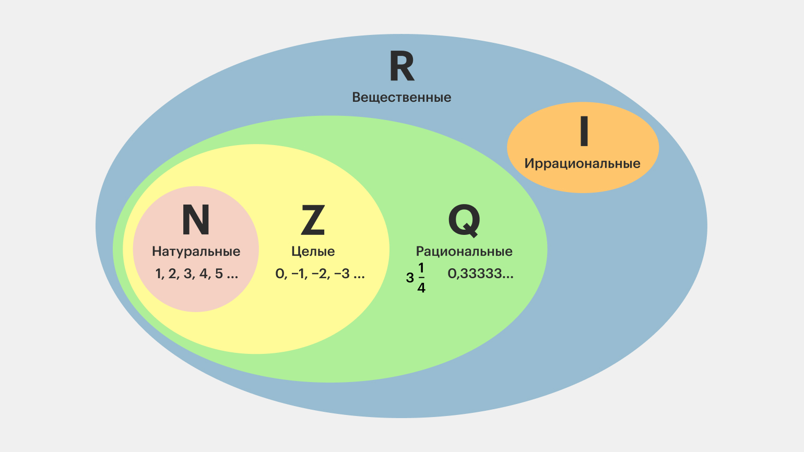
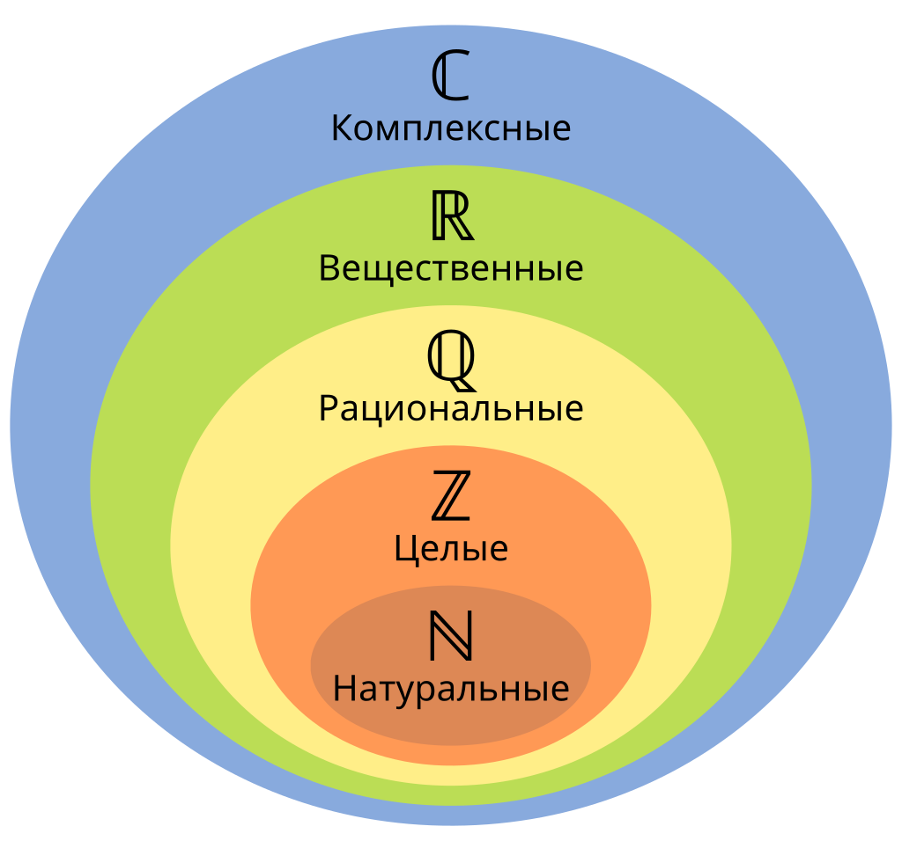
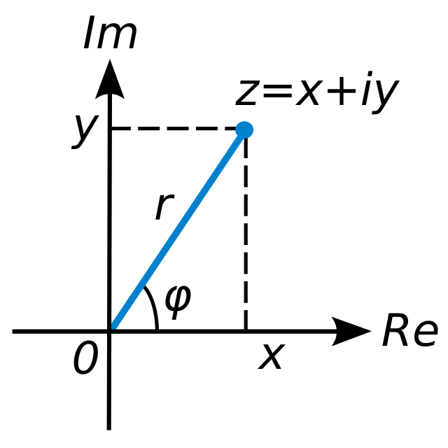

# Раздел 1. Основы теории комплексных чисел

## Определение комплексного числа

Как вы узнали из прошлых курсов, существует множество типов чисел: **натуральные**, **целые**, **рациональные**, **иррациональные** и **вещественные**. На этом уроке вы познакомитесь с новым типом — **комплексными числами**.

**Рассмотрим пример:** решим уравнение $x^2 - 4 = 0$

**Решение**
1.  $x^2 - 4 = 0$
2.  $x^2 = 4$
3.  $x = \pm 2$

Мы получили два ответа — числа $2$ и $-2$ (оба целые). А что, если нам надо решить уравнение $x^2 + 4 = 0$? Оно сложнее, ведь нужно извлечь квадратный корень из отрицательного числа. Для решения таких задач и существуют **комплексные числа**!

**Комплексным числом** называют число вида $z = x + yi$, где:
-   $x$ и $y$ — вещественные числа,
-   $i$ — **мнимая единица**, для которой выполняется равенство: $i^2 = -1$.

Теперь мы можем решить изначальное уравнение:
1.  $x^2 + 4 = 0$
2.  $x^2 = -4$
3.  $x = \pm 2i$

Обновим нашу схему, добавив комплексные числа

## Формы записи комплексных чисел

Комплексные числа имеют несколько форм записи. Каждая удобна для своих операций.

### **Алгебраическая форма**
Имеет вид $z = a + bi$.
-   $a$ — **действительная часть** ($Re\ z$),
-   $b$ — **мнимая часть** ($Im\ z$).
**Удобна** для сложения, вычитания и отображения на комплексной плоскости.

### **Тригонометрическая форма**
Имеет вид $z = r \cdot (\cos \varphi + i \sin \varphi)$, где:
-   $r = |z| = \sqrt{a^2 + b^2}$ — **модуль** числа (расстояние от начала координат до точки на плоскости),
-   $\varphi = \arctan \frac{b}{a}$ — **аргумент** числа (угол отклонения от действительной оси).
**Удобна** для умножения, деления, возведения в степень и извлечения корня.

### **Показательная форма**
Является следствием формулы Эйлера $e^{i\varphi} = \cos \varphi + i \sin \varphi$.
Имеет вид $z = r \cdot e^{i\varphi}$.
**Удобна** для тех же операций, что и тригонометрическая форма, но запись более компактна.

## Геометрическое изображение

Комплексное число $z = x + iy$ удобно представлять как точку на плоскости (**комплексная плоскость**), где:
-   Ось **OX** (**действительная ось**) отвечает за действительную часть $x$,
-   Ось **OY** (**мнимая ось**) отвечает за мнимую часть $y$.

-   **Модуль** $r = |z| = \sqrt{x^2 + y^2}$ — это длина радиус-вектора точки.
-   **Аргумент** $\varphi$ — угол между положительным направлением действительной оси и радиус-вектором. Находится по формуле: $\varphi = \arctan \frac{y}{x}$ (с учётом квадранта).

## 4. Арифметические операции

### **Сложение и вычитание**
Производятся покомпонентно в **алгебраической форме**.
$(a + bi) \pm (c + di) = (a \pm c) + (b \pm d)i$

**Геометрически:** соответствует сложению или вычитанию векторов.

### **Умножение**
Удобнее производить в **алгебраической** или **тригонометрической/показательной форме**.

**В алгебраической форме:**
$(a + bi) \cdot (c + di) = a \cdot c + a \cdot di + bi \cdot c + bi \cdot di = (ac - bd) + (ad + bc)i$
(так как $i^2 = -1$).

**В тригонометрической форме:**
$z_1 \cdot z_2 = r_1 (\cos \varphi_1 + i \sin \varphi_1) \cdot r_2 (\cos \varphi_2 + i \sin \varphi_2) = r_1 r_2 [\cos (\varphi_1 + \varphi_2) + i \sin (\varphi_1 + \varphi_2)]$
**При умножении модули перемножаются, а аргументы складываются.**

**В показательной форме:**
$z_1 \cdot z_2 = r_1 e^{i\varphi_1} \cdot r_2 e^{i\varphi_2} = (r_1 r_2) e^{i(\varphi_1 + \varphi_2)}$

### **Комплексно-сопряжённое число**
Для числа $z = a + bi$ **комплексно-сопряжённым** называется число $\overline{z} = a - bi$.
-   Числа $z$ и $\overline{z}$ симметричны относительно действительной оси.
-   Их произведение всегда является вещественным числом: $z \cdot \overline{z} = (a + bi)(a - bi) = a^2 + b^2 = |z|^2$.

### **Деление**
Деление — это операция, обратная умножению. Удобнее выполнять с помощью **комплексно-сопряжённого** числа или в **тригонометрической форме**.

**В алгебраической форме:**
Чтобы избавиться от мнимой части в знаменателе, домножают числитель и знаменатель на сопряжённое знаменателю число.
$\frac{a + bi}{c + di} = \frac{(a + bi)(c - di)}{(c + di)(c - di)} = \frac{(ac + bd) + (bc - ad)i}{c^2 + d^2}$

**В тригонометрической форме:**
$\frac{z_1}{z_2} = \frac{r_1}{r_2} [\cos (\varphi_1 - \varphi_2) + i \sin (\varphi_1 - \varphi_2)]$
**При делении модули делятся, а аргументы вычитаются.**

**В показательной форме:**
$\frac{z_1}{z_2} = \frac{r_1 e^{i\varphi_1}}{r_2 e^{i\varphi_2}} = \frac{r_1}{r_2} e^{i(\varphi_1 - \varphi_2)}$

---

## Для чего нужны комплексные числа
Применяемость данных чисел не ограничивается только научной сферой, хотя в этой области они наиболее востребованы (это и описание волн или колебаний в системах, квантовая механика и многие другие сферы), но и более применяемыми сферами,например, компьютерной графике и робототехнике, где они предоставляют элегантный и эффективный инструмент для поворота и масштабирования векторов на плоскости.