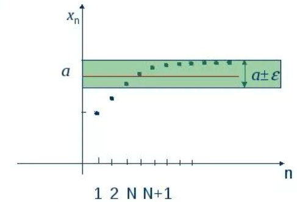

# Числовые последовательности. Предел функции. Свойства пределов 

## 1. Числовые последовательности

**Определение:** Числовой последовательностью называется функция $f: \mathbb{N} \rightarrow \mathbb{R}$, которая каждому натуральному числу $n$ ставит в соответствие некоторое действительное число $x_n$.

Обозначение: $\{x_n\} = x_1, x_2, x_3, \ldots, x_n, \ldots$

- $x_n$ — общий член последовательности
- Последовательность считается заданной, если указан закон, по которому можно найти любой её член

**Примеры:**
- $x_n = \frac{1}{n}$: $1, \frac{1}{2}, \frac{1}{3}, \frac{1}{4}, \ldots$
- $x_n = n^2$: $1, 4, 9, 16, \ldots$
- $x_n = (-1)^n$: $-1, 1, -1, 1, \ldots$ (знакочередующаяся)

### Предел последовательности

Число $a$ называется **пределом последовательности** $\{x_n\}$, если для любого сколь угодно малого положительного числа $\varepsilon > 0$ найдётся такой номер $N$ (зависящий от $\varepsilon$), что для всех членов последовательности с номерами $n > N$ выполняется неравенство $|x_n - a| < \varepsilon$.

**Обозначение:** $\lim_{n \to \infty} x_n = a$ или $x_n \to a$ при $n \to \infty$

**Геометрический смысл:** Все члены последовательности, начиная с некоторого номера, попадают в интервал $(a - \varepsilon; a + \varepsilon)$ (в "эпсилон-окрестность" точки $a$).

**Пример:** $\lim_{n \to \infty} \frac{1}{n} = 0$. Какое бы маленькое $\varepsilon$ мы ни взяли, найдётся номер $N > \frac{1}{\varepsilon}$, такой что для всех $n > N$ будет выполняться $|\frac{1}{n} - 0| < \varepsilon$.

**Сходящаяся последовательность** — последовательность, имеющая конечный предел.

**Расходящаяся последовательность** — последовательность, не имеющая конечного предела (например, $x_n = n^2$ или $x_n = (-1)^n$).

## 2. Пределы функций

**Функция** — это правило, которое каждому числу x ставит в соответствие другое число y.

**Предел функции** — это значение, к которому функция приближается, когда x приближается к какому-то числу, то есть **предел** — это число, к которому последовательность **приближается** всё ближе и ближе.

**Пример:** 
Что происходит с функцией $f(x) = \frac{x^2 - 1}{x - 1}$ когда x приближается к 1?

Если подставить x = 1, получится $\frac{0}{0}$ — неопределенность. Но если посчитать значения:
- x = 0.9 → f(x) ≈ 1.9
- x = 0.99 → f(x) ≈ 1.99
- x = 0.999 → f(x) ≈ 1.999

Видно, что функция приближается к 2!

**Обозначение:** $\lim_{x \to x_0} f(x) = A$

**Геометрический смысл:** Для любой $\varepsilon$-окрестности точки $A$ на оси $Oy$ найдётся такая $\delta$-окрестность точки $x_0$ на оси $Ox$, что для всех $x$ из этой $\delta$-окрестности (кроме, возможно, $x = x_0$) значения функции $f(x)$ лежат в $\varepsilon$-окрестности точки $A$.

### Предел на бесконечности

- $\lim_{x \to \infty} f(x) = A$ — функция $f(x)$ стремится к числу $A$ при неограниченном увеличении $x$
- $\lim_{x \to +\infty} f(x) = A$ — $x$ стремится к $+\infty$
- $\lim_{x \to -\infty} f(x) = A$ — $x$ стремится к $-\infty$

## 3. Свойства пределов

Пределы ведут себя "логично" при арифметических операциях:

1. **Константа:** $\lim (5 \cdot f(x)) = 5 \cdot \lim f(x)$
2. **Сумма:** $\lim (f(x) + g(x)) = \lim f(x) + \lim g(x)$  
3. **Разность:** $\lim (f(x) - g(x)) = \lim f(x) - \lim g(x)$
4. **Произведение:** $\lim (f(x) \cdot g(x)) = \lim f(x) \cdot \lim g(x)$
5. **Частное:** $\lim \left(\frac{f(x)}{g(x)}\right) = \frac{\lim f(x)}{\lim g(x)}$ (если знаменатель ≠ 0)

6. **Предел сложной функции:** Если $\lim_{x \to x_0} g(x) = u_0$ и функция $f(u)$ непрерывна в точке $u_0$, то:
   $\lim_{x \to x_0} f(g(x)) = f(\lim_{x \to x_0} g(x)) = f(u_0)$

7. **Теорема о сжатой функции (теорема о двух милиционерах):**
   Если $f(x) \leq g(x) \leq h(x)$ в некоторой окрестности точки $x_0$ и $\lim_{x \to x_0} f(x) = \lim_{x \to x_0} h(x) = A$, то $\lim_{x \to x_0} g(x) = A$

