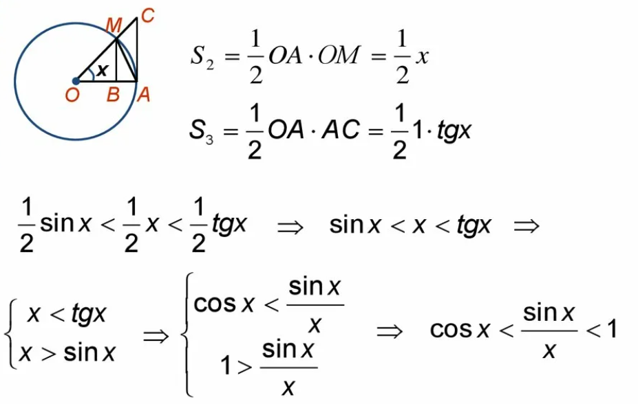
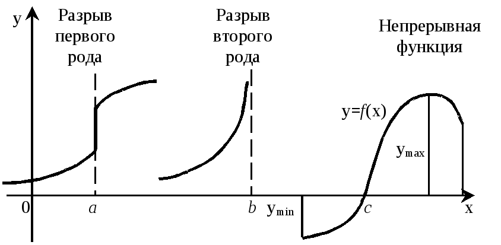
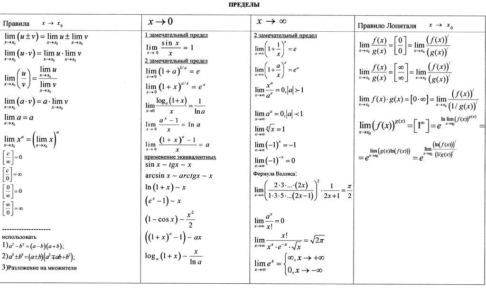

# Замечательные пределы, раскрытие неопределенностей. Односторонние пределы, классификация точек разрыва

На прошлом уроке мы познакомились с понятием предела, дали ему строгое математическое определение и увидели, как это понятие работает для вычисления производной. Сегодня мы углубим наши знания: научимся работать с **замечательными пределами**, раскрывать **неопределенности**, а также познакомимся с **односторонними пределами** и **точками разрыва** функций.

## Замечательные пределы

Замечательные пределы — это готовые решения для часто встречающихся сложных пределов. Их не нужно каждый раз заново доказывать, можно просто использовать как «волшебные ключики».

### *Первый замечательный предел*

**Формула:**
$$\lim_{x \to 0} \frac{\sin x}{x} = 1$$

**Геометрическая интерпретация.**

Если взять очень маленький угол $x$ (в радианах!), то длина дуги окружности ($x$) и длина катета-противолежащего ($\sin x$) будут почти одинаковы. Чем меньше угол, тем меньше между ними разница, а в пределе они совпадают.

*Геометрическая интерпретация первого замечательного предела*

**Практические следствия:**

1.  **Предел с тангенсом:**
    $$\lim_{x \to 0} \frac{\tan x}{x} = \lim_{x \to 0} \frac{\sin x}{x \cdot \cos x} = \lim_{x \to 0} \frac{\sin x}{x} \cdot \frac{1}{\cos x} = 1 \cdot 1 = 1$$

2.  **Предел с косинусом:**
    $$\lim_{x \to 0} \frac{1 - \cos x}{x^2} = \lim_{x \to 0} \frac{2\sin^2(x/2)}{x^2} = \frac{1}{2} \cdot \lim_{x \to 0} \frac{\sin^2(x/2)}{(x/2)^2} = \frac{1}{2} \cdot 1^2 = \frac{1}{2}$$

3.  **Предел с арксинусом:**
    $$\lim_{x \to 0} \frac{\arcsin x}{x} = 1$$
    *(Доказательство:* сделаем замену 
    $t = \arcsin x$,
    тогда $x = \sin t$,
    и при $x \to 0$ будет 
    $t \to 0$.
    Получаем $\lim_{t \to 0} \frac{t}{\sin t} = 1$)

### *Второй замечательный предел*

**Формула:**
$$\lim_{x \to \infty} \left(1 + \frac{1}{x}\right)^x = e$$
где $e \approx 2.71828$ — важная математическая константа, основание натуральных логарифмов.

**Интерпретация**
Чтобы было понятнее попробуйте представить что вы положили в банк **1 рубль** под **100% годовых**.

*   **Если проценты начислят 1 раз в год:** $1 \cdot (1 + 1) = 2$ рубля.
*   **Если два раза в год (по 50% за полгода):** $1 \cdot (1 + 0.5)^2 = 2.25$ рубля.
*   **Если 12 раз в месяц (по $\frac{1}{12}$):** $1 \cdot (1 + \frac{1}{12})^{12} \approx 2.613$ рубля.
*   **Если каждый день (по $\frac{1}{365}$):** $1 \cdot (1 + \frac{1}{365})^{365} \approx 2.714$ рубля.

Чем чаще начисляются проценты, тем ближе результат к числу $e$!

**Другие полезные формы второго замечательного предела:**

*   $\lim_{x \to 0} (1 + x)^{1/x} = e$
*   $\lim_{x \to 0} \frac{\ln(1 + x)}{x} = 1$
*   $\lim_{x \to 0} \frac{e^x - 1}{x} = 1$

## Раскрытие неопределенностей

Часто при прямой подстановке числа, к которому стремится $x$, в функцию получается не число, а **неопределенность**. Это сигнал, что предел может существовать, но чтобы его найти, нужно преобразовать выражение.

### Основные типы неопределенностей:

1.  $\frac{0}{0}$ — самая частая неопределенность.
2.  $\frac{\infty}{\infty}$ — вторая по популярности.
3.  $0 \cdot \infty$
4.  $\infty - \infty$
5.  $1^{\infty}$ — для нее часто используют второй замечательный предел.

### Методы раскрытия неопределенностей:

**1. Алгебраические преобразования (разложение на множители, приведение к общему знаменателю)**

Найти: 
$\lim_{x \to 1} \frac{x^2 - 1}{x - 1}$

Подстановка: $\frac{1^2 - 1}{1 - 1} = \frac{0}{0}$ (неопределенность)

Решаем: раскладываем числитель на множители.

$\lim_{x \to 1} \frac{(x-1)(x+1)}{x-1} = \lim_{x \to 1} (x+1) = 1 + 1 = 2$

**2. Умножение на сопряженное выражение (для корней)**
Найти: $\lim_{x \to 0} \frac{\sqrt{4+x} - 2}{x}$

Подстановка: $\frac{0}{0}$ (неопределенность)

Решаем: умножаем числитель и знаменатель на сопряженное ($\sqrt{4+x} + 2$).

$\lim_{x \to 0} \frac{(\sqrt{4+x} - 2)(\sqrt{4+x} + 2)}{x
(\sqrt{4+x} + 2)} = \lim_{x \to 0} \frac{(4+x) - 4}{x(\sqrt{4+x} + 2)} = \lim_{x \to 0} \frac{1}{\sqrt{4+x} + 2} = \frac{1}{4}$

**3. Использование замечательных пределов**

Найти: $\lim_{x \to 0} \frac{\sin(3x)}{x}$

Подстановка: $\frac{0}{0}$ (неопределенность)

Решаем: подводим под первый замечательный предел.

$\lim_{x \to 0} \frac{\sin(3x)}{x} = \lim_{x \to 0} \frac{3 \cdot \sin(3x)}{3x} = 3 \cdot \lim_{x \to 0} \frac{\sin(3x)}{3x} = 3 \cdot 1 = 3$

**4. Правило Лопиталя (будем изучать подробнее позже)**
*Кратко: если получается $\frac{0}{0}$ или $\frac{\infty}{\infty}$, можно отдельно продифференцировать числитель и знаменатель.*

$\lim_{x \to 0} \frac{\sin x}{x} \stackrel{(\frac{0}{0})}{=} \lim_{x \to 0} \frac{(\sin x)'}{(x)'} = \lim_{x \to 0} \frac{\cos x}{1} = 1$

## Односторонние пределы и точки разрыва

### Односторонние пределы

Предел не всегда существует, если приближаться к точке с любой стороны. Поэтому вводят понятия:

*   **Предел справа:** $\lim_{x \to a^+} f(x)$ — $x$ приближается к $a$ **со стороны больших значений** ($x > a$).
*   **Предел слева:** $\lim_{x \to a^-} f(x)$ — $x$ приближается к $a$ **со стороны меньших значений** ($x < a$).

**Полный предел** $\lim_{x \to a} f(x)$ **существует тогда и только тогда, когда существуют и равны оба односторонних предела:**
$$\lim_{x \to a^+} f(x) = \lim_{x \to a^-} f(x) = L$$

---

### Классификация точек разрыва

Если функция не является непрерывной в точке, эта точка называется **точкой разрыва**. Разрывы бывают разными.

**1. Устранимый разрыв ("дырка")**
*   **Что происходит:** Односторонние пределы **существуют и равны** друг другу, но сама функция в точке $a$ или не определена, или определена не равным им значением.
    $\lim_{x \to a^+} f(x) = \lim_{x \to a^-} f(x) = L$, но $f(a) \neq L$ или $f(a)$ не существует.
*   **Пример:** $f(x) = \frac{x^2-1}{x-1}$ при $x=1$. Предел равен 2, но в точке $x=1$ функция не определена.
*   **Как "починить":** Доопределить функцию: $f(1) = 2$.

**2. Разрыв первого рода ("скачок")**
*   **Что происходит:** Оба односторонних предела **существуют и конечны**, но **не равны** друг другу.
    $\lim_{x \to a^+} f(x) \neq \lim_{x \to a^-} f(x)$
*   **Пример:**

    $
    f(x) = \begin{cases}
        x^2, & \text{если } x < 1 \\
        x + 1, & \text{если } x \geq 1
    \end{cases}
    $

    $\lim_{x \to 1^-} f(x) = 1, \quad \lim_{x \to 1^+} f(x) = 2$

*   **Величина скачка:** $|f(a^+) - f(a^-)| = |2 - 1| = 1$.

**3. Разрыв второго рода ("обрыв")**
*   **Что происходит:** Хотя бы один из односторонних пределов **бесконечен** или **вообще не существует**.
*   **Примеры:**
    *   $f(x) = \frac{1}{x}$ при $x=0$ (вертикальная асимптота: $\lim_{x \to 0^+} \frac{1}{x} = +\infty$, $\lim_{x \to 0^-} \frac{1}{x} = -\infty$).
    *   $f(x) = \sin(\frac{1}{x})$ при $x=0$ (функция бесконечно колеблется, не приближаясь к какому-либо значению).

### Сводная таблица классификации точек разрыва

| Тип разрыва | Условие | Можно "починить"? | Пример |
| :---------- | :----------------------------------------------------------- | :----------------: | :----------------------------------------- |
| **Устранимый** | $\lim_{x \to a^+} f(x) = \lim_{x \to a^-} f(x) \neq f(a)$ | Да | $\frac{x^2-1}{x-1}$ при $x=1$ |
| **I рода (скачок)** | $\lim_{x \to a^+} f(x) \neq \lim_{x \to a^-} f(x)$ (конечные) | Нет | $\begin{cases} x^2, & x < 1 \\ x+1, & x ≥ 1 \end{cases}$ |
| **II рода** | Хотя бы один односторонний предел **∞** или **не существует** | Нет | $\frac{1}{x}$, $\sin(\frac{1}{x})$ при $x=0$ |

**Пример изображение точек разрыва:**

*Наглядное представление разных типов разрывов на графике.*

---

В конце конспекта по данной теме я оставлю вам полезную запись всех полезных правил, чтобы было ясно и просто работать, решая задачи.
