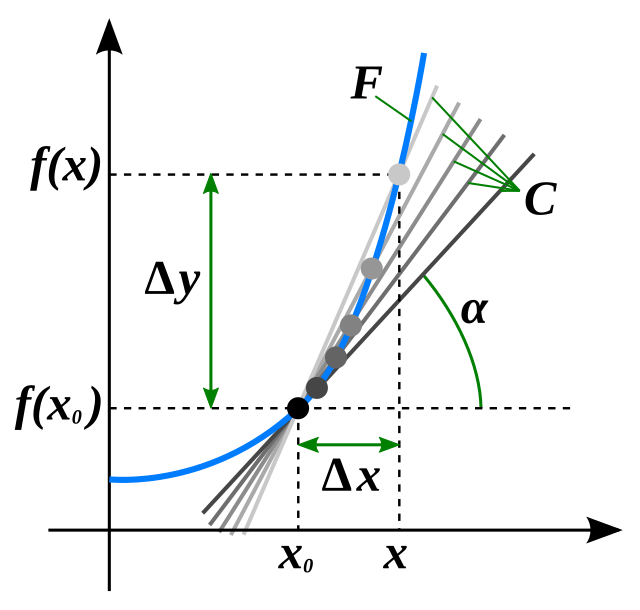
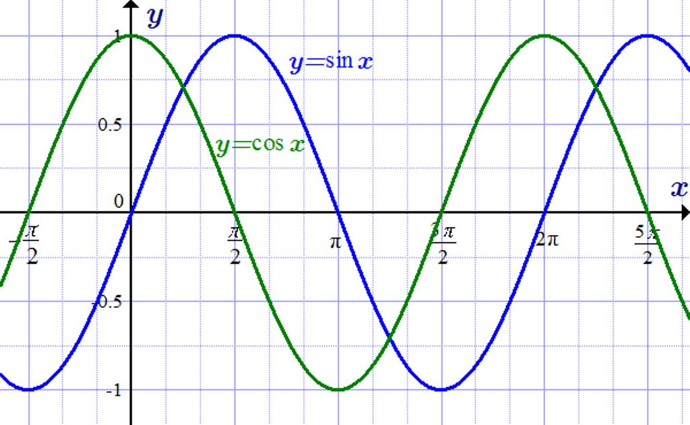
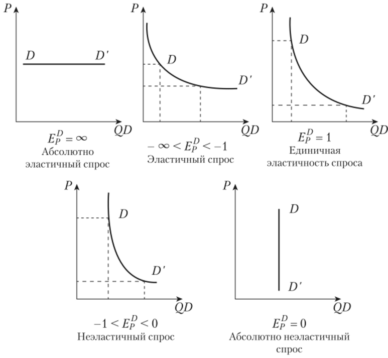
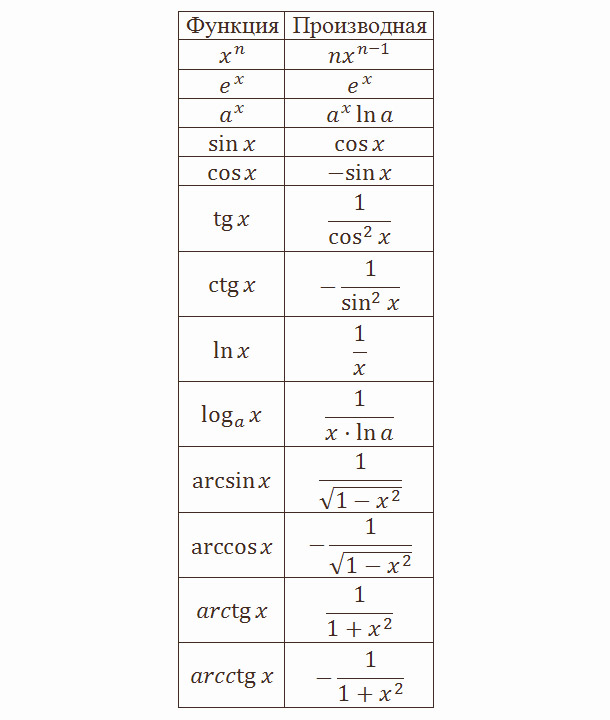
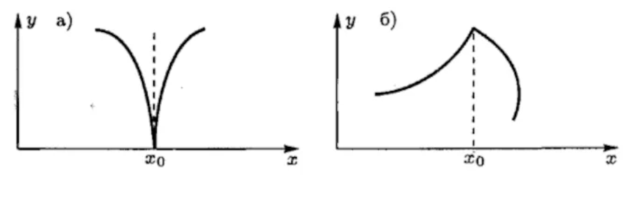
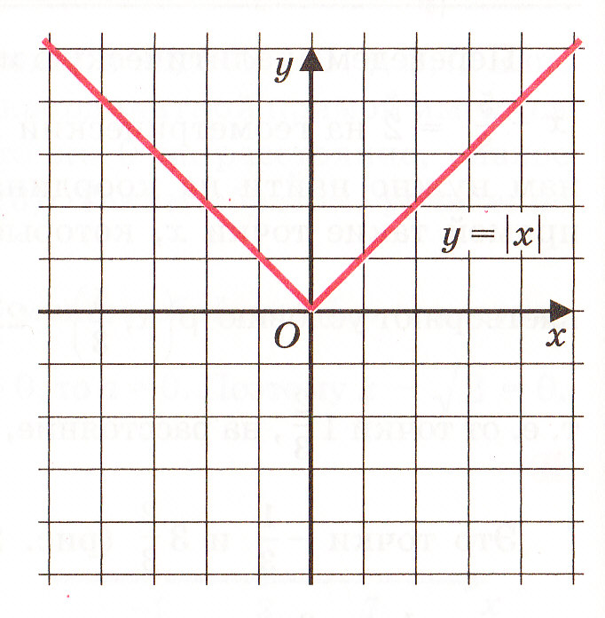

# **Производная функции**  

Познакомившись с такими вещами, как предел последовательности и предел функции мы поднимаемся по ступенькам математического анализа и впереди нас ждет производная - математический инструмент, позволяющий измерять мгновенные изменения. Без неё невозможны современные технологии: от решения задач до GPS.

В качестве примера рассмотрим **физическую задачу**:  
> *Материальная точка движется по прямой. Её путь $ s(t) $ — известная функция времени. Как найти её **мгновенную скорость** в момент $ t_0 $?*

- За время от $ t_0 $ до $ t $ точка прошла путь $ \Delta s = s(t) - s(t_0) $
- Средняя скорость:  
  $$
  v_{ср} = \frac{\Delta s}{\Delta t} = \frac{s(t) - s(t_0)}{t - t_0}
  $$
- Но средняя скорость — это усреднённое значение. А что, если мы хотим **точную скорость в конкретный момент**?

Давайте уменьшать до максимально маленького значения как мы делали на предыдущих уроках с производной, то есть $ \Delta t \to 0 $.  
Тогда:
$$
v(t_0) = \lim_{\Delta t \to 0} \frac{s(t_0 + \Delta t) - s(t_0)}{\Delta t}
$$

Это и есть **производная функции $ s(t) $** в точке $ t_0 $.

Сформируем это более формально:

Пусть функция $ y = f(x) $ определена на интервале $ (a, b) $, и $ x_0 \in (a,b) $.

- Приращение аргумента: $ \Delta x = x - x_0 $
- Приращение функции: $ \Delta y = f(x_0 + \Delta x) - f(x_0) $
- Отношение приращений:  
  $$
  \frac{\Delta y}{\Delta x} = \frac{f(x_0 + \Delta x) - f(x_0)}{\Delta x}
  $$

> **Определение**:  
> Производной функции $ f(x) $ в точке $ x_0 $ называется предел отношения приращения функции к приращению аргумента при стремлении приращения аргумента к нулю, если этот предел существует:
>
> $$
> f'(x_0) = \lim_{\Delta x \to 0} \frac{f(x_0 + \Delta x) - f(x_0)}{\Delta x}
> $$

Если предел существует → функция **дифференцируема** в точке $ x_0 $.

*Реализация производной*

Еще одним из необходимых элементов производной являются разные виды ее записи. Ниже представлена следующая таблица:
| Обозначение | Название | Автор |
|-------------|----------|-------|
| $ f'(x) $ | Лагранж | Ж.Л. Лагранж |
| $ \frac{dy}{dx} $ | Лейбниц | Г.В. Лейбниц |
| $ \dot{y} $ | Ньютон | И. Ньютон |
| $ Df(x) $ | Операторный | Современный анализ |

---

### **Пример 1: Производная синуса**

Докажем: $ (\sin x)' = \cos x $

Используем определение:

$$
(\sin x)' = \lim_{\Delta x \to 0} \frac{\sin(x + \Delta x) - \sin x}{\Delta x}
$$

Применим формулу разности синусов:

$$
\sin A - \sin B = 2 \cos\left(\frac{A+B}{2}\right) \sin\left(\frac{A-B}{2}\right)
$$

Тогда:
$$
\sin(x + \Delta x) - \sin x = 2 \cos\left(x + \frac{\Delta x}{2}\right) \sin\left(\frac{\Delta x}{2}\right)
$$

Подставляем:
$$
(\sin x)' = \lim_{\Delta x \to 0} \frac{2 \cos\left(x + \frac{\Delta x}{2}\right) \sin\left(\frac{\Delta x}{2}\right)}{\Delta x}
= \lim_{\Delta x \to 0} \cos\left(x + \frac{\Delta x}{2}\right) \cdot \frac{\sin\left(\frac{\Delta x}{2}\right)}{\frac{\Delta x}{2}}
$$

Заметим:
- $ \cos\left(x + \frac{\Delta x}{2}\right) \to \cos x $
- $ \frac{\sin u}{u} \to 1 $ при $ u \to 0 $, где $ u = \frac{\Delta x}{2} $

Следовательно:
$$
(\sin x)' = \cos x \cdot 1 = \cos x
$$

**Вывод**: производная синуса — косинус. Это **не случайность** — это следствие тригонометрической периодичности и геометрии единичной окружности.

> **Интересный факт**:  
> В физике, если $ x(t) = \sin(\omega t) $ — колебание маятника, то его скорость $ v(t) = \omega \cos(\omega t) $, а ускорение $ a(t) = -\omega^2 \sin(\omega t) $ — т.е. ускорение пропорционально смещению с противоположным знаком → это **гармонический осциллятор**!

*Изображение двух гармонических функций: косинуса (зеленый) и синуса (синий)*

---

### **Пример 2: Производная логарифма**

Докажем: $ (\log_a x)' = \frac{1}{x \ln a} $

Используем определение:

$$
(\log_a x)' = \lim_{\Delta x \to 0} \frac{\log_a(x + \Delta x) - \log_a x}{\Delta x}
= \lim_{\Delta x \to 0} \frac{1}{\Delta x} \log_a\left(1 + \frac{\Delta x}{x}\right)
$$

Перейдём к натуральному логарифму:  
$ \log_a z = \frac{\ln z}{\ln a} $

Тогда:
$$
= \frac{1}{\ln a} \lim_{\Delta x \to 0} \frac{1}{\Delta x} \ln\left(1 + \frac{\Delta x}{x}\right)
= \frac{1}{\ln a} \lim_{\Delta x \to 0} \ln\left( \left(1 + \frac{\Delta x}{x}\right)^{1/\Delta x} \right)
$$

Замена: $ u = \frac{\Delta x}{x} \Rightarrow \Delta x = ux $, тогда при $ \Delta x \to 0 \Rightarrow u \to 0 $

$$
= \frac{1}{\ln a} \lim_{u \to 0} \ln\left( (1 + u)^{1/(ux)} \right)
= \frac{1}{\ln a} \cdot \frac{1}{x} \lim_{u \to 0} \ln\left( (1 + u)^{1/u} \right)
$$

Но $ \lim_{u \to 0} (1+u)^{1/u} = e $, значит:

$$
= \frac{1}{\ln a} \cdot \frac{1}{x} \cdot \ln e = \frac{1}{x \ln a}
$$

**Частный случай**: $ a = e \Rightarrow (\ln x)' = \frac{1}{x} $

> **Важно!** Эта производная — основа логарифмического масштабирования в экономике (эластичность), биологии (рост популяций), информатике (логарифмическая сложность алгоритмов).

*Реализации спроса в экономике это формула $ a = e \Rightarrow (\ln x)' = \frac{1}{x} $*

*Таблица функций и их производных*

## **Односторонние производные и дифференцируемость**

### Когда производная **не существует**?
- Разрыв функции
- «Угол» — резкий перегиб
- Вертикальная касательная

### Определение односторонних производных

- **Правая производная**:
  $$
  f'_+(x_0) = \lim_{\Delta x \to 0^+} \frac{f(x_0 + \Delta x) - f(x_0)}{\Delta x}
  $$
- **Левая производная**:
  $$
  f'_-(x_0) = \lim_{\Delta x \to 0^-} \frac{f(x_0 + \Delta x) - f(x_0)}{\Delta x}
  $$

Эти функции непрерывные, но не имеют производной в точке $ x_0 $

a) Бесконечная производная
б) Производной нет

> **Теорема**:  
> Функция дифференцируема в точке $ x_0 $ **тогда и только тогда**, когда существуют обе односторонние производные и они **равны**:
> $$
> f'_-(x_0) = f'_+(x_0)
> $$

### Пример: модуль $ f(x) = |x| $ в точке $ x=0 $

- $ f'_+(0) = \lim_{\Delta x \to 0^+} \frac{|0 + \Delta x| - |0|}{\Delta x} = \frac{\Delta x}{\Delta x} = 1 $
- $ f'_-(0) = \lim_{\Delta x \to 0^-} \frac{|0 + \Delta x| - |0|}{\Delta x} = \frac{-\Delta x}{\Delta x} = -1 $

→ $ f'_-(0) \ne f'_+(0) \Rightarrow $ производная **не существует** в 0!

> *График**: угол в нуле — касательная не может быть проведена однозначно.  
> Это классический пример **недифференцируемой, но непрерывной** функции.