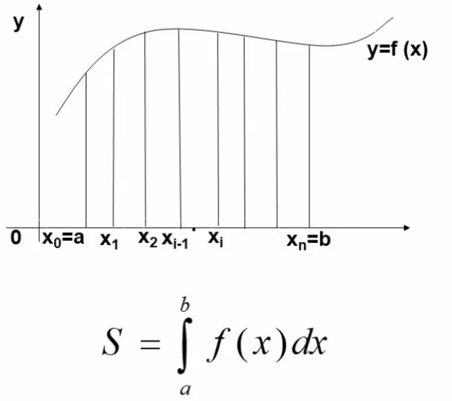
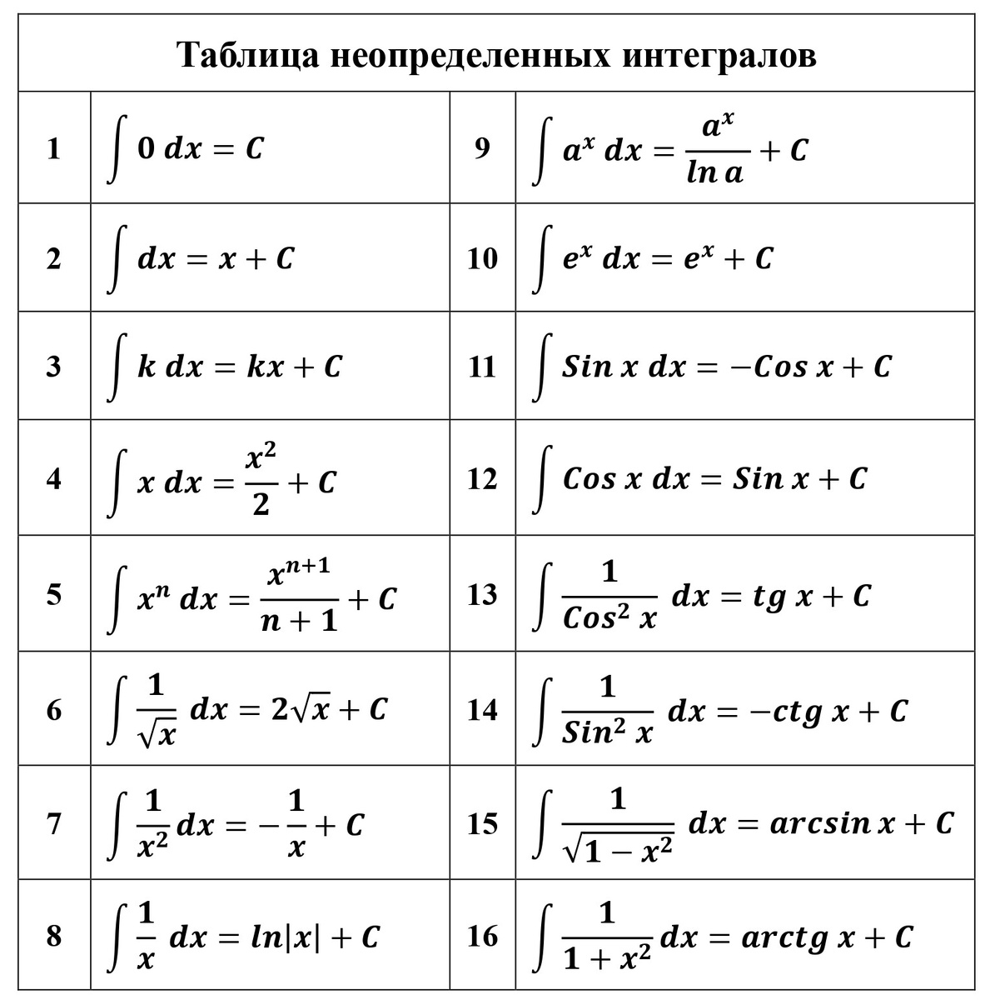

# **Неопределенный и определенный интеграл и их свойства**

## **Введение**

Интегрирование — это одна из двух фундаментальных операций математического анализа (наряду с дифференцированием). Если производная описывает мгновенную скорость изменения функции, то интеграл позволяет восстановить функцию по ее скорости изменения (первообразная) или измерить "накопленную величину" — площадь, объем, работу силы и многое другое.

---

## **Часть 1. Неопределенный интеграл**

### **1.1. Первообразная функции**

**Определение:** Функция $F(x)$ называется **первообразной** функции $f(x)$ на заданном промежутке, если в каждой точке этого промежутка выполняется равенство:
$$F'(x) = f(x).$$

**Пример:**
Рассмотрим функцию $f(x) = 2x$. Ее первообразными будут:
*   $F(x) = x^2$, так как $(x^2)' = 2x$.
*   $F(x) = x^2 + 5$, так как $(x^2 + 5)' = 2x$.
*   $F(x) = x^2 - 100$, так как $(x^2 - 100)' = 2x$.

**Основное свойство первообразных:** Если $F(x)$ — первообразная для $f(x)$, то и функция $F(x) + C$, где $C$ — любое действительное число, также является первообразной для $f(x)$. Это следует из того, что производная константы равна нулю: $(F(x) + C)' = F'(x) = f(x)$.

### **1.2. Определение неопределенного интеграла**

**Определение:** **Неопределенным интегралом** от функции $f(x)$ называется множество *всех* ее первообразных.

**Обозначение:**
$$\int f(x)  dx = F(x) + C,$$
где:
*   $\int$ — знак интеграла;
*   $f(x)$ — подынтегральная функция;
*   $f(x)dx$ — подынтегральное выражение;
*   $x$ — переменная интегрирования;
*   $C$ — постоянная интегрирования (произвольная константа).

**Важные тождества,** вытекающие непосредственно из определения:
1.  $(\int f(x)  dx)' = f(x)$ (Производная от интеграла равна подынтегральной функции).
2.  $d(\int f(x)  dx) = f(x) dx$ (Дифференциал от интеграла равен подынтегральному выражению).

**Геометрический смысл:** Геометрически неопределенный интеграл представляет собой семейство параллельных кривых (интегральных кривых), получаемых друг из друга сдвигом вдоль оси $Oy$. Каждому значению константы $C$ соответствует одна кривая этого семейства.

### **1.3. Свойства неопределенного интеграла**

1.  **Производная от интеграла равна подынтегральной функции:**
    $$(\int f(x)  dx)' = f(x).$$

2.  **Дифференциал от интеграла равен подынтегральному выражению:**
    $$d(\int f(x)  dx) = f(x)  dx.$$

3.  **Интеграл от дифференциала функции равен этой функции плюс константа:**
    $$\int d(F(x)) = F(x) + C.$$

4.  **Постоянный множитель можно выносить за знак интеграла:**
    $$\int k \cdot f(x)  dx = k \cdot \int f(x)  dx, \quad \text{где } k = const.$$

5.  **Интеграл от алгебраической суммы функций равен алгебраической сумме интегралов:**
    $$\int [f(x) \pm g(x)]  dx = \int f(x)  dx \pm \int g(x)  dx.$$

### **1.4. Таблица основных неопределенных интегралов**

Эта таблица является фундаментом для вычисления интегралов. Ее необходимо знать наизусть.

### **1.5. Примеры решения неопределенных интегралов**

**Пример 1.** Найти интеграл: $\int (3x^2 + 2\cos x)  dx$.

**Решение:**
Применяем свойства линейности (свойства 4 и 5) и табличные интегралы (формулы 3 и 8).
$$
\int (3x^2 + 2\cos x)  dx = \int 3x^2  dx + \int 2\cos x  dx = 3 \int x^2  dx + 2 \int \cos x  dx = 
$$
$$
= 3 \cdot \frac{x^3}{3} + 2 \cdot \sin x + C = x^3 + 2\sin x + C.
$$

**Ответ:** $x^3 + 2\sin x + C$.

**Пример 2.** Найти интеграл: $\int \frac{(x + 2)^2}{\sqrt{x}}  dx$.

**Решение:**
Упростим подынтегральное выражение, раскрыв скобки и разделив почленно.
$$
\frac{(x + 2)^2}{\sqrt{x}} = \frac{x^2 + 4x + 4}{x^{1/2}} = \frac{x^2}{x^{1/2}} + \frac{4x}{x^{1/2}} + \frac{4}{x^{1/2}} = x^{3/2} + 4x^{1/2} + 4x^{-1/2}.
$$
Теперь интегрируем почленно, используя формулу 3 из таблицы ($\int x^n  dx = \frac{x^{n+1}}{n+1} + C$).
$$
\int (x^{3/2} + 4x^{1/2} + 4x^{-1/2})  dx = \frac{x^{5/2}}{5/2} + 4 \cdot \frac{x^{3/2}}{3/2} + 4 \cdot \frac{x^{1/2}}{1/2} + C =
$$
$$
= \frac{2}{5}x^{5/2} + 4 \cdot \frac{2}{3}x^{3/2} + 4 \cdot 2x^{1/2} + C = \frac{2}{5}x^2\sqrt{x} + \frac{8}{3}x\sqrt{x} + 8\sqrt{x} + C.
$$

**Ответ:** $\frac{2}{5}x^2\sqrt{x} + \frac{8}{3}x\sqrt{x} + 8\sqrt{x} + C$.

---

## **Часть 2. Определенный интеграл**

### **2.1. Понятие определенного интеграла**

Понятие определенного интеграла возникает при решении задач о вычислении площади криволинейной трапеции и других задач, связанных с суммированием бесконечно малых величин.

**Криволинейная трапеция** — это фигура, ограниченная:
*   сверху — графиком неотрицательной функции $y = f(x)$,
*   снизу — осью абсцисс ($y=0$),
*   слева и справа — вертикальными прямыми $x = a$ и $x = b$.

**Идея интегральной суммы:**
1.  Отрезок $[a, b]$ разбивается на $n$ маленьких отрезков точками $a = x_0 < x_1 < x_2 < ... < x_n = b$.
2.  На каждом отрезке $[x_{i-1}, x_i]$ выбирается произвольная точка $\xi_i$.
3.  Строится сумма площадей прямоугольников с основанием $\Delta x_i = x_i - x_{i-1}$ и высотой $f(\xi_i)$:
    $$S_n = \sum_{i=1}^{n} f(\xi_i) \Delta x_i.$$
    Эта сумма называется **интегральной суммой**.

**Определение:** **Определенным интегралом** от функции $f(x)$ на отрезке $[a, b]$ называется предел интегральных сумм при стремлении длины наибольшего из отрезков разбиения к нулю (при условии, что этот предел существует и не зависит от способа разбиения и выбора точек $\xi_i$):
$$\int_{a}^{b} f(x)  dx = \lim_{\max \Delta x_i \to 0} \sum_{i=1}^{n} f(\xi_i) \Delta x_i.$$

**Обозначение:**
*   $\int_{a}^{b} f(x)  dx$ — определенный интеграл.
*   $a$ и $b$ — пределы интегрирования ($a$ — нижний, $b$ — верхний).

**Геометрический смысл:** Если $f(x) \ge 0$ на $[a, b]$, то определенный интеграл численно равен **площади** криволинейной трапеции, ограниченной графиком функции $y=f(x)$, осью $Ox$ и прямыми $x=a$, $x=b$.
$$S = \int_{a}^{b} f(x)  dx.$$

**Физический смысл:** Интеграл может представлять собой путь, пройденный телом, если известна его скорость, работу переменной силы и многие другие величины.

### **2.2. Формула Ньютона-Лейбница**

Эта формула является основной теоремой интегрального исчисления и устанавливает связь между определенным интегралом и первообразной.

**Теорема (Ньютона-Лейбница):** Если функция $f(x)$ непрерывна на отрезке $[a, b]$, а $F(x)$ — любая ее первообразная на этом отрезке, то справедлива формула:
$$\int_{a}^{b} f(x)  dx = F(b) - F(a).$$

**Обозначение:** Разность $F(b) - F(a)$ принято записывать как $F(x)\Big|_{a}^{b}$.

**Алгоритм вычисления определенного интеграла:**
1.  Найти любую первообразную $F(x)$ подынтегральной функции $f(x)$.
2.  Подставить в нее верхний и нижний пределы интегрирования.
3.  Вычесть из значения первообразной на верхнем пределе ее значение на нижнем пределе.

### **2.3. Свойства определенного интеграла**

1.  **Интеграл с одинаковыми пределами равен нулю:**
    $$\int_{a}^{a} f(x)  dx = 0.$$

2.  **При перестановке пределов интегрирования интеграл меняет знак:**
    $$\int_{a}^{b} f(x)  dx = - \int_{b}^{a} f(x)  dx.$$

3.  **Аддитивность.** Для любого числа $c \in [a, b]$ (или вне его) выполняется:
    $$\int_{a}^{b} f(x)  dx = \int_{a}^{c} f(x)  dx + \int_{c}^{b} f(x)  dx.$$

4.  **Линейность.**
    *   Постоянный множитель можно выносить за знак интеграла:
        $$\int_{a}^{b} k \cdot f(x)  dx = k \cdot \int_{a}^{b} f(x)  dx.$$
    *   Интеграл от суммы (разности) функций равен сумме (разности) интегралов:
        $$\int_{a}^{b} [f(x) \pm g(x)]  dx = \int_{a}^{b} f(x)  dx \pm \int_{a}^{b} g(x)  dx.$$

### **2.4. Примеры решения определенных интегралов**

**Пример 3.** Вычислить интеграл: $\int_{1}^{3} (2x + 1)  dx$.

**Решение:**
1.  Найдем первообразную $F(x)$:
    $$F(x) = \int (2x + 1)  dx = 2 \cdot \frac{x^2}{2} + x + C = x^2 + x + C.$$
    Берем $F(x) = x^2 + x$.
2.  Применяем формулу Ньютона-Лейбница:
    $$\int_{1}^{3} (2x + 1)  dx = F(3) - F(1) = (3^2 + 3) - (1^2 + 1) = (9+3) - (1+1) = 12 - 2 = 10.$$

**Ответ:** $10$.

**Пример 4.** Вычислить интеграл: $\int_{0}^{\pi/2} \sin x  dx$.

**Решение:**
1.  Первообразная для $\sin x$ это $-\cos x$.
2.  Применяем формулу Ньютона-Лейбница:
    $$\int_{0}^{\pi/2} \sin x  dx = (-\cos x)\Big|_{0}^{\pi/2} = (-\cos(\pi/2)) - (-\cos 0) = (-0) - (-1) = 1.$$

**Ответ:** $1$.

**Пример 5.** Вычислить площадь фигуры, ограниченной линиями $y = x^2$, $y = 0$, $x = 1$, $x = 2$.

**Решение:**
Искомая фигура — криволинейная трапеция. Функция $y = x^2$ неотрицательна на отрезке $[1, 2]$, поэтому площадь равна определенному интегралу.
$$S = \int_{1}^{2} x^2  dx.$$

1.  Находим первообразную: $F(x) = \frac{x^3}{3}$.
2.  Вычисляем по формуле Ньютона-Лейбница:
    $$S = F(2) - F(1) = \frac{2^3}{3} - \frac{1^3}{3} = \frac{8}{3} - \frac{1}{3} = \frac{7}{3}.$$

**Ответ:** $S = \frac{7}{3}$ (кв. ед.).

---

## **Практика. Задачи для самостоятельного решения**

**Задача 1.** Найдите неопределенный интеграл: $\int (5x^4 - \frac{3}{x^2} + e^x)  dx$.

**Задача 2.** Найдите неопределенный интеграл: $\int (\sqrt{x} - 1)^2  dx$. (Предварительно упростите выражение под интегралом).

**Задача 3.** Вычислите определенный интеграл: $\int_{0}^{1} (4x^3 + 2x)  dx$.

**Задача 4.** Вычислите определенный интеграл: $\int_{\pi/6}^{\pi/3} \cos x  dx$.

**Задача 5.** Вычислите площадь фигуры, ограниченной линиями $y = \sqrt{x}$, осью $OX$ и прямой $x = 4$.