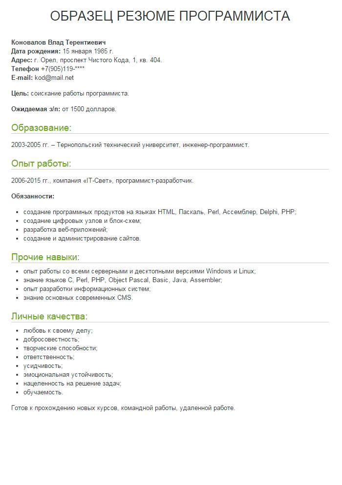
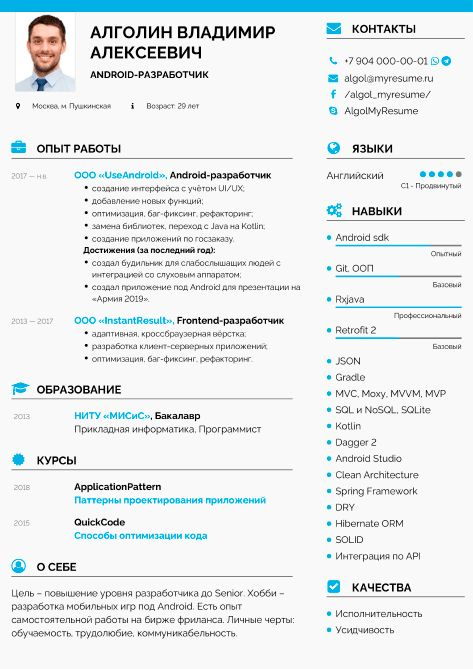
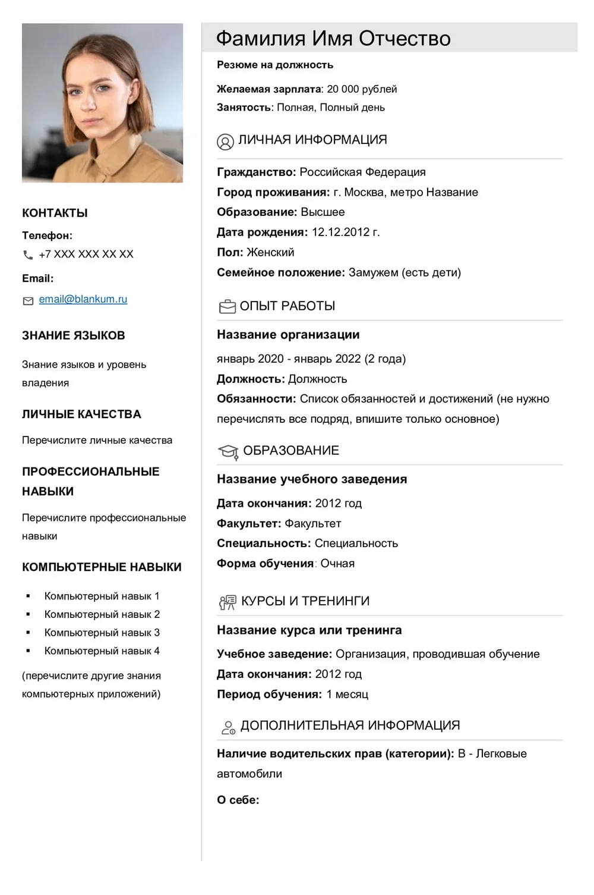

# **Создание сайта-визитки на HTML и CSS**

**Добрый день, уважаемые студенты!**

На прошлых занятиях мы с вами изучали основы HTML и CSS, знакомились с тегами, стилями и принципами веб-разработки. Сегодня мы совершим важный шаг — объединим все полученные знания для создания вашего **персонального сайта-визитки**!

### **Почему это важно?**
- **Профессиональное портфолио** — покажите свои навыки работодателям
- **Практическое применение** — используете HTML/CSS в реальном проекте
- **Развивающийся проект** — этот сайт будет расти вместе с вашими умениями
- **Онлайн-присутствие** — создадите свою цифровую визитную карточку

---

## **Часть 1. Анализ примеров и планирование**

### **1.1. Изучаем примеры резюме**

Давайте внимательно рассмотрим примеры и проанализируем, что можно использовать в своих проектах:







**Задание:** Подумайте, какие элементы из этих примеров вы хотели бы использовать в своем резюме, а что стоит изменить или улучшить.

### **1.2. Планирование структуры**

Прежде чем писать код, давайте спланируем нашу будущую страницу. Подумайте над следующими вопросами:

#### **Какую информацию включить?**
- **Имя и фамилия** (крупно, в заголовке)
- **Специальность** ("Студент веб-разработки", "Frontend-разработчик" и т.д.)
- **О себе** (2-3 предложения о ваших интересах и целях)
- **Контакты** (email, Telegram, GitHub, социальные сети)
- **Фото или аватар** (профессиональное или стилизованное)
- **Навыки** (HTML, CSS, JavaScript и другие)
- **Образование** (ваш колледж, курсы)
- **Проекты** (если уже есть что показать)

#### **Как расположить элементы?**
```
[Шапка сайта]
├── Фото (слева/по центру)
├── Имя и специальность (крупно)
└── Краткое описание

[Основной контент - 2 колонки]
├── Левая колонка:
│   ├── Контакты
│   ├── Навыки
│   └── Языки
└── Правая колонка:
    ├── Опыт
    ├── Образование
    └── Проекты

[Подвал]
└── Copyright и ссылки
```

---

## **Часть 2. Настройка рабочего окружения**

### **2.1. Подключаем GitHub к VS Code**

**Зачем это нужно?**
- **Безопасное хранение** кода
- **История изменений** — можно откатиться к любой версии
- **Совместная работа** над проектами
- **Публикация проекта** через GitHub Pages

#### **Инструкция для Linux:**
```bash
# 1. Установите Git (если не установлен)
sudo apt update
sudo apt install git

# 2. Настройте пользователя
git config --global user.name "Ваше Имя"
git config --global user.email "ваш.email@example.com"

# 3. Создайте папку проекта и перейдите в нее
mkdir my-resume
cd my-resume

# 4. Инициализируйте Git репозиторий
git init

# 5. Подключитесь к удаленному репозиторию на GitHub
git remote add origin https://github.com/ваш-логин/название-репозитория.git
```

#### **Инструкция для Windows:**
```cmd
# 1. Скачайте и установите Git с официального сайта
# https://git-scm.com/download/win

# 2. Откройте командную строку или PowerShell
# 3. Настройте пользователя
git config --global user.name "Ваше Имя"
git config --global user.email "ваш.email@example.com"

# 4. Создайте папку проекта
mkdir my-resume
cd my-resume

# 5. Инициализируйте Git
git init

# 6. Подключите удаленный репозиторий
git remote add origin https://github.com/ваш-логин/название-репозитория.git
```

#### **Альтернативный вариант:**
Если возникают сложности с GitHub, можно работать с **флеш-накопителя** или **облачного хранилища** (Google Drive, Yandex Disk). Однако настоятельно рекомендую освоить Git — это стандарт в разработке!

---

## **Часть 3. Создание HTML-структуры**

### **3.1. Базовая структура HTML-документа**

Создайте файл `index.html` и используйте эту базовую структуру:

```html
<!DOCTYPE html>
<html lang="ru">
<head>
    <meta charset="UTF-8">
    <meta name="viewport" content="width=device-width, initial-scale=1.0">
    <title>Мое резюме - [Ваше Имя]</title>
    <link rel="stylesheet" href="style.css">
</head>
<body>
    <!-- Здесь будет ваша разметка -->
</body>
</html>
```

### **3.2. Ключевые элементы для вашего сайта**

#### **Что такое `<div>` и зачем он нужен?**
`<div>` (division) — это универсальный контейнер, который помогает группировать элементы и структурировать страницу. Представьте его как **виртуальную коробку**, в которую можно складывать другие элементы.

```html
<div class="container">
    <h1>Мое имя</h1>
    <p>Описание</p>
</div>
```

#### **Концепция контейнеров**
Контейнеры помогают создавать аккуратные, выровненные блоки:

```html
<!-- Основной контейнер для всего контента -->
<div class="main-container">
    
    <!-- Контейнер для шапки -->
    <header class="header">
        <!-- содержимое шапки -->
    </header>
    
    <!-- Контейнер для основного контента -->
    <main class="content">
        
        <!-- Левая колонка -->
        <div class="left-column">
            <!-- контакты, навыки -->
        </div>
        
        <!-- Правая колонка -->
        <div class="right-column">
            <!-- опыт, образование -->
        </div>
        
    </main>
    
    <!-- Контейнер для подвала -->
    <footer class="footer">
        <!-- копирайт, ссылки -->
    </footer>
    
</div>
```

### **3.3. Пошаговая разметка вашего резюме**

#### **Шаг 1: Создаем шапку (header)**
```html
<header class="header">
    <div class="photo-container">
        
    </div>
    <div class="header-info">
        <h1 class="name">Иван Иванов</h1>
        <h2 class="profession">Студент веб-разработки</h2>
        <p class="description">
            Увлекаюсь созданием современных и удобных веб-сайтов. 
            Стремлюсь к постоянному развитию в IT-сфере.
        </p>
    </div>
</header>
```

### **3.4. Полезные HTML-теги для поиска**

Для наполнения вашего сайта вам могут понадобиться:
- `<a href="">` — для создания ссылок
- `<ul>` и `<li>` — для списков навыков
- `` — для изображений
- `<section>` — для семантического разделения контента
- `<strong>` и `<em>` — для выделения текста
- `<br>` — для переноса строк

**Задание:** Используйте поиск в интернете, чтобы найти подробную информацию о каждом теге и примерах его использования!

---

## **Часть 4. Практическое задание**

### **Задачи на занятие:**

1. **Спланируйте структуру** своего резюме (5 минут)
2. **Настройте Git** и создайте репозиторий (10 минут)
3. **Создайте базовую HTML-структуру** (30 минут)
4. **Наполните контентом** свои разделы (15 минут)

### **Советы:**
- **Начинайте с простого** — не старайтесь сделать все идельно сразу
- **Используйте поиск** — гуглите непонятные теги и свойства
- **Сохраняйтесь часто** — Ctrl+S ваша лучшая привычка
- **Не стесняйтесь спрашивать** — я здесь, чтобы помочь!