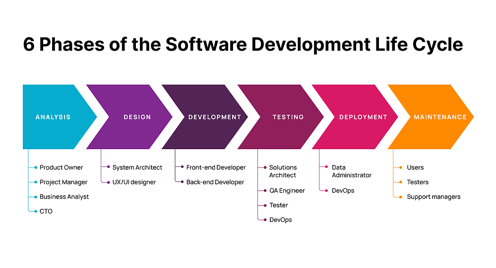
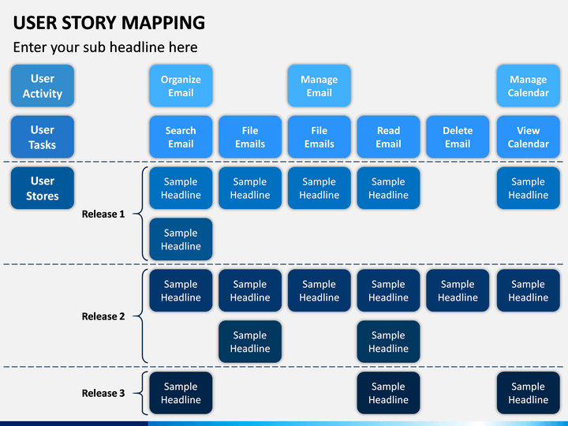
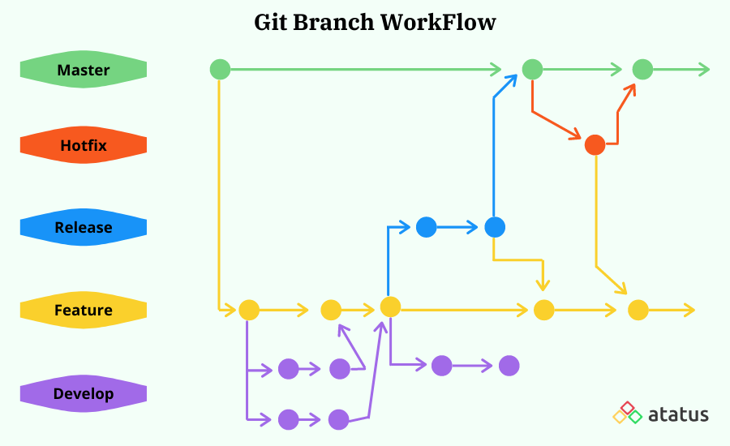
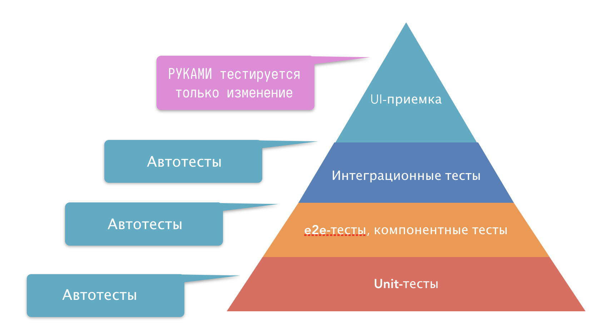
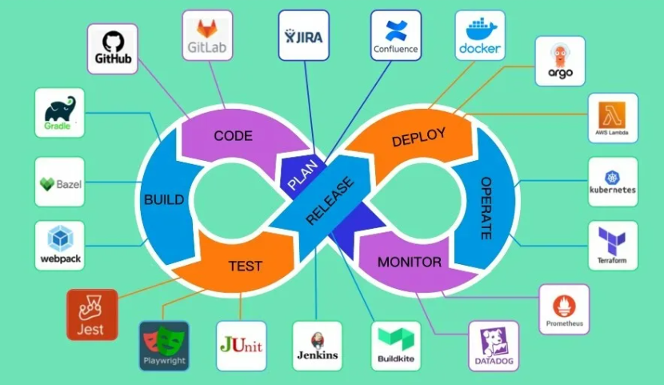

# Разработка программных продуктов: от идеи до реализации

## 🎯 Введение в жизненный цикл программного обеспечения

Разработка программного продукта — это **не хаотичное написание кода**, а **структурированный процесс**, напоминающий строительство здания, производство автомобиля или даже написание книги. Без чёткого плана, этапов и контроля качества — продукт обречён на провал.

**Аналогия: Строительство дома vs. Разработка ПО**

| Этап строительства дома       | Этап разработки ПО              | Цель этапа |
|-------------------------------|----------------------------------|------------|
| Идея и эскиз               | Анализ требований                | Понять, что и для кого строим |
| Архитектурный проект       | Проектирование системы           | Определить структуру и технологии |
| Возведение фундамента и стен | Разработка (кодирование)        | Создать основной функционал |
| Проверка коммуникаций, утечек | Тестирование                    | Убедиться, что всё работает как надо |
| Сдача объекта, ключи жильцам | Внедрение и запуск              | Передать продукт пользователям |
| Текущий ремонт, модернизация | Сопровождение и обновления      | Поддерживать и улучшать продукт |


*Аналогия - дом*

---

## Универсальные этапы разработки любого цифрового продукта

Независимо от масштаба — от мобильного приложения до корпоративной ERP-системы — все проекты проходят через одни и те же фазы. Это и есть **жизненный цикл разработки ПО (SDLC — Software Development Life Cycle)**.



*Цикл разработки цифрового продукта*

---

### Этап 1: Идея и анализ требований

**Цель:** Чётко определить, **что** мы делаем, **для кого** и **зачем**.

#### Что включает:
- **Формулировка проблемы** — какую боль решает продукт?
- **Целевая аудитория** — кто пользователи? (возраст, профессия, техническая грамотность)
- **Конкурентный анализ** — кто уже делает похожее? Чем мы будем лучше?
- **Сбор требований** — интервью, анкеты, анализ рынка.
- **Приоритизация функций** — что обязательно в MVP (Minimum Viable Product), что — позже.

#### Пример документа: Product Requirements Document (PRD)
```markdown
Название продукта: "Умный трекер привычек"

Цель: Помочь пользователям формировать полезные привычки через геймификацию.

ЦА: Люди 18–35 лет, стремящиеся к саморазвитию.

Основные функции (MVP):
- Регистрация/авторизация
- Добавление привычек (название, частота, напоминания)
- Отслеживание выполнения (чекбоксы)
- Прогресс в виде графика
- Уведомления

Технические ограничения:
- Поддержка iOS и Android
- Офлайн-режим
- Синхронизация через облако
```



*User Story Map*

---

### Этап 2: Проектирование и планирование

**Цель:** Создать **технический план** — как будет устроена система, какие технологии использовать, как распределить задачи.

#### Что включает:
- **Техническое задание (ТЗ)** — детальное описание архитектуры, API, БД.
- **Прототипы интерфейса** — мокапы, wireframes (Figma, Adobe XD).
- **Архитектура системы** — монолит, микросервисы, клиент-сервер и т.д.
- **Дорожная карта (Roadmap)** — сроки, спринты, milestones.
- **Оценка ресурсов** — команда, бюджет, инструменты.

#### Пример архитектуры для веб-приложения:

```
[Пользователь] 
    → [Frontend: React] 
    → [Backend API: Django] 
    → [База данных: PostgreSQL] 
    → [Хранение файлов: AWS S3]
```

---

### Этап 3: Разработка (кодирование)

**Цель:** Реализовать продукт согласно проекту — **написать качественный, поддерживаемый код**.

#### Что включает:
- **Чистый код** — следование стандартам, документирование.
- **Система контроля версий** — Git, ветки (main, dev, feature/*).
- **Code Review** — проверка кода коллегами.
- **CI/CD** — автоматическая сборка и тестирование.
- **Агил-методологии** — Scrum, Kanban, ежедневные стендапы.

#### Лучшие практики:
- Разбивайте задачи на маленькие подзадачи (до 1 дня).
- Пишите unit-тесты параллельно с кодом.
- Используйте линтеры и форматтеры (Prettier, Black, ESLint).



*Git-ветки разработки*

---

### Этап 4: Тестирование и отладка

**Цель:** Убедиться, что продукт **работает корректно**, **без багов** и **удобен для пользователя**.

#### Виды тестирования:
| Тип тестирования       | Описание                          | Инструменты |
|------------------------|-----------------------------------|-------------|
| Unit-тесты             | Тест отдельных функций/классов    | pytest, JUnit, Jest |
| Интеграционные         | Тест взаимодействия модулей       | Postman, Selenium |
| Сквозные (End-to-End)  | Тест всего сценария “как пользователь” | Cypress, Playwright |
| UX/UI тестирование     | Удобство интерфейса               | UsabilityHub, Figma Mirror |
| Нагрузочное            | Поведение под высокой нагрузкой   | JMeter, k6 |
| Безопасности           | Поиск уязвимостей                 | OWASP ZAP, Burp Suite |



*Пирамида тестирования*

---

### 🚀 Этап 5: Внедрение и запуск

**Цель:** Доставить продукт **реальным пользователям** без сбоев.

#### Что включает:
- **Деплой** — на сервер, в AppStore/Google Play, в облако.
- **Миграция данных** — если есть старая система.
- **Настройка инфраструктуры** — балансировщики, базы, кэш, CDN.
- **Обучение пользователей** — гайды, видео, вебинары.
- **Мониторинг первой волны** — сбор фидбэка, отлов критических багов.

#### 📈 Пример чек-листа деплоя:
- [ ] Бэкап базы
- [ ] Запущены миграции
- [ ] Настроен мониторинг (Sentry, Prometheus)
- [ ] Проверен SSL-сертификат
- [ ] Запущен smoke-тест



*CI/CD пайплайн*

---

### Этап 6: Сопровождение и обновления

**Цель:** Поддерживать продукт **в рабочем состоянии** и **развивать** его на основе обратной связи.

#### Что включает:
- **Hotfix’ы** — срочное исправление багов.
- **Feature-релизы** — выпуск новых функций.
- **Оптимизация** — ускорение, снижение потребления памяти.
- **Аналитика** — сбор метрик (DAU, retention, conversion).
- **Поддержка пользователей** — чат, тикеты, FAQ.

---

## Пример 1: Разработка игры “Угадай число”

### Идея и анализ требований

**Проблема:** Начинающим программистам не хватает простых, понятных проектов для практики.

**ЦА:** Ученики 5–9 классов, студенты колледжей, новички в Python.

**Функции MVP:**
- Генерация случайного числа (1–100)
- Ввод числа с клавиатуры
- Подсказки “больше/меньше”
- Счётчик попыток
- Возможность перезапуска

**Технические ограничения:** Только консоль, без GUI, совместимость с Python 3.8+.

---

### Проектирование и планирование

**Архитектура:** ООП — класс `GuessNumberGame` инкапсулирует логику.

**Технологии:** Python 3, модули `random`, `sys`.

**План разработки:**
- День 1: класс + генерация числа
- День 2: ввод + валидация
- День 3: подсказки + счётчик
- День 4: цикл игры + тесты

---

### Разработка (код игры)

```python
import random

class GuessNumberGame:
    def __init__(self, min_num=1, max_num=100):
        self.min_num = min_num
        self.max_num = max_num
        self.secret_number = None
        self.attempts = 0
        self.game_active = False
    
    def generate_secret_number(self):
        self.secret_number = random.randint(self.min_num, self.max_num)
    
    def get_user_guess(self):
        while True:
            try:
                guess = int(input(f"Введите число от {self.min_num} до {self.max_num}: "))
                if self.min_num <= guess <= self.max_num:
                    return guess
                else:
                    print(f"Число должно быть между {self.min_num} и {self.max_num}!")
            except ValueError:
                print("Пожалуйста, введите целое число!")
    
    def give_hint(self, guess):
        if guess < self.secret_number:
            print("Загаданное число больше!")
        else:
            print("Загаданное число меньше!")
    
    def play_round(self):
        self.attempts = 0
        self.game_active = True
        self.generate_secret_number()
        print(f"\n🎯 Я загадал число от {self.min_num} до {self.max_num}. Попробуйте угадать!")
        
        while self.game_active:
            self.attempts += 1
            guess = self.get_user_guess()
            
            if guess == self.secret_number:
                print(f"🎉 Поздравляю! Вы угадали число {self.secret_number} за {self.attempts} попыток!")
                self.game_active = False
            else:
                self.give_hint(guess)
    
    def ask_for_replay(self):
        while True:
            choice = input("\n🔄 Хотите сыграть еще раз? (да/нет): ").lower().strip()
            if choice in ['да', 'д', 'yes', 'y']:
                return True
            elif choice in ['нет', 'н', 'no', 'n']:
                return False
            else:
                print("Пожалуйста, введите 'да' или 'нет'")
    
    def run(self):
        print("👋 Добро пожаловать в игру 'Угадай число'!")
        while True:
            self.play_round()
            if not self.ask_for_replay():
                print("🙏 Спасибо за игру! До свидания!")
                break

if __name__ == "__main__":
    game = GuessNumberGame()
    game.run()
```

---

### Тестирование и отладка

**Тест-кейсы:**

| Сценарий                 | Действие                     | Ожидаемый результат           |
|--------------------------|------------------------------|-------------------------------|
| Ввод корректного числа   | 50                           | Подсказка или победа          |
| Ввод буквы               | “abc”                        | Сообщение об ошибке           |
| Ввод числа вне диапазона | 150 (при диапазоне 1–100)    | Сообщение о диапазоне         |
| Угадывание с 1 попытки   | Ввести загаданное число      | Сообщение “за 1 попытку”      |
| Отказ от повторной игры  | Ввести “нет”                 | Программа завершается         |
---

### Внедрение и запуск

- Упаковка в `.exe` через `PyInstaller`:  
  ```bash
  pip install pyinstaller
  pyinstaller --onefile guess_number.py
  ```
- Создание `README.md` с инструкцией запуска.
- Публикация на GitHub: https://github.com/username/guess-number-game

---

### Сопровождение и обновления

**План развития:**
- v1.1: Уровни сложности (диапазон 1–10, 1–100, 1–1000)
- v1.2: Режим “на время”
- v1.3: GUI на Tkinter
- v2.0: Онлайн-режим с рейтингом

---

## Пример 2: Разработка образовательного веб-сайта

### Идея и анализ требований

**Проблема:** Нет интерактивной платформы для обучения Python с мгновенной проверкой кода.

**ЦА:** Студенты, самоучки, школьники.

**Функции MVP:**
- Регистрация / вход
- Интерактивные уроки
- Онлайн-редактор кода
- Автопроверка заданий
- Прогресс-бар курса

---

### Проектирование и планирование

**Стек технологий:**
- Frontend: React + CodeMirror
- Backend: Django + DRF
- БД: PostgreSQL
- Деплой: Docker + Nginx + AWS EC2

**ER-диаграмма БД:**

```
[User] —< [UserProgress] >— [Lesson] —< [Course]
```

---

### Разработка (ключевые компоненты)

**Backend (Django models.py):**

```python
# models.py
from django.db import models
from django.contrib.auth.models import User

class Course(models.Model):
    title = models.CharField(max_length=200, verbose_name="Название")
    description = models.TextField(verbose_name="Описание")
    created_at = models.DateTimeField(auto_now_add=True)
    difficulty = models.CharField(
        max_length=20,
        choices=[
            ('beginner', 'Начинающий'),
            ('intermediate', 'Средний'),
            ('advanced', 'Продвинутый')
        ],
        default='beginner'
    )
    
    def __str__(self):
        return self.title

class Lesson(models.Model):
    course = models.ForeignKey(Course, on_delete=models.CASCADE, related_name='lessons')
    title = models.CharField(max_length=200)
    content = models.TextField()  # Markdown или HTML
    order = models.IntegerField(default=0)
    exercise = models.TextField(help_text="Задание для студента")
    solution = models.TextField(help_text="Эталонное решение")
    test_code = models.TextField(help_text="Код для автопроверки", blank=True)
    
    class Meta:
        ordering = ['order']
    
    def __str__(self):
        return f"{self.course.title} - {self.title}"

class UserProgress(models.Model):
    user = models.ForeignKey(User, on_delete=models.CASCADE)
    lesson = models.ForeignKey(Lesson, on_delete=models.CASCADE)
    completed = models.BooleanField(default=False)
    code_solution = models.TextField(blank=True, null=True)
    completed_at = models.DateTimeField(null=True, blank=True)
    
    class Meta:
        unique_together = ('user', 'lesson')
```

**Frontend (React редактор):**

```jsx
// CodeEditor.jsx
import React, { useState, useEffect } from 'react';
import CodeMirror from '@uiw/react-codemirror';
import { python } from '@codemirror/lang-python';
import { githubDark } from '@uiw/codemirror-theme-github';
import './CodeEditor.css';

const CodeEditor = ({ lesson, onCodeSubmit, initialCode = '' }) => {
  const [code, setCode] = useState(initialCode || lesson.initialCode || '# Начните писать код здесь\n');
  const [output, setOutput] = useState('');
  const [isRunning, setIsRunning] = useState(false);

  const handleRunCode = async () => {
    setIsRunning(true);
    setOutput('⏳ Выполняется...');
    
    try {
      const response = await fetch('/api/lessons/run-code/', {
        method: 'POST',
        headers: { 'Content-Type': 'application/json' },
        body: JSON.stringify({ 
          code, 
          lesson_id: lesson.id,
          user_id: localStorage.getItem('user_id')
        }),
      });
      
      const result = await response.json();
      
      if (result.success) {
        setOutput(`✅ Успешно! ${result.message || ''}`);
        onCodeSubmit(code, true);
      } else {
        setOutput(`❌ Ошибка: ${result.error}`);
        onCodeSubmit(code, false);
      }
    } catch (error) {
      setOutput(`🚨 Ошибка соединения: ${error.message}`);
    } finally {
      setIsRunning(false);
    }
  };

  return (
    <div className="code-editor-container">
      <div className="editor-header">
        <h3>💻 Редактор кода</h3>
        <button 
          onClick={handleRunCode} 
          disabled={isRunning}
          className={`run-button ${isRunning ? 'running' : ''}`}
        >
          {isRunning ? '⏳ Проверка...' : '▶️ Запустить'}
        </button>
      </div>
      
      <CodeMirror
        value={code}
        height="400px"
        theme={githubDark}
        extensions={[python()]}
        onChange={setCode}
        basicSetup={{
          lineNumbers: true,
          highlightActiveLine: true,
          foldGutter: true,
          dropCursor: true,
        }}
      />
      
      <div className="output-panel">
        <h4>📝 Результат выполнения:</h4>
        <pre className="output-content">{output}</pre>
      </div>
    </div>
  );
};

export default CodeEditor;
```

---

### Тестирование

**Backend тесты (Django):**
```python
# test_models.py
from django.test import TestCase
from .models import Course, Lesson

class CourseModelTest(TestCase):
    def test_course_creation(self):
        course = Course.objects.create(
            title="Python для начинающих",
            description="Базовый курс",
            difficulty="beginner"
        )
        self.assertEqual(course.title, "Python для начинающих")
        self.assertEqual(str(course), "Python для начинающих")
```

**Frontend тесты (Jest + React Testing Library):**
```javascript
// CodeEditor.test.jsx
import { render, screen, fireEvent } from '@testing-library/react';
import CodeEditor from './CodeEditor';

test('renders run button and editor', () => {
  render(<CodeEditor lesson={{ id: 1, title: "Test Lesson" }} />);
  expect(screen.getByText('💻 Редактор кода')).toBeInTheDocument();
  expect(screen.getByText('▶️ Запустить')).toBeInTheDocument();
});
```

---

### Внедрение

- Dockerfile для backend:
```dockerfile
FROM python:3.10-slim
WORKDIR /app
COPY requirements.txt .
RUN pip install -r requirements.txt
COPY . .
CMD ["gunicorn", "myproject.wsgi:application", "--bind", "0.0.0.0:8000"]
```

- CI/CD через GitHub Actions → авто-деплой на AWS при пуше в `main`.

---

### Сопровождение

- Мониторинг: Sentry для ошибок, Prometheus + Grafana для метрик.
- Еженедельные релизы новых уроков.
- Сбор фидбэка через встроенную форму.
