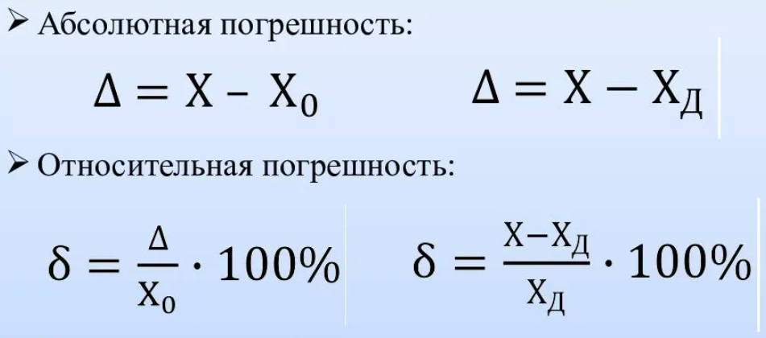

# Конспект: Источники и классификация погрешностей

**Численные методы** — это методы, используемые для приближённого решения задач, точное аналитическое решение которых получить невозможно или чрезвычайно сложно. Любое численное решение неизбежно содержит погрешности. Их изучение, оценка и минимизация — ключевая задача вычислительной математики, особенно важная в технических и научных расчётах.

---

## 1. Классификация погрешностей по происхождению

### 1.1. Неустранимая погрешность
Возникает из-за неточного задания исходных данных и упрощений в математической модели.
*   **Источник:** Ошибки измерений, приближённые константы (напр., `π ≈ 3.1416`), упрощение физической модели.
*   **Пример:** Использование значения `g = 9.8 м/с²` вместо точного, зависящего от координат.

### 1.2. Погрешность метода (или теоретическая)
Связана с заменой исходной задачи на упрощённую, доступную для вычислений (дискретизация).
*   **Источник:**
    *   Замена бесконечного процесса конечным (усечение ряда Тейлора).
    *   Замена производной разностным отношением.
    *   Замена интегрирования суммированием (методы прямоугольников, трапеций).
*   **Пример:** Вычисление `sin(x)` с помощью обрыва ряда: `sin(x) ≈ x - x³/3! + x⁵/5!`.

### 1.3. Вычислительная погрешность (погрешность округления)
Возникает в процессе вычислений из-за конечности разрядной сетки компьютера.
*   **Источник:**
    *   Округление результатов арифметических операций.
    *   Представление чисел в формате с плавающей запятой (напр., `1/10` нельзя точно представить в двоичной системе).
*   **Пример:** Вычисление `(1/3) * 3` даст `0.999...` вместо `1`.

---

## 2. Классификация погрешностей по характеру проявления

### 2.1. Абсолютная погрешность
Разность между приближённым (`x`) и точным (`x*`) значением величины.
`Δx = |x* - x|`

### 2.2. Относительная погрешность
Отношение абсолютной погрешности к модулю точного значения. Является более информативной мерой точности.
`δx = Δx / |x*| ≈ Δx / |x|`

---

## 3. Методы оценки и минимизации погрешностей

1.  **Априорная оценка:** Теоретический анализ алгоритма до проведения вычислений. Часто используется для оценки погрешности метода.
2.  **Использование устойчивых алгоритмов:** Выбор вычислительных схем, в которых погрешность не растёт катастрофически (напр., выбор ведущего элемента в методе Гаусса).
3.  **Контроль невязки:** Для уравнения `F(x) = 0` невязкой называется значение `r = |F(x*)|`, где `x*` — найденное решение. Малая невязка — признак точности.
4.  **Вычисление погрешностей результатов арифметических действий:**
    *   **Сумма/Разность:** Абсолютная погрешность суммы/разности **не превышает суммы** абсолютных погрешностей слагаемых.
        `Δ(a ± b) ≈ Δa + Δb`
    *   **Произведение:** Относительная погрешность произведения **не превышает суммы** относительных погрешностей сомножителей.
        `δ(a * b) ≈ δa + δb`
    *   **Частное:** Относительная погрешность частного **не превышает суммы** относительных погрешностей делимого и делителя.
        `δ(a / b) ≈ δa + δb`
    *   **Степень:** Относительная погрешность степени `n` приближённо в `n` раз больше относительной погрешности основания.
        `δ(xⁿ) ≈ |n| * δx`