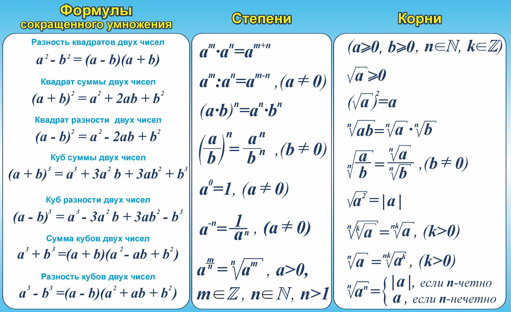

# Приближённые решения алгебраических и трансцендентных уравнений

## Зачем на практике нужны численные методы?

Прежде чем углубляться в теорию, давайте поймём, зачем это вообще нужно в реальной жизни.

Представьте:

- Вы инженер: рассчитываете, при какой температуре произойдёт тепловое расширение детали до критического размера → получаете уравнение типа $e^T - kT - C = 0$.
- Вы физик: моделируете движение маятника с трением → уравнение $\sin(\theta) + \mu \theta' + \theta = 0$, где нужно найти момент остановки.
- Вы экономист: ищете точку безубыточности, где доход = издержки → $R(x) - C(x) = 0$, а функции — нелинейные.
- Вы программист: реализуете алгоритм машинного обучения, где нужно решать уравнения вида $\nabla L(w) = 0$ для оптимизации.

**Во всех этих случаях:**

- Аналитического решения нет (или оно слишком сложное).
- Нужен числовой ответ с заданной точностью — например, до 0.001.
- Требуется алгоритм, который можно запрограммировать и запустить на компьютере.

Именно поэтому мы изучаем приближённые численные методы — они позволяют находить корни уравнений практически всегда, даже когда "формулой не берётся".

## Постановка задачи

### Зачем нужны приближённые методы?

В реальной инженерной, физической, экономической практике мы постоянно сталкиваемся с уравнениями вида:

$$f(x) = 0$$

где $f(x)$ — некоторая функция, которая может быть:
- **алгебраической** (например, $x^3 - 2x + 1 = 0$),
- **трансцендентной** (например, $e^x - x - 2 = 0$, $\sin x - x/2 = 0$).

> Алгебраическое уравнение — содержит только алгебраические операции (сложение, умножение, возведение в степень).
> 
> Трансцендентное уравнение — содержит трансцендентные функции: экспоненты, логарифмы, тригонометрические функции и т.п.

Для уравнений степени выше 4 не существует общей формулы для нахождения корней (теорема Абеля-Руффини). Для трансцендентных уравнений аналитические решения почти всегда отсутствуют.

Поэтому мы используем численные методы — алгоритмы, позволяющие находить корни с заданной точностью.

### Постановка задачи

**Цель**: найти все действительные корни уравнения $f(x) = 0$ на отрезке $[a, b]$ с заданной точностью $\varepsilon > 0$.

**Этапы решения**:
1. **Локализация корней** — определить интервалы, содержащие по одному корню.
2. **Уточнение корней** — применение численных методов для нахождения корня с заданной точностью.

## Локализация корней

### Что такое локализация?

Это процесс выделения таких отрезков $[a_i, b_i]$, на каждом из которых:
- функция $f(x)$ непрерывна,
- $f(a_i) \cdot f(b_i) < 0$ — т.е. функция меняет знак (по теореме Больцано-Коши, на отрезке есть хотя бы один корень),
- желательно, чтобы корень был единственным на этом отрезке (для этого проверяют монотонность или отсутствие экстремумов).

> Теорема Больцано-Коши: Если $f(x)$ непрерывна на $[a, b]$ и $f(a) \cdot f(b) < 0$, то существует хотя бы одна точка $c \in (a, b)$, такая что $f(c) = 0$.

### Практические способы локализации

#### Способ 1: Табулирование функции

Разбиваем отрезок $[a, b]$ на части с шагом $h$, вычисляем значения $f(x_i)$, ищем смену знака.

**Пример 1**: Локализовать корни уравнения $f(x) = x^3 - 6x + 2 = 0$ на отрезке $[-3, 3]$.

Составим таблицу:

| x   | -3 | -2 | -1 | 0 | 1 | 2 | 3 |
|-----|----|----|----|---|---|---|---|
| f(x)| -7 | 6  | 7  | 2 | -3| -2| 11|

Видим смену знака:
- между -3 и -2: $f(-3) = -7 < 0$, $f(-2) = 6 > 0$ → корень в $[-3, -2]$
- между 0 и 1: $f(0) = 2 > 0$, $f(1) = -3 < 0$ → корень в $[0, 1]$
- между 2 и 3: $f(2) = -2 < 0$, $f(3) = 11 > 0$ → корень в $[2, 3]$

Найдено 3 интервала локализации.

---

#### Способ 2: Графический метод

Строим график $y = f(x)$ и визуально определяем, где он пересекает ось OX.

**Пример 2**: $f(x) = \cos x - x$

Строим графики $y = \cos x$ и $y = x$, находим точку пересечения — это и есть корень уравнения.

Можно оценить: при $x=0$: $\cos 0 - 0 = 1 > 0$, при $x=1$: $\cos 1 - 1 ≈ 0.54 - 1 = -0.46 < 0$ → корень в $[0, 1]$.

#### Способ 3: Аналитический — с использованием производной

Если $f'(x)$ не меняет знак на $[a, b]$, то функция монотонна → корень единственный.

**Пример 3**: $f(x) = e^x - 2x - 1$

$f'(x) = e^x - 2$

$f'(x) = 0$ → $x = \ln 2 ≈ 0.693$

Значит, на $[0, 1]$ производная меняет знак → функция не монотонна. Но на $[1, 2]$: $f'(x) > 0$ → монотонно возрастает.

Проверим значения:
- $f(1) = e^1 - 2 - 1 ≈ 2.718 - 3 = -0.282 < 0$
- $f(2) = e^2 - 4 - 1 ≈ 7.389 - 5 = 2.389 > 0$

→ Корень на $[1, 2]$, и он единственный, т.к. функция возрастает.

---

## Численные методы уточнения корней

Теперь, когда корни локализованы, переходим к их уточнению. Рассмотрим 3 основных метода.

### 1. Метод половинного деления (бисекции)

#### Идея:
Делим отрезок пополам, выбираем ту половину, где функция меняет знак, повторяем.

#### Алгоритм:
1. Задать $[a, b]$, где $f(a) \cdot f(b) < 0$, и точность $\varepsilon$.
2. Вычислить $c = \frac{a+b}{2}$.
3. Если $f(c) = 0$ или $|b - a| < \varepsilon$ — корень найден.
4. Иначе: если $f(a) \cdot f(c) < 0$, то $b = c$, иначе $a = c$.
5. Вернуться к шагу 2.

#### Пример 4: Решим $x^3 - 6x + 2 = 0$ на $[0, 1]$ с точностью $\varepsilon = 0.01$

$f(x) = x^3 - 6x + 2$

Шаг 0: $a=0, b=1$, $f(0)=2 > 0$, $f(1)=-3 < 0$

| Итерация | a     | b     | c       | f(c)           | Новый отрезок |
|----------|-------|-------|---------|----------------|----------------|
| 1        | 0     | 1     | 0.5     | -0.875         | [0, 0.5]       |
| 2        | 0     | 0.5   | 0.25    | 0.515625       | [0.25, 0.5]    |
| 3        | 0.25  | 0.5   | 0.375   | -0.205...      | [0.25, 0.375]  |
| 4        | 0.25  | 0.375 | 0.3125  | 0.148...       | [0.3125, 0.375]|
| 5        | 0.3125| 0.375 | 0.34375 | -0.030...      | [0.3125, 0.34375]|
| 6        | 0.3125| 0.34375|0.328125| 0.058...       | [0.328125, 0.34375]|
| 7        | 0.328125|0.34375|0.3359375| 0.014...      | [0.3359375, 0.34375]|
| 8        | 0.3359|0.34375|0.3398   | -0.008...      | [0.3359, 0.3398]|

Длина отрезка: $0.3398 - 0.3359 ≈ 0.0039 < 0.01$ → 

**Ответ**: $x ≈ 0.338$

> Преимущества: простота, гарантированная сходимость.
> Недостатки: медленная сходимость (линейная), требует только непрерывности.

---

### 2. Метод хорд (секущих)

#### Идея:
Заменяем кривую хордой и находим точку её пересечения с осью OX.

Формула:

$$x_{n+1} = x_n - \frac{f(x_n)(x_n - x_{n-1})}{f(x_n) - f(x_{n-1})}$$

Или, если фиксировать один конец (если $f''(x)$ не меняет знак):

$$x_{n+1} = a - \frac{f(a)(b - a)}{f(b) - f(a)} \quad \text{или} \quad x_{n+1} = b - \frac{f(b)(b - a)}{f(b) - f(a)}$$

Выбираем тот конец, где $f(x) \cdot f''(x) > 0$ — он фиксируется.

#### Пример 5: Решим то же уравнение $x^3 - 6x + 2 = 0$ на $[0, 1]$

$f(x) = x^3 - 6x + 2$

$f''(x) = 6x$ → на $[0, 1]$ $f''(x) \geq 0$

$f(0) = 2 > 0$, $f(1) = -3 < 0$

Проверим: $f(a) \cdot f''(a) = 2 \cdot 0 = 0$ — не подходит.

$f(b) \cdot f''(b) = (-3) \cdot 6 = -18 < 0$ — тоже не подходит.

Значит, лучше использовать двухстороннюю формулу хорд.

Возьмём $x_0 = 0$, $x_1 = 1$

$$x_2 = x_1 - \frac{f(x_1)(x_1 - x_0)}{f(x_1) - f(x_0)} = 1 - \frac{(-3)(1 - 0)}{-3 - 2} = 1 - \frac{-3}{-5} = 1 - 0.6 = 0.4$$

$$f(0.4) = 0.064 - 2.4 + 2 = -0.336$$

$$x_3 = 0.4 - \frac{(-0.336)(0.4 - 1)}{-0.336 - (-3)} = 0.4 - \frac{(-0.336)(-0.6)}{2.664} ≈ 0.4 - \frac{0.2016}{2.664} ≈ 0.4 - 0.0757 ≈ 0.3243$$

$$f(0.3243) ≈ 0.3243^3 - 6 \cdot 0.3243 + 2 ≈ 0.034 - 1.9458 + 2 ≈ 0.0882$$

$$x_4 = 0.3243 - \frac{0.0882 \cdot (0.3243 - 0.4)}{0.0882 - (-0.336)} ≈ 0.3243 - \frac{0.0882 \cdot (-0.0757)}{0.4242} ≈ 0.3243 + 0.0157 ≈ 0.3400$$

Уже близко к корню. Продолжая, получим за 5-6 шагов точность 0.001.

> Быстрее бисекции, не требует производной.
> Требует аккуратного выбора начальных точек, возможна неустойчивость.

---

### 3. Метод Ньютона (касательных)

#### Идея:
Заменяем кривую касательной в текущей точке.

Формула:

$$x_{n+1} = x_n - \frac{f(x_n)}{f'(x_n)}$$

#### Условия сходимости:
- $f(a) \cdot f(b) < 0$
- $f'(x)$ и $f''(x)$ не меняют знак на $[a, b]$
- Начальное приближение $x_0$ выбирается так, чтобы $f(x_0) \cdot f''(x_0) > 0$

#### Пример 6: $f(x) = x^3 - 6x + 2$, на $[0, 1]$

$f'(x) = 3x^2 - 6$, $f''(x) = 6x$

На $[0, 1]$: $f''(x) \geq 0$, $f'(x) < 0$ → функция убывает и выпукла вниз.

Выберем $x_0 = 1$, т.к. $f(1) = -3 < 0$, $f''(1) = 6 > 0$ → $f(x_0) \cdot f''(x_0) < 0$ — не подходит.

Выберем $x_0 = 0$: $f(0) = 2 > 0$, $f''(0) = 0$ — не подходит.

Возьмём $x_0 = 0.5$

$f(0.5) = -0.875$, $f''(0.5) = 3 > 0$ → $f(x_0) \cdot f''(x_0) < 0$ — всё ещё не то.

Лучше взять $x_0 = 0.2$: $f(0.2) = 0.008 - 1.2 + 2 = 0.808 > 0$, $f''(0.2) = 1.2 > 0$ → произведение > 0 → 

$$x_1 = 0.2 - \frac{f(0.2)}{f'(0.2)} = 0.2 - \frac{0.808}{3 \cdot (0.04) - 6} = 0.2 - \frac{0.808}{0.12 - 6} = 0.2 - \frac{0.808}{-5.88} ≈ 0.2 + 0.137 ≈ 0.337$$

$$f(0.337) ≈ 0.337^3 - 6 \cdot 0.337 + 2 ≈ 0.038 - 2.022 + 2 ≈ 0.016$$

$$f'(0.337) ≈ 3 \cdot (0.337)^2 - 6 ≈ 3 \cdot 0.1136 - 6 ≈ 0.3408 - 6 = -5.6592$$

$$x_2 = 0.337 - \frac{0.016}{-5.6592} ≈ 0.337 + 0.0028 ≈ 0.3398$$

$$f(0.3398) ≈ 0.3398^3 - 6 \cdot 0.3398 + 2 ≈ 0.0392 - 2.0388 + 2 ≈ 0.0004$$

→ Уже очень близко!

> Очень быстрая сходимость (квадратичная), если удачно выбрано начальное приближение.
> Требует вычисления производной, может расходиться при плохом выборе $x_0$.

---

## Сравнение методов

| Метод             | Скорость сходимости | Требования к функции         | Гарантия сходимости | Сложность реализации |
|-------------------|---------------------|------------------------------|---------------------|----------------------|
| Половинного деления | Линейная (медленная) | Непрерывность                | Всегда сходится     | Очень простая        |
| Хорд              | Сверхлинейная       | Непрерывность, дифференцируемость | Не всегда          | Средняя              |
| Ньютона           | Квадратичная (быстрая) | Дважды дифференцируемость   | При хорошем начальном приближении | Сложная          |