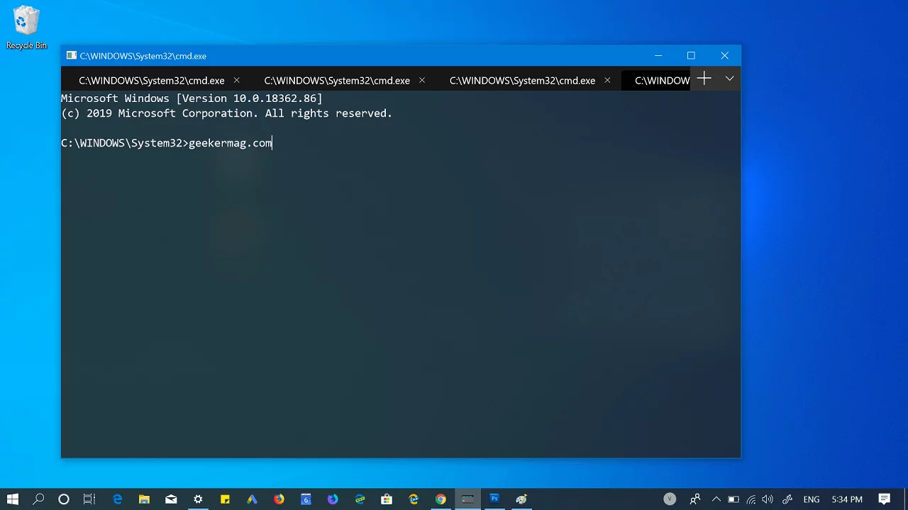
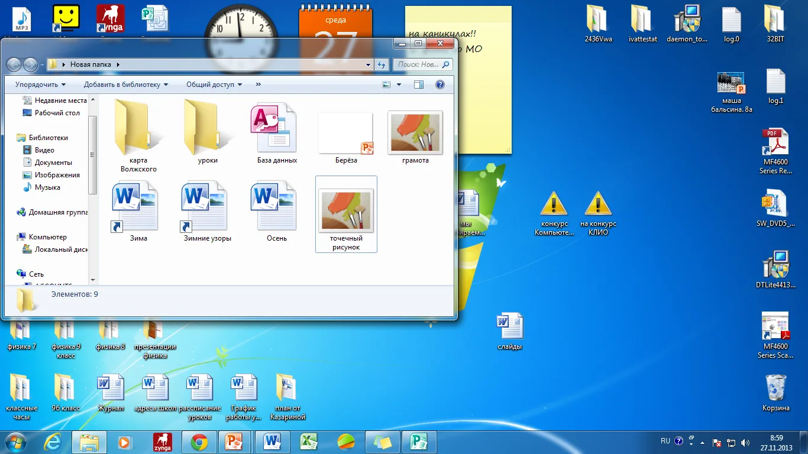
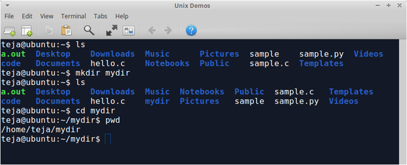

# Основы работы с командной строкой

### Введение
Сегодня целью нашего занятия будет выступать не серьезная лекция на тему операционных систем, а более практически необходимая, а именно изучения командной строки для повседневной работы в разработке.

Давайте зададим себе вопрос: «Когда нам надо создать папку, что мы делаем?»
Правильно открываем проводник и кликаем нужные кнопки для создания папки. А есть ли те, которые делали это через терминал. 

> Целью нашего сегодняшнего занятия будет знакомство с терминалом и **интеграция его в разработку**.

### Сферы использования терминала


| Ситуация | Что происходит | Как делает **пользователь** | Как делает **программист** |
|----------|----------------|------------------------------|----------------------------|
| Создаёшь проект | Нужна папка `my-app` | Открывает проводник → ПКМ → Создать папку → Переименовать | `mkdir my-app` |
| Устанавливаешь библиотеку | Нужен `requests` | Ищет в Google, скачивает .zip, распаковывает, копирует в папку Python | `pip install requests` |
| Отправляешь код на GitHub | Надо закоммитить | Кликает в VS Code → "Commit" → "Push" | `git add .`, `git commit -m "..."`, `git push` |
| Ищешь файл | Нужен `config.json` | Открывает 10 папок, вручную ищет | `find . -name "config.json"` или `dir /s config.json` |
| Запускаешь сервер | Нужно запустить Flask | Дважды кликает на `app.py` → открывается окно → закрывается | `python app.py` — и видишь логи прямо в терминале |

> Главная мысль данной таблицы гласит **«Терминал — для тех, кто хочет контролировать процесс.»**



*Пример использования терминала*



*Использование проводника*

---

### Основные команды терминала

| Команда | Зачем? | Пример |
|--------|-------|--------|
| `pwd` | **P**rint **W**orking **D**irectory — где я сейчас? | `pwd` → `/home/alex/projects` |
| `ls` | **L**i**S**t — что здесь есть? | `ls -la` (все файлы, включая скрытые) |
| `cd` | **C**hange **D**irectory — перейти | `cd ../docs` |
| `mkdir` | **M**a**K**e **DIR**ectory | `mkdir src` |
| `touch` | Создать пустой файл | `touch main.py` |
| `echo` | Напечатать текст | `echo "Hello" > hello.txt` |
| `cat` | **Cat** (кот!) — показать содержимое | `cat hello.txt` |
| `rm` | **R**e**M**ove — удалить | `rm hello.txt` |
| `clear` | Очистить экран | `clear` (или `Ctrl+L`) |

> **Интерактив:**  
Как создать папку `data` внутри папки `project`?

*Решение*



---

### Файловая система — как карта мира

Представьте аналогию с городом, если наш компьютер - это город, то:
- `/` — центр города (корень)  
- `~` — твой дом  
- `.` — текущая комната  
- `..` — коридор за дверью  

> **Правило 1:** Все пути начинаются с `/` — это абсолютный путь.  
> ```bash
> /home/user/project/main.py
> ```

> **Правило 2:** `.` и `..` — относительные пути.  
> Если мы находимся `/home/user/project/`, то:  
> - `cd ..` → попадёшь в `/home/user`  
> - `cd ./src` → остаёшься в той же папке, но переходишь в `src`  
> - `cd ../docs` → переходим в `/home/user/docs`

**Вопрос**  
*«Вы в папке `/home/student/projects/web-site`.*  
*Как попасть в `/home/student/documents/report.pdf`?»*  

---

### Важность данной темы непосредственно для работника?

**Работа на сервере**  
Мы получили доступ к серверу через SSH — там **нет графики**. Только терминал.  
А мы должны:  
- Скачать проект (`git clone`)  
- Установить зависимости (`pip install -r requirements.txt`)  
- Запустить (`python app.py`)  
  
**Автоматизация**  
Нам нужно переименовать 100 файлов `photo_001.jpg` → `img_001.jpg`.  
Вручную — 10 минут.  
В терминале — одна команда:  
```bash
for f in photo_*.jpg; do mv "$f" "img_${f#photo_}"; done
 ```

> **Терминал — это язык, который понимают все программисты.**

---