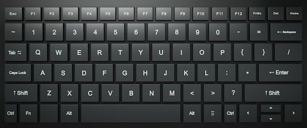
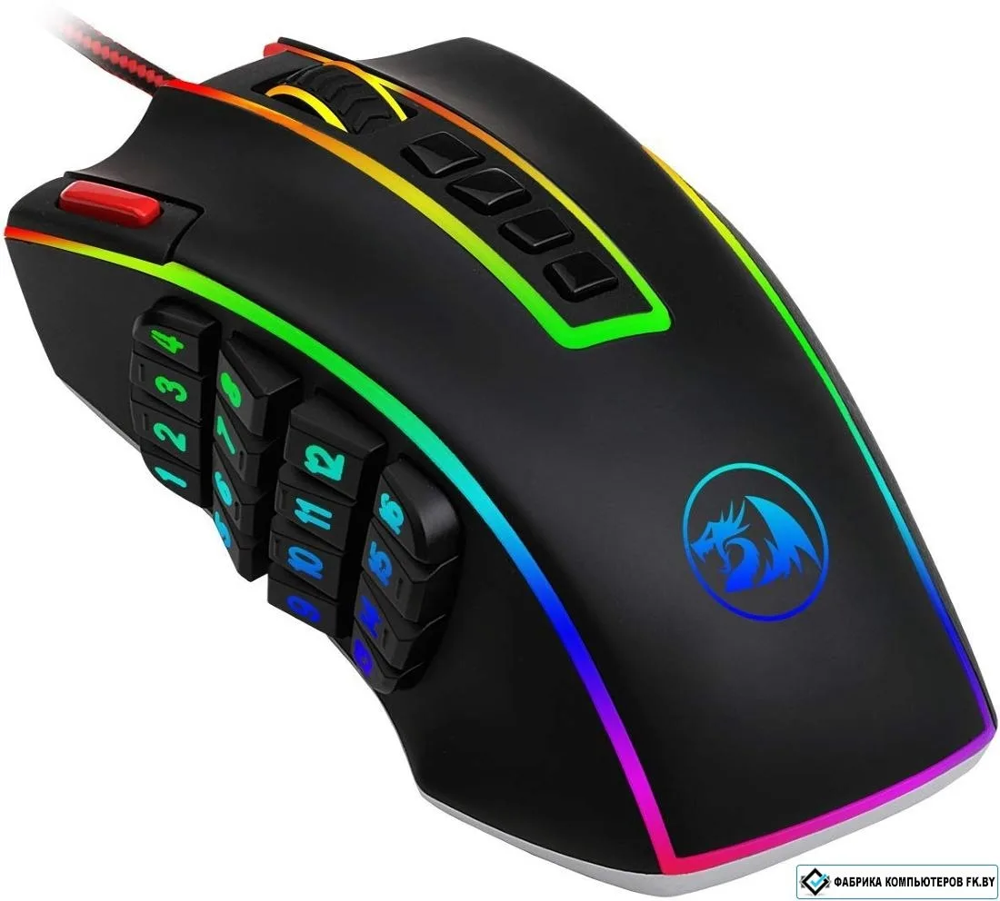

# Практическая работа №2. Устройство клавиатуры и мыши, настройка параметров работы клавиатуры и мыши

## Вводная часть (Теоретические сведения)

### 1. Клавиатура

Клавиатура — основное устройство ввода текстовой и управляющей информации. Современные клавиатуры имеют несколько групп клавиш:

*   **Алфавитно-цифровые клавиши:** Основной блок для ввода букв, цифр и символов.
*   **Клавиши управления курсором (Стрелки, Home, End, Page Up/Down):** Используются для навигации по тексту и интерфейсам.
*   **Цифровая клавиатура (Numpad):** Отдельный блок для быстрого ввода цифр и математических операций.
*   **Функциональные клавиши (F1-F12):** Клавиши, выполняющие специальные команды, зависящие от программы.
*   **Специальные (модификаторы) клавиши (Ctrl, Alt, Shift, Win):** Используются в комбинациях с другими клавишами для расширения их функционала.
*   **Клавиши-индикаторы (Caps Lock, Num Lock, Scroll Lock):** Светодиоды, отображающие состояние соответствующих режимов.

**Важные параметры настройки в ОС:**
*   **Скорость повтора символа:** Определяет, как быстро начинают повторяться символы при удержании клавиши.
*   **Задержка перед началом повтора:** Время, через которое начнется повтор символа после удержания клавиши.
*   **Частота мерцания курсора:** Скорость мигания текстового курсора.

### 2. Компьютерная мышь

Мышь — координатное устройство ввода для управления курсором и взаимодействия с элементами интерфейса.

*   **Основные кнопки (Левая, Правая):**
    *   *Левая* — выбор, активация, перетаскивание.
    *   *Правая* — вызов контекстного меню.
*   **Колесо прокрутки:** Прокрутка содержимого окон. Часто является и средней кнопкой (нажатие на колесо).
*   **Дополнительные кнопки (например, Side Buttons):** Могут быть запрограммированы на конкретные действия (в играх — часто на гранаты, стрейф и т.д.).

**Важные параметры настройки в ОС:**
*   **Скорость движения указателя (Чувствительность):** Определяет, насколько далеко перемещается курсор при движении мыши.
*   **Настройка двойного щелчка:** Определяет скорость, с которой должен быть выполнен двойной клик для его регистрации системой.
*   **Включение/выключение повышенной точности указателя:** Алгоритм, сглаживающий движение мыши и упрощающий точное наведение (в играх часто рекомендуется отключать).

---

## Практические задания

В данной части работы вам предстоит настроить клавиатуру и мышь, используя игру Counter-Strike 1.6 как полигон для проверки конфигурации.

### Задание 1: Настройка базовых параметров клавиатуры

1.  Откройте «Панель управления» -> «Оборудование и звук» -> «Устройства и принтеры» -> «Клавиатура».
2.  Поэкспериментируйте с ползунками «Задержка перед началом повтора» и «Скорость повтора». Найдите комфортную для себя настройку.
3.  **Практическая проверка в CS 1.6:** Запустите игру. В консоли (~) введите команду `buy ak47` (или другую длинную команду), удерживая клавишу назад (Backspace). Опишите, как изменение скорости повтора влияет на скорость удаления текста. Какая настройка будет эффективнее для быстрой покупки в напряженной ситуации?

### Задание 2: Анализ и настройка раскладки клавиатуры

1.  Определите, какая раскладка клавиатуры активна в вашей системе (Русская, Английская и т.д.).
2.  Запомните или запишите комбинацию клавиш для переключения между раскладками (обычно `Alt + Shift` или `Ctrl + Shift`).
3.  **Практическая проверка в CS 1.6:** Запустите игру. Попробуйте в чате написать сообщение на русском и на английском языке, переключая раскладки. Почему в мультиплеерных играх, особенно в соревновательных, часто используют только английскую раскладку для чата и настроек управления?

### Задание 3: Настройка параметров мыши (Панель управления)

1.  Откройте «Панель управления» -> «Оборудование и звук» -> «Мышь».
2.  Во вкладке «Кнопки мыши»:
    *   Настройте скорость выполнения двойного щелчка.
    *   Если у вашей мыши есть дополнительные кнопки, проверьте, можно ли их настроить здесь.
3.  Во вкладке «Параметры указателя»:
    *   Поэкспериментируйте с ползунком «Скорость движения указателя».
    *   **Снимите галочку** с пункта «Включить повышенную точность указателя». Объясните, почему этот параметр может мешать в шутерах, где важна мышечная память.
4.  **Практическая проверка в CS 1.6:** Запустите игру и зайдите на карту `aim_map` или подобную. Почувствуйте разницу в управлении с включенной и выключенной повышенной точностью. Опишите свои ощущения.

### Задание 4: Настройка мыши непосредственно в CS 1.6

1.  Запустите CS 1.6. Перейдите в настройки (`Settings` -> `Keyboard/Mouse`).
2.  Найдите параметры:
    *   `Mouse Sensitivity` (Чувствительность мыши)
    *   `Mouse Acceleration` (Ускорение мыши)
3.  Установите `Mouse Acceleration` в значение `0`. Объясните, почему ускорение мыши не используется профессиональными киберспортсменами.
4.  Подберите значение `Mouse Sensitivity`, при котором вам будет комфортно точно наводить прицел на голову противника на разных дистанциях. Опишите процесс подбора.

### Задание 5: Конфигурация управления через консоль и файлы настроек

Консоль и конфигурационные файлы (.cfg) в CS 1.6 позволяют проводить тонкую настройку управления.

1.  Откройте консоль в игре (клавиша `~`).
2.  Введите и выполните следующие команды, объяснив назначение каждой:
    *   `sensitivity 2.5` (замените значение на своё)
    *   `zoom_sensitivity_ratio 1.2` (как это повлияет на прицеливание с AWP?)
    *   `bind "MOUSE3" "buy hegrenade; buy flashbang"` (что произойдет при нажатии на колесо мыши?)
    *   `bind "w" "+forward"` (что означает знак "+" перед командой?)
3.  Создайте простой конфиг-файл с именем `my_practice.cfg`, который будет автоматически покупать вам автомат Калашникова (AK-47), броню и патроны при нажатии одной клавиши (например, F5). Для этого в блокноте напишите строку: `bind "F5" "buy ak47; buy vesthelm; buy primammo"` и сохраните файл в папке `cstrike` с расширением `.cfg`.

---

## Контрольные вопросы

1.  Для чего нужны клавиши-модификаторы (Ctrl, Alt, Shift)? Приведите пример их использования в CS 1.6.
2.  Чем отличается работа мыши с включенной и выключенной «Повышенной точностью указателя»?
3.  Почему в соревновательных шутерах рекомендуется отключать ускорение мыши как в ОС, так и в игре?
4.  Что делает команда `bind` в консоли CS 1.6?
5.  Объясните, как настройка «Задержка перед началом повтора» на клавиатуре может повлиять на геймплей.