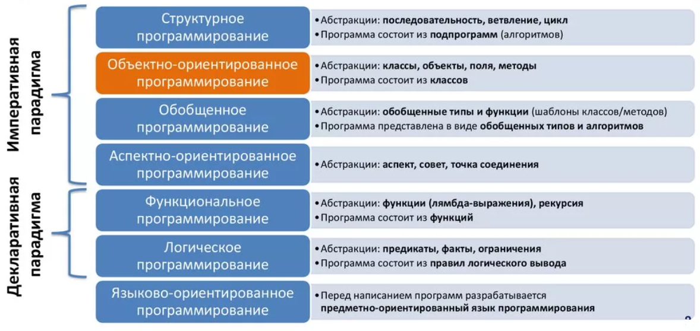
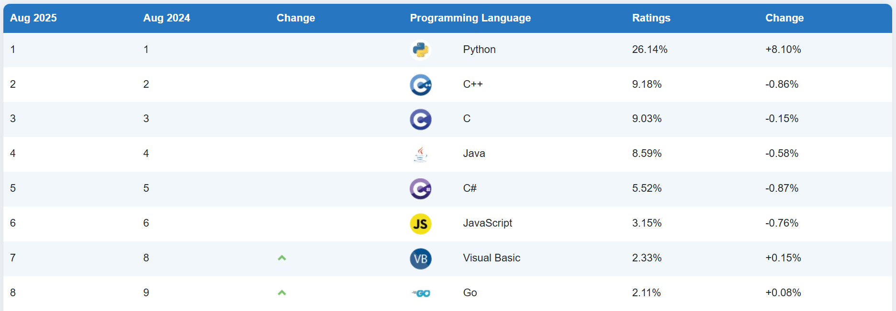
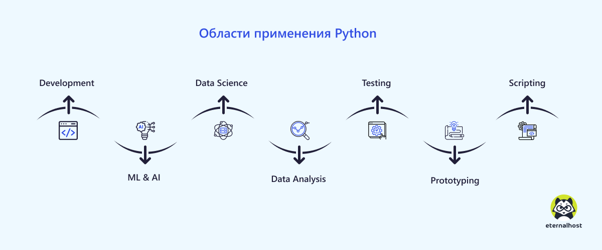

# Конспект: Введение в программирование и язык Python

**Программирование** — это искусство общения с компьютером на понятном ему языке. Представьте, что компьютер — это самый исполнительный сотрудник в мире, но он понимает только очень точные и конкретные инструкции. Задача программиста — составить эти инструкции таким образом, чтобы компьютер мог выполнить нужную задачу.

Каждый день мы сталкиваемся с результатами работы программистов: мобильные приложения, веб-сайты, компьютерные игры, банковские системы — всё это создано с помощью программирования. Программирование развивает логическое мышление, креативность и умение решать сложные задачи.

**Язык программирования** — это формальный язык, состоящий из набора правил (синтаксиса), который позволяет человеку писать инструкции для компьютера. Как и в человеческих языках, здесь есть свои "слова" (ключевые слова), "правила грамматики" (синтаксис) и "значения" (семантика).


## Основные парадигмы программирования

Программирование — это не просто написание кода, это особый способ мышления. Существуют разные подходы к созданию программ, которые называются **парадигмами программирования**.

### Императивное программирование
Это самый интуитивно понятный подход, где программист **явно описывает шаги** для достижения результата. Представьте, что вы даете другу инструкцию как дойти до библиотеки: "Иди прямо 100 метров, поверни налево, затем иди еще 50 метров". Компьютер выполняет команды последовательно, шаг за шагом.

### Структурное программирование
Развитие императивного подхода, которое вводит строгие правила организации кода. Основная идея — разбивать сложные задачи на более мелкие блоки **функции**, использовать циклы вместо повторения кода и избегать бесконтрольных переходов. Это делает код более малым, понятным и надежным.

### Объектно-ориентированное программирование (ООП)
Здесь программа представляется как набор взаимодействующих объектов. Каждый объект — это как бы маленький "робот" со своими свойствами (данными) и возможностями (методами). Например, в игре объектом может быть персонаж с свойствами "здоровье", "скорость" и методами "двигаться", "атаковать".

### Функциональное программирование
Основано на математическом понятии функций. Здесь программы строятся путем комбинирования функций, которые преобразуют данные. Ключевые особенности — неизменяемость данных (**once created, never changed**) и функции как объекты первого класса.

### Логическое программирование
Самый необычный подход, где программист описывает условия задачи, а компьютер сам находит решение. Например, можно описать правила шахматной игры, и компьютер будет вычислять лучшие ходы.



# Обзор современных языков программирования

Современный мир программирования многообразен — существует несколько сотен языков программирования, каждый со своей специализацией и особенностями.

**Python** — универсальный язык с простым синтаксисом, идеален для начинающих. Используется в data science, веб-разработке, автоматизации.

**JavaScript** — язык веба, работает в браузерах. Позволяет создавать интерактивные сайты и веб-приложения.

**Java** — строгий и надежный язык для корпоративных приложений. Принцип "write once, run anywhere" — написал once, работает везде.

**C#** — основной язык для разработки под платформы Microsoft. Мощный и современный, с отличной поддержкой.

**Swift** — язык для экосистемы Apple. Современный, безопасный и быстрый.

**Go** — простой и эффективный язык от Google для сетевых и многопоточных приложений.

**Rust** — язык системного программирования с акцентом на безопасность работы с памятью.

**Инфографика TIOBE за август 2024 и 2025 годов**



## Знакомство с языком Python

### История и философия
Python был создан голландским программистом Гвидо ван Россумом в конце 1980-х годов. Название происходит не от змеи, а от британского комедийного шоу "Monty Python's Flying Circus". Философия Python выражена в документе "The Zen of Python", который включает принципы вроде "Простое лучше сложного" и "Читаемость имеет значение".

### Ключевые особенности
**Простота и читаемость** — синтаксис Python максимально приближен к английскому языку. Отступы являются частью синтаксиса, что делает код аккуратным.

**Динамическая типизация** — не нужно заранее объявлять типы переменных. Тип определяется в момент присваивания значения.

**Интерпретируемость** — Python не требует компиляции, код выполняется построчно интерпретатором.

**Кроссплатформенность** — один и тот же код работает на Windows, macOS, Linux.

**Богатая стандартная библиотека** — "батарейки в комплекте" — множество полезных модулей уже включены.

### Первые шаги в Python
```python
# Это комментарий - объяснение для людей
print("Добро пожаловать в мир Python!")

# Переменные и базовые типы данных
name = "Мария"          # Строка
age = 19                # Целое число
average_grade = 4.8     # Дробное число
is_student = True       # Логическое значение
```

## Сферы применения Python

Универсальность Python делает его одним из самых востребованных языков в различных областях.

### Веб-разработка
Фреймворки Django и Flask позволяют создавать мощные веб-приложения. Instagram, Pinterest и Dropbox используют Python в своей backend-разработке.

### Наука о данных и аналитика
Библиотеки Pandas для работы с таблицами, NumPy для научных вычислений и Matplotlib для визуализации делают Python лидером в data science.

### Искусственный интеллект и машинное обучение
TensorFlow, PyTorch и scikit-learn — основные инструменты современных AI-разработчиков. От распознавания изображений до генерации текста.

### Автоматизация и DevOps
Python отлично подходит для написания скриптов автоматизации, управления системами и разработки инструментов DevOps.

### Образование
Благодаря простому синтаксису Python стал стандартом для обучения программированию во многих школах и университетах мира.

### Разработка игр
Хотя Python не основной язык для AAA-игр, он отлично подходит для прототипирования и indie-разработки с использованием библиотек like Pygame.



### Выбор среды разработки
**PyCharm** — мощная профессиональная среда с полным набором инструментов.

**VS Code** — легкий и настраиваемый редактор с огромным количеством расширений.

**Jupyter Notebook** — интерактивная среда, идеальная для анализа данных и обучения.

## Ресурсы для дальнейшего изучения

### Официальные ресурсы
- Документация Python: docs.python.org
- Официальный туториал: идеально для начального обучения

### Онлайн-курсы
- Coursera: курсы от ведущих университетов
- Stepik: русскоязычные курсы по Python
- Codecademy: интерактивное обучение

### Сообщества
- Stack Overflow — ответы на вопросы