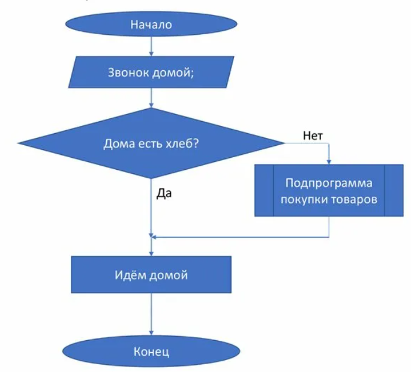
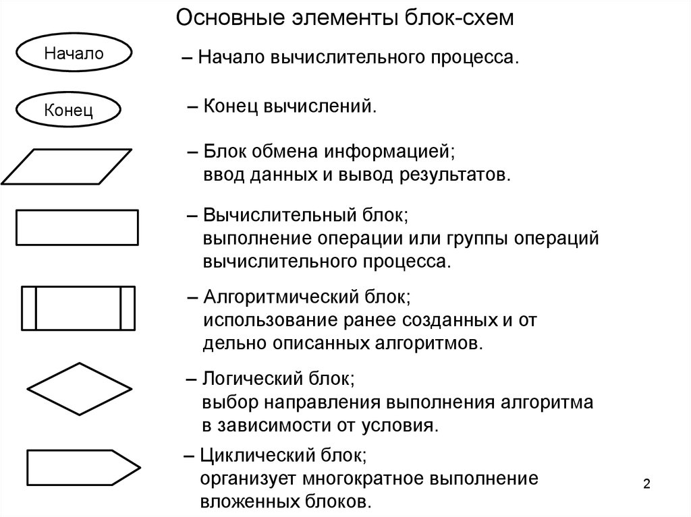
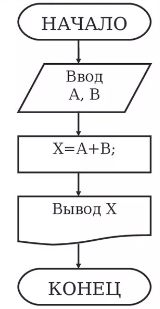
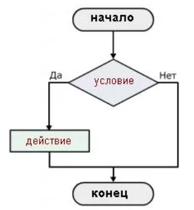
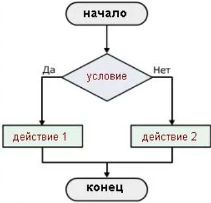
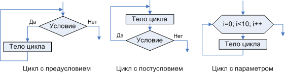

# Понятие алгоритма и его основные типы

## Понятие алгоритма

**Алгоритм** - это понятное и точное предписание (набор инструкций), которое определяет процесс преобразования исходных данных в желаемый результат за конечное число шагов.


Пример алгоритма

### Ключевые свойства алгоритма:

1.  **Дискретность** (пошаговость): Процесс решения задачи разделён на отдельные законченные действия-шаги.
2.  **Понятность**: Каждая команда алгоритма должна быть однозначной и понятной исполнителю.
3.  **Определённость** (детерминированность): Каждая команда должна трактоваться исполнителем единственным образом. При одних и тех же исходных данных алгоритм всегда выдаёт одинаковый результат.
4.  **Результативность**: Алгоритм должен завершать работу за конечное число шагов и выдавать результат.
5.  **Массовость**: Алгоритм должен решать не одну конкретную задачу, а целый класс однотипных задач.

## Типы алгоритмов (по структуре)
Перед тем как изучать типы алгоритмов стоит рассмотреть все функциональные элементы блок-схемы.



### Линейный алгоритм

**Линейный алгоритм** - это алгоритм, в котором все действия (команды) выполняются **строго последовательно**, одно за другим, от начала и до конца, без каких-либо условий и повторений.

**Особенности:**
*   Самый простой тип.
*   Не содержит проверок условий.
*   Не содержит циклов (повторений).
*   Выполняется всегда одинаково, независимо от исходных данных.

**Схема (блок-схема)**



---

### Разветвлённый алгоритм (алгоритм с условием)

**Разветвлённый алгоритм** - это алгоритм, в котором в зависимости от выполнения или невыполнения **некоторого условия** дальнейшие действия меняются.

**Особенности:**
*   Содержит оператор условия (`if...else` - "если...то...иначе").
*   Есть как мини два возможных пути выполнения.
*   Выбор пути зависит от результата проверки условия (Да/Нет).

**Схема (блок-схема):**



*Неполный алгоритм*



*Полный алгоритм*

---

### Циклический алгоритм (алгоритм с циклом)

**Циклический алгоритм** - это алгоритм, в котором некоторая последовательность действий **повторяется несколько раз** до тех пор, пока выполняется определённое условие.

**Основные виды циклов:**
*   **Цикл "Пока" (с предусловием):** `while` - действия повторяются *пока* условие истинно. Проверка условия происходит *до* выполнения тела цикла.
*   **Цикл "До" (с постусловием):** `do...while` - действия выполняются *до тех пор*, пока условие не станет истинным. Тело цикла выполнится *как минимум один раз*.
*   **Цикл со счётчиком:** `for` - действия повторяются заданное количество раз.

**Схема циклов**



---

## Реализации алгоритмов в Python

### Линейный алгоритм в Python

Линейный алгоритм в Python представляет собой простую последовательность команд:

```python
# Пример линейного алгоритма: вычисление площади прямоугольника
a = 5  # длина
b = 3  # ширина
area = a * b  # вычисление площади
print("Площадь прямоугольника:", area)  # вывод результата
```

### Разветвлённый алгоритм в Python

Для реализации условий в Python используется конструкция `if-elif-else`:

```python
# Пример разветвлённого алгоритма: проверка возраста
age = int(input("Сколько вам лет? "))  # запрос возраста

if age >= 18:
    print("Вы совершеннолетний")
elif age >= 13:
    print("Вы подросток")
else:
    print("Вы ребенок")
```

### Циклический алгоритм в Python

В Python есть два основных типа циклов: `for` и `while`.

**Цикл for (со счётчиком):**
```python
# Пример цикла for: вывод чисел от 1 до 5
for i in range(1, 6):
    print(i)
```

**Цикл while (с условием):**
```python
# Пример цикла while: обратный отсчёт
count = 5
while count > 0:
    print(count)
    count = count - 1  # уменьшаем count на 1
print("Старт!")
```
---