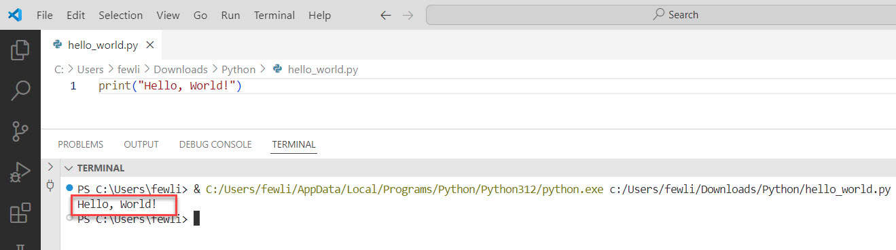
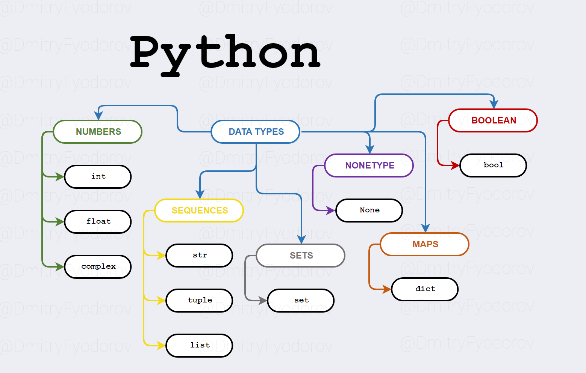
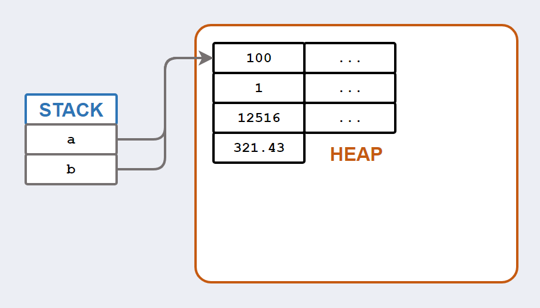
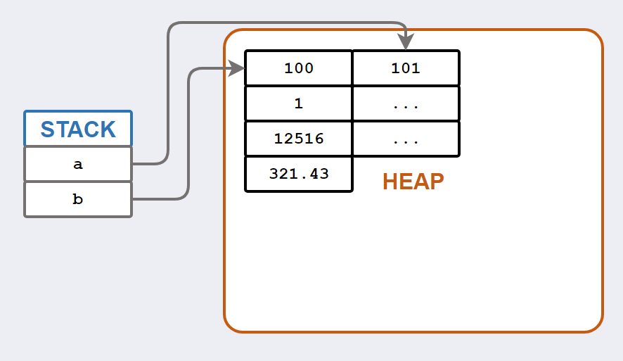
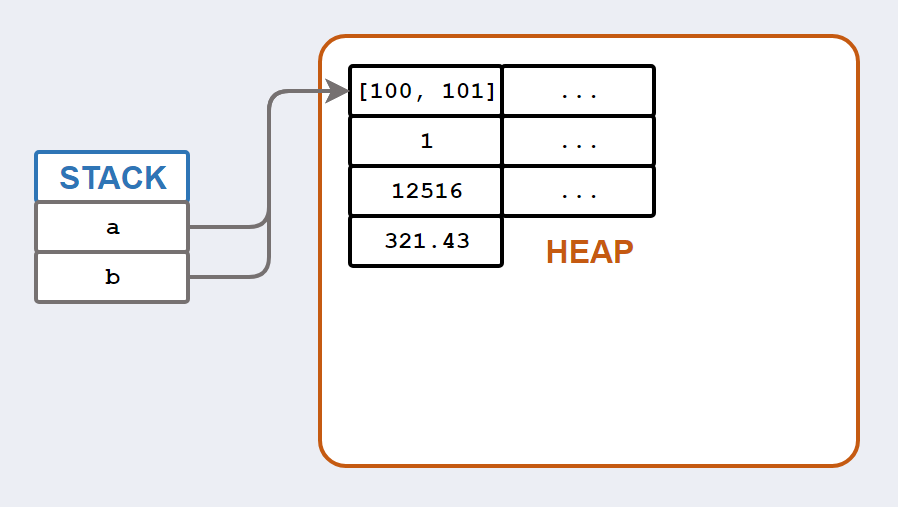
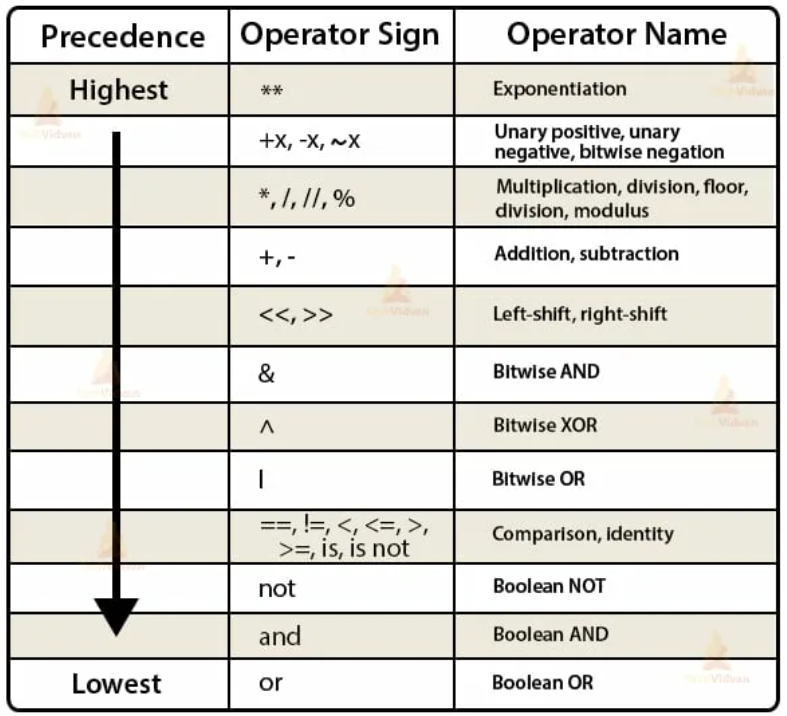

# **Типы данных, переменные и синтаксис Python**

## **Что такое программа?**

Данная лекция познакомит вас с базовыми понятиями типов данных, переменных и синтаксиса в Python. Правильное понимание действий с конкретными типами данных позволит вам оптимизированно писать код, используя минимум памяти компьютера и максимум его производительности.

Для начала вспомним, что такое программа. Под программой подразумевают набор инструкций для компьютера. Компьютер получает программу, переводит её на понятный себе язык и затем выполняет шаг за шагом. Вспомним, какими плюсами обладает Python.

Python — язык, который:
- Легко читается (почти как английский),
- Не требует сложной настройки,
- Используется в интернете, играх, анализе данных, роботах.

Напомним, как писать программы в VS Code и запускать их на старом, как и наш мир, примере "Привет, мир!"

```python
print("Привет, мир!")
```
Запускаем в IDLE или VS Code и видим:  
`Привет, мир!`

Это — **вывод на экран**. Компьютер выполнил команду `print()`.



---

## **Типы данных — основа всего**

Стоит сказать, что Python - это объектно-ориентированный язык программирования со строгой динамической типизацией. Под динамической типизацией подразумевают, что типы объектов определяются в процессе исполнения программы (runtime).

### Виды типов данных
- Неизменяемые (немутабельные, immutable) типы данных: None, bool, int, float, complex, str, tuple. Также bytes и frozenset;

- Изменяемые (мутабельные, mutable) типы данных: list, dict, set. Также байтовый массив bytearray.



**Таблица численных типов**
| Тип | Пример | Описание |
|-----|--------|----------|
| `int` | `42`, `-7`, `0` | Представление целых чисел, как положительных, так и отрицательных |
| `float` | `3.14`, `-0.5`, `2.0` | Числа, которые могут иметь десятичную часть (с плавающей точкой) |
| `complex` | `3+4j`, `-2j`, `1+0j` | Комплексные числа, состоящие из действительной и мнимой части |

**Таблица типов boolean**
| Тип | Пример | Описание |
|-----|--------|----------|
| `bool` | `True`, `False` | Логическое значение (истина/ложь) |

**Таблица типов sequences**
| Тип | Пример | Описание |
|-----|--------|----------|
| `str` | `"Hello"`, `'world'`, `"""многострочный текст"""` | Текстовая информация (строка, последовательность символов) |
| `tuple` | `(1, 2, 3)`, `('a', 'b')`, `(1,)` | Неизменяемые упорядоченные коллекции элементов (кортежи) |
| `list` | `[1, 2, 3]`, `['a', 'b', 'c']`, `[]` | Изменяемые упорядоченные коллекции элементов (списки) |
| `frozenset` | `frozenset([1, 2, 3])`, `frozenset(['a', 'b'])` | Неизменяемая неупорядоченная коллекция уникальных элементов |
| `bytearray` | `bytearray([65, 66, 67])`, `bytearray(b'ABC')` | Изменяемая последовательность байтов |
| `bytes` | `b'hello'`, `bytes([104, 101, 108, 108, 111])` | Неизменяемая последовательность байтов |

**Таблица типов sets**
| Тип | Пример | Описание |
|-----|--------|----------|
| `set` | `{1, 2, 3}`, `{'a', 'b', 'c'}`, `set()` | Неупорядоченная и неиндексированная коллекция уникальных элементов |

**Таблица типов nonetype**
| Тип | Пример | Описание |
|-----|--------|----------|
| `None` | `None` | Специальное значение, обозначающее отсутствие значения |

**Таблица типов Maps**
| Тип | Пример | Описание |
|-----|--------|----------|
| `dict` | `{'name': 'John', 'age': 30}`, `{1: 'one', 2: 'two'}` | Ассоциативный массив, пары «ключ-значение», где каждый ключ является уникальным |

---
## **Переменные — коробки для данных**

> *«Переменная — это ярлык на коробке. Внутри — данные. Ты можешь менять содержимое, но ярлык остаётся тем же.»*

### Как объявить переменную?
```python
age = 20
name = "Анна"
height = 1.75
is_student = True
```

Здесь:
- `age`, `name`, `height`, `is_student` — **имена переменных**.
- `=` — оператор присваивания. Читается: *«присвоить»*.
- Python **сам определяет тип** по значению.

**Как устроены неизменяемые типы данных?**
В качестве примера напишем код, в котором делаем присвоение int значения к a и потом, ссылаясь на него, в другой переменной:

```python
a = 100
b = a
```

`=` позволяет нам получать ссылку на один объект. В результате получается, что две переменные будут ссылаться на одну и ту же ячейку в памяти.



Если мы попытаемся переменной a присвоить другое значение (в данном случае посредством инкрементирования значения), то после операции `+=` переменная a будет ссылаться на другой объект в памяти.



**Как устроены изменяемые типы данных?**

Сделаем такой же эксперимент только для изменяемого типа:

```python
list_a = [100]
list_b = list_a
```

Две переменные ссылаются на один и тот же список. Оператор присваивания `=` одинаково работает как с неизменяемыми, так и с изменяемыми типами данных. Суть в том, что при добавлении здесь элементов, мы не будем перезаписывать что-либо, а добавим еще одно значение в конец нашего элемента в памяти.



Получается, что в случае с изменяемым типом данных, мы будем постоянно работать с одним объектом. Объект в таком случае мы можем модифицировать по любой из существующих ссылок. И по любой ссылке мы всегда будем получать актуальное состояние этого объекта.

### Правила имён переменных:
Стоит уточнить, что существуют также некоторые правила для написания переменных, указанные в таблице ниже.

| Разрешено | Запрещено |
|----------|-----------|
| `name`, `age_2`, `total_price` | `2name`, `my-name`, `class` |
| Только буквы, цифры, `_` | Начинаться с цифры |
| Регистр важен: `Name ≠ name` | Использовать зарезервированные слова |

### Зарезервированные слова (не использовать как имена!)
```python
and     del     from    not     while
as      elif    global  or      with
assert  else    if      pass    yield
break   except  import  print
class   exec    in      raise
continue finally is      return
def     for     lambda  try
```

> *«Если вы попробуете написать `class = 5`, Python скажет: "Нет, это слово — моя тайная команда!"»*

---

## **Инструкции, операторы и приоритеты**

### Инструкция — это команда
```python
x = 5           # инструкция присваивания
print(x)        # инструкция вывода
y = x + 3       # инструкция вычисления
```

### Операторы — действия
| Оператор | Действие | Пример |
|----------|----------|--------|
| `+` | Сложение | `5 + 3 = 8` |
| `-` | Вычитание | `5 - 3 = 2` |
| `*` | Умножение | `5 * 3 = 15` |
| `/` | Деление | `15 / 3 = 5.0` |
| `//` | Целочисленное деление | `15 // 2 = 7` |
| `%` | Остаток от деления | `15 % 4 = 3` |
| `**` | Возведение в степень | `2 ** 3 = 8` |

### Операнды — то, над чем выполняется действие
В выражении `a + b`:  
- `a` и `b` — **операнды**  
- `+` — **оператор**

### Приоритет операций (как в математике!)

| Приоритет | Операторы | Пример |
|-----------|-----------|--------|
| 1 (высший) | `**` | `2 ** 3 + 1 = 9` (сначала степень) |
| 2 | `*`, `/`, `//`, `%` | `5 + 3 * 2 = 11` (сначала умножение) |
| 3 | `+`, `-` | `10 - 3 + 2 = 9` (слева направо) |
| 4 | `=`, `+=`, `-=`, ... | `x = 5 + 3` (присваивание в конце) |

Пример:
```python
result = 2 + 3 * 4  # результат: 14
result = (2 + 3) * 4  # результат: 20
```



*Пирамида приоритетов*

При подготовке лекции ссылался на данный [источник](https://habr.com/ru/articles/825806/)