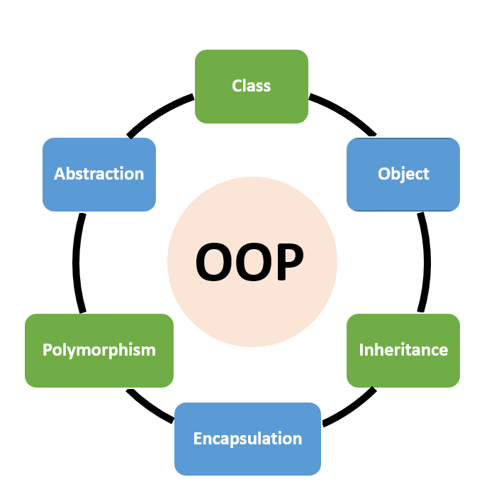
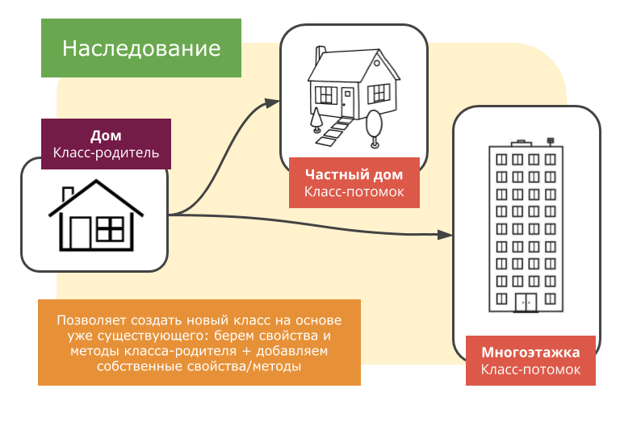
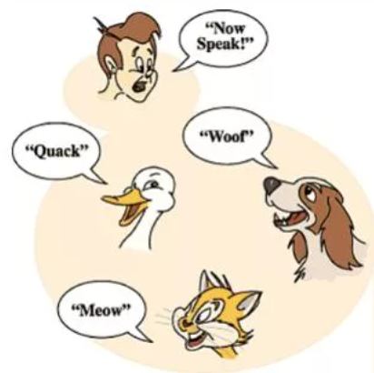

# **Основы Объектно-Ориентированного Программирования (ООП)**

**Цель лекции:** 
Данная лекция будет посвещена одному из столпов не только языка программирования Python, но и языков программирования вцелом. А именно речь пойдет о основных концепциях объектно ориентированного программирования (ООП) — классов, объектов, наследования, инкапсуляции и полиморфизма. Далее мы не сможем и представить нашей жизни без такой замечательной методики как ООП

---

#### **Почему ООП?**

До этого мы писали программы как набор инструкций (процедурное программирование). Это как строить дом из отдельных кирпичей, просто складывая их друг на друга. ООП — это другой подход. Представьте, что у вас есть готовые блоки с дверьми и окнами (объекты), которые можно легко комбинировать. Это делает процесс быстрее, надежнее и удобнее.

**Проблема, которую решает ООП.**
    *   **Сложность:** Когда программа становится большой, в ней трудно разобраться.
    *   **Повторное использование кода:** Мы часто копируем и вставляем одни и те же куски кода.
    *   **Внесение изменений:** Изменение в одной части программы может сломать другую.

**Основная идея ООП:**
    *   Мы представляем программу как набор взаимодействующих **объектов**. Каждый объект — это модель какого-то понятия из реального мира (например, `Студент`, `Книга`, `Банковский счет`) или системы.

**Ключевые понятия, которые мы изучим:**
*   **Класс и Объект**
*   **Инкапсуляция**
*   **Наследование**
*   **Полиморфизм**



---

#### **Классы и Объекты — основа основ**

1.  **Класс — это чертеж.**
    *   **Класс** — это шаблон или описание будущего объекта. В классе мы описываем, какие **данные (атрибуты, свойства)** и **действия (методы)** будет иметь объект.
    *   **Аналогия:** Чертеж автомобиля. В чертеже указано, что у автомобиля есть `цвет`, `модель`, `мощность двигателя` (атрибуты), и что он может `ехать()`, `тормозить()`, `сигналить()` (методы). Самого автомобиля пока нет.

2.  **Объект (или экземпляр) — это конкретный предмет, созданный по чертежу.**
    *   **Объект** — это конкретная сущность, созданная на основе класса.
    *   **Аналогия:** Конкретный автомобиль `ВАЗ-2107 синего цвета`, стоящий у вас во дворе. Это реальный объект, созданный по чертежу (классу) "Автомобиль".

3.  **Пример кода на Python:**
    ```python
    # Создаем класс (чертеж) "Студент"
    class Student:
        # Метод-конструктор. Вызывается при создании нового объекта.
        # self - это ссылка на сам создаваемый объект.
        def __init__(self, name, age, student_id):
            # Создаем атрибуты (свойства) для объекта
            self.name = name
            self.age = age
            self.student_id = student_id

        # Метод (действие), которое может выполнять студент
        def introduce(self):
            print(f"Привет! Меня зовут {self.name}, мне {self.age} лет. Мой ID: {self.student_id}")

        def have_birthday(self):
            self.age += 1
            print(f"У меня день рождения! Теперь мне {self.age} лет.")

    # Создаем объекты (экземпляры) по чертежу класса Student
    student1 = Student("Анна", 20, "S12345")
    student2 = Student("Иван", 19, "S67890")

    # Используем объекты
    student1.introduce()  # Вывод: Привет! Меня зовут Анна, мне 20 лет. Мой ID: S12345
    student2.introduce()  # Вывод: Привет! Меня зовут Иван, мне 19 лет. Мой ID: S67890

    student1.have_birthday() # Вывод: У меня день рождения! Теперь мне 21 лет.
    print(student1.age)      # Вывод: 21
    ```

---

#### **Инкапсуляция — принцип сокрытия данных**

1.  **Определение:**
    *   **Инкапсуляция** — это упаковка данных (атрибутов) и методов в одной единице (классе), а также возможность скрыть внутреннее устройство объекта от внешнего вмешательства.

2.  **Зачем это нужно?**
    *   **Защита данных:** Мы не хотим, чтобы кто-то извне мог изменить атрибуты объекта неподходящим образом. Например, нельзя установить возраст студента в -10 лет.
    *   **Упрощение взаимодействия:** Пользователь класса (другой программист) работает с ним через четко определенные методы, не вникая в сложную внутреннюю логику. Как вождение автомобиля: вы нажимаете на газ, не зная, как устроен двигатель.

3.  **Модификаторы доступа (публичный, защищенный, приватный):**
    *   В Python они реализованы через соглашение об именовании.
    *   **Публичные (public)** атрибуты: `name`. Доступны откуда угодно.
    *   **Защищенные (protected)** атрибуты: `_age` (с одним подчеркиванием). Сигнал: "Это для внутреннего использования, не трогай снаружи".
    *   **Приватные (private)** атрибуты: `__student_id` (с двумя подчеркиваниями). Python делает их имя уникальным для класса, что сильно затрудняет доступ извне.

4.  **Механизм свойств (properties) — правильный способ контроля доступа.**
    ```python
    class BankAccount:
        def __init__(self, initial_balance):
            # Делаем атрибут __balance приватным
            self.__balance = initial_balance

        # Геттер (getter) - метод для чтения значения
        def get_balance(self):
            print("Запрос баланса...")
            return self.__balance

        # Сеттер (setter) - метод для записи значения с проверкой
        def set_balance(self, new_balance):
            if new_balance >= 0:
                self.__balance = new_balance
                print(f"Баланс обновлен: {self.__balance}")
            else:
                print("Ошибка: Баланс не может быть отрицательным!")

    # Использование
    account = BankAccount(100)
    # account.__balance = -500  # Не сработает! Атрибут приватный.
    account.set_balance(200)  # Правильный способ через метод
    account.balance = 300     # Правильный способ через property (как будто это обычный атрибут)
    print(account.get_balance())
    ```

---

#### **Наследование — принцип по которому мы передаем свойства одному классу от другого**

1.  **Определение:**
    *   **Наследование** позволяет создавать новый класс на основе существующего (родительского). Новый класс (дочерний) наследует все атрибуты и методы родительского класса и может добавлять свои или изменять унаследованные.

2.  **Зачем это нужно?**
    *   **Повторное использование кода:** Не нужно копировать код из родительского класса.
    *   **Создание иерархий:** Мы можем моделировать отношения "является разновидностью".

3.  **Пример:**
    ```python
    # Родительский (базовый) класс
    class Animal:
        def __init__(self, name):
            self.name = name

        def speak(self):
            print(f"{self.name} издает звук.")

        def eat(self):
            print(f"{self.name} ест.")

    # Дочерний класс Dog (наследуется от Animal)
    class Dog(Animal):  # Указываем родительский класс в скобках
        # Мы можем добавить новые атрибуты
        def __init__(self, name, breed):
            super().__init__(name)  # Вызываем конструктор родительского класса
            self.breed = breed

        # Мы можем переопределить (изменить) методы родителя
        def speak(self):
            print(f"{self.name} (породы {self.breed}) гавкает: Гав-гав!")

    # Дочерний класс Cat
    class Cat(Animal):
        def speak(self):
            print(f"{self.name} мяукает: Мяу!")

    # Использование
    generic_animal = Animal("Неизвестное животное")
    generic_animal.speak()  # Вывод: Неизвестное животное издает звук.

    my_dog = Dog("Барсик", "Такса")
    my_dog.eat()    # Унаследованный метод от Animal: Барсик ест.
    my_dog.speak()  # Свой собственный метод: Барсик (породы Такса) гавкает: Гав-гав!

    my_cat = Cat("Мурка")
    my_cat.speak()  # Свой собственный метод: Мурка мяукает: Мяу!
    ```



---

#### **Полиморфизм — одно действие, много форм**

1.  **Определение:**
    *   **Полиморфизм** позволяет использовать объекты разных классов с одинаковым интерфейсом (одинаковыми именами методов) единым образом.

2.  **Суть полиморфизма:**
    *   Нам не важно, какой именно это объект — `Dog` или `Cat`. Если мы знаем, что у него есть метод `speak()`, мы можем его вызвать, и каждый объект отреагирует по-своему.

3.  **Пример (продолжаем с животными):**
    ```python
    # Функция, которая работает с ЛЮБЫМ объектом, у которого есть метод speak()
    def make_animal_speak(animal):
        animal.speak()

    # Создаем список разных животных
    zoo = [Dog("Шарик", "Дворняжка"), Cat("Васька"), Dog("Рекс", "Овчарка")]

    # Всех их можно заставить "говорить" одним и тем же способом!
    for animal in zoo:
        make_animal_speak(animal)
    ```
    **Вывод:**
    ```
    Шарик (породы Дворняжка) гавкает: Гав-гав!
    Васька мяукает: Мяу!
    Рекс (породы Овчарка) гавкает: Гав-гав!
    ```

